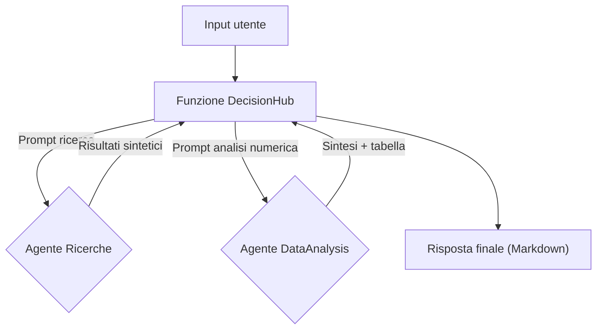
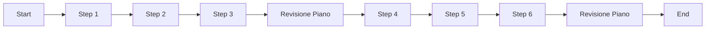

# Guida completa: creare agenti AI con datapizzai

## Panoramica

Questa guida illustra come costruire e orchestrare agenti AI utilizzando la libreria `datapizzai` (>= 3.0.8). L'obiettivo è una comprensione chiara del funzionamento degli agenti e della loro interazione in sistemi complessi, con esempi minimali e pratici.

## Indice

- [1. Creare un agente](#1-creare-un-agente)
- [2. Eseguire un agente](#2-eseguire-un-agente)
- [3. Sistema multi‑agente](#3-sistema-multiagente)
- [4. Planning interval](#4-planning-interval)

## 1. Creare un agente

Un agente è un'entità autonoma che utilizza un LLM per ragionare, usare strumenti (`tools`) e risolvere problemi. La sua creazione richiede la configurazione di diversi parametri che ne definiscono il comportamento.

```python
import os
from dotenv import load_dotenv
from datapizzai.clients import OpenAIClient
from datapizzai.tools import tool
from datapizzai.tools.google import google_search_tool
from datapizzai.agents import Agent  # in alternativa: from datapizzai.agents import Agent, ClientManager

load_dotenv()

# Client OpenAI
openai_client = OpenAIClient(
    api_key=os.getenv("OPENAI_API_KEY"),
    model="gpt-4o",
    system_prompt="Sei un assistente AI utile.",
    temperature=0.7,
)

# Tool
@tool
def get_weather(location: str, when: str) -> str:
    """Retrieves weather information for a specified location and time."""
    return "25 °C"

# Agent collegato al client
agent = Agent(
    name="WeatherAgent",
    client=openai_client,
    system_prompt="Sei un assistente meteo. Usa i tool quando servono e rispondi in italiano.",
    tools=[get_weather],
    terminate_on_text=True,
)
response = agent.run("Che tempo ci sarà lunedì prossimo a Milano?")
print(response)
```

## 2. Eseguire un agente

Una volta configurato, l'agente può essere eseguito in diverse modalità:

- **Sincrona**: Esecuzione bloccante che attende la risposta finale.
  ```python
  response = agent.run("Calcola 25 * 4 + 100")
  ```
- **Asincrona**: Per operazioni I/O non bloccanti, ideale in applicazioni web.
  ```python
  response = await agent.a_run("Spiega cos'è l'AI")
  ```
- **Streaming**: Riceve la risposta un pezzo alla volta (chunk), mostrando sia i passaggi intermedi sia il testo finale.
  ```python
  for chunk in agent.stream_invoke("Racconta una barzelletta"):
      if isinstance(chunk, str):
          print("Testo finale:", chunk)
      else:
          print("Step intermedio:", type(chunk).__name__)
  ```

## 3. Sistema multi‑agente

In alcuni flussi è utile orchestrare agenti con competenze diverse senza complicare il ciclo principale. L'esempio seguente usa una funzione applicativa `decision_hub_pipeline` che:
1. Chiede all'agente `Ricerche` (basato su Google) di raccogliere fonti sintetiche relative al tema richiesto.
2. Passa i risultati all'agente `DataAnalysis`, che estrae i numeri chiave con un tool dedicato e produce una tabella Markdown.
3. Restituisce la risposta finale già pronta per la visualizzazione.



```python
import os
import re
from dotenv import load_dotenv

from datapizzai.agents import Agent
from datapizzai.clients import GoogleClient
from datapizzai.tools import tool
from datapizzai.tools.google import google_search_tool

load_dotenv()

google_client = GoogleClient(
    api_key=os.getenv("GOOGLE_API_KEY"),
    model="gemini-2.5-flash",
    temperature=0.2,
)

@tool
def extract_numeric_table(raw_text: str) -> str:
    """Estrae valori numerici e li organizza in tabella Markdown."""
    pattern = re.compile(r"[-+]?\d+[\d,.]*\s?(?:%|€|eur|m|k)?", re.IGNORECASE)
    rows = []
    for line in raw_text.splitlines():
        matches = pattern.findall(line)
        if matches:
            cleaned = [m.replace(',', '.').strip() for m in matches]
            rows.append((line.strip(), ", ".join(cleaned)))
    if not rows:
        return "| Voce | Valore |
| --- | --- |
| Nessun numero individuato | - |"
    table = ["| Voce | Valore |", "| --- | --- |"]
    table += [f"| {voice} | {value} |" for voice, value in rows]
    return "
".join(table)

research_agent = Agent(
    name="Ricerche",
    client=google_client,
    system_prompt=(
        "Sei uno specialista di ricerca. Usa il tool google_search_tool UNA sola volta, "
        "fissa top_k a 3 e restituisci soltanto un elenco numerato (1., 2., 3.) con titolo e fonte."
    ),
    tools=[google_search_tool],
    terminate_on_text=True,
    max_steps=2,
)

analysis_agent = Agent(
    name="DataAnalysis",
    client=google_client,
    system_prompt=(
        "Ricevi le note di ricerca e devi estrarre ogni cifra o percentuale. "
        "Prima di rispondere devi SEMPRE usare il tool extract_numeric_table passando il testo completo. "
        "Dopo il tool fornisci una sintesi di due frasi e incolla la tabella ottenuta."
    ),
    tools=[extract_numeric_table],
    terminate_on_text=True,
    max_steps=3,
)

def decision_hub_pipeline(user_query: str, top_k: int = 3) -> str:
    research_prompt = (
        f"Analizza il tema: {user_query}. Usa il tool per elencare al massimo {top_k} risultati. "
        "Rispondi solo con un elenco numerato."
    )
    research_notes = research_agent.run(research_prompt)

    analysis_prompt = (
        "Sintetizza l'elenco seguente. Estrai i numeri rilevanti, usa il tool extract_numeric_table, "
        "poi fornisci uno scenario e la tabella."
    )
    structured_output = analysis_agent.run(
        f"{analysis_prompt}

ELENCO FONTI:
{research_notes}"
    )

    return (
        f"### Aggiornamento su '{user_query}'

"
        f"{structured_output}

"
        "---
"
        "Fonti ottenute con google_search_tool."
    )

user_query = "Serve un aggiornamento sulle opportunità commerciali dell'AI generativa in fintech e un check dei rischi."
final_answer = decision_hub_pipeline(user_query)
print(final_answer)
```

- L'orchestratore può incorporare regole aggiuntive (classificatori, feedback umano, memorie condivise) prima di decidere quali agenti invocare.
## 4. Planning interval

Con `planning_interval=N` l’agente rivede il piano ogni N passi. È utile per task lunghi/ramificati.

```python
from datapizzai.agents import Agent

agent = Agent(
    client=client,
    planning_interval=3,  # pianifica ogni 3 step
)

response = agent.run("Scrivi un piano per migrare un monolite a microservizi e stimane l'effort")
print(response)
```

Esecuzione concettuale (planning ogni 3 step):


