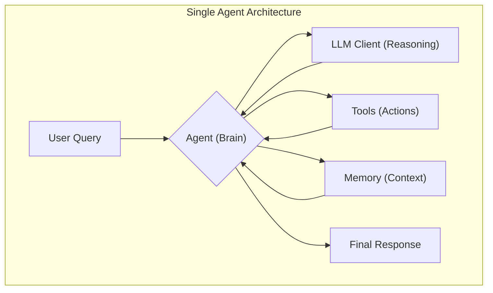
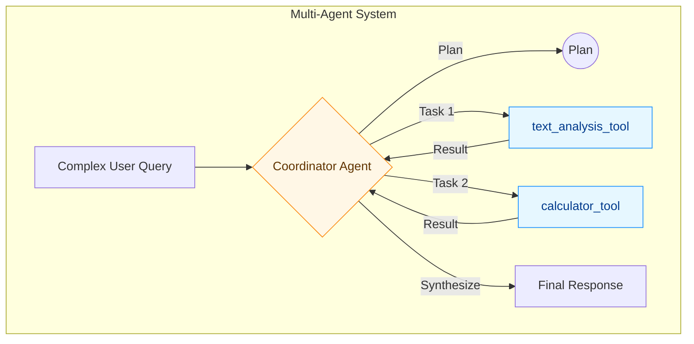
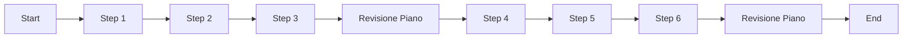

# Guida completa: creare agenti AI con datapizzai

## Panoramica

Questa guida illustra come costruire e orchestrare agenti AI utilizzando la libreria `datapizzai` (>= 3.0.8). L'obiettivo è una comprensione chiara del funzionamento degli agenti e della loro interazione in sistemi complessi, con esempi minimali e pratici.

## Indice

- [1. Creare un agente](#1-creare-un-agente)
- [2. Eseguire un agente](#2-eseguire-un-agente)
- [3. Sistema multi‑agente](#3-sistema-multi-agente)
- [4. Esempio minimale](#4-esempio-minimale)
- [5. Planning interval](#5-planning-interval)

## 1. Creare un agente

Un agente è un'entità autonoma che utilizza un modello linguistico (LLM) per ragionare e usare strumenti (`tools`) per risolvere problemi.



La sua creazione richiede la configurazione di diversi parametri che ne definiscono il comportamento.

```python
import os
from dotenv import load_dotenv
from datapizzai.clients import OpenAIClient
from datapizzai.tools import tool
from datapizzai.agents import Agent  # in alternativa: from datapizzai.agents import Agent, ClientManager

load_dotenv()

openai_client = OpenAIClient(
    api_key=os.getenv("OPENAI_API_KEY"),
    model="gpt-4o",
    system_prompt="Sei un esperto di meteorologia.",
    temperature=0.3,
)

# Test veloce del client (la seconda chiamata è un cache hit)
r1 = openai_client.invoke("Ciao! Come stai?")
print("Risposta 1:", r1.text)

# Tool
@tool
def get_weather(location: str, when: str) -> str:
    """Retrieves weather information for a specified location and time."""
    return "25 °C"

# Agent collegato al client
agent = Agent(
    name="WeatherAgent",
    client=openai_client,
    system_prompt="Sei un assistente meteo. Usa i tool quando servono e rispondi in italiano.",
    tools=[get_weather],
    terminate_on_text=True,
)
response = agent.run("What's the weather tomorrow in Milan?")
print(response)
```

## 2. Eseguire un agente

Una volta configurato, l'agente può essere eseguito in diverse modalità:

- **Sincrona**: Esecuzione bloccante che attende la risposta finale.
  ```python
  response = agent.run("Calcola 25 * 4 + 100")
  ```
- **Asincrona**: Per operazioni I/O non bloccanti, ideale in applicazioni web.
  ```python
  response = await agent.a_run("Spiega cos'è l'AI")
  ```
- **Streaming**: Riceve la risposta un pezzo alla volta (chunk), mostrando sia i passaggi intermedi sia il testo finale.
  ```python
  for chunk in agent.stream_invoke("Racconta una barzelletta"):
      if isinstance(chunk, str):
          print("Testo finale:", chunk)
      else:
          print("Step intermedio:", type(chunk).__name__)
  ```

## 3. Sistema multi‑agente

Per problemi complessi, è efficace combinare più agenti specializzati. Un agente "coordinatore" riceve la richiesta, la scompone e delega i sotto-compiti agli agenti più adatti.

Questo si ottiene tramite il parametro `can_call`.



```python
analyst_agent = Agent(name="Analyst_Agent", tools=[text_analysis_tool])
calculator_agent = Agent(name="Calculator_Agent", tools=[calculator_tool])

coordinator = Agent(name="Coordinator_Agent", can_call=[analyst_agent, calculator_agent])
response = coordinator.run("Analizza il testo 'AI is powerful' e calcola 1024 / 256")
```

- `can_call` (`List[Agent]`): Rende gli agenti nella lista disponibili come "strumenti" per il coordinatore, che può quindi invocarli passandogli un compito specifico.

## 4. Esempio minimale

Questo script completo e funzionante mostra come creare e usare un agente base. Assicurati di avere un file `.env` con la tua `OPENAI_API_KEY`.

```python
from datapizzai.tools import tool
from datapizzai.agents import Agent

@tool
def get_weather(location: str, when: str) -> str:
    return "25 °C"

agent = Agent(tools=[get_weather], terminate_on_text=True)
print(agent.run("What's the weather tomorrow in Milan?"))
```

## 5. Planning interval

Con `planning_interval=N` l’agente rivede il piano ogni N passi. È utile per task lunghi/ramificati.

```python
from datapizzai.agents import Agent

agent = Agent(
    client=client,
    planning_interval=3,  # pianifica ogni 3 step
)

response = agent.run("Scrivi un piano per migrare un monolite a microservizi e stimane l'effort")
print(response)
```

Esecuzione concettuale (planning ogni 3 step):



## Informazioni aggiuntive

- Il file `agent_complete.py` contiene implementazioni complete e scenari avanzati.
