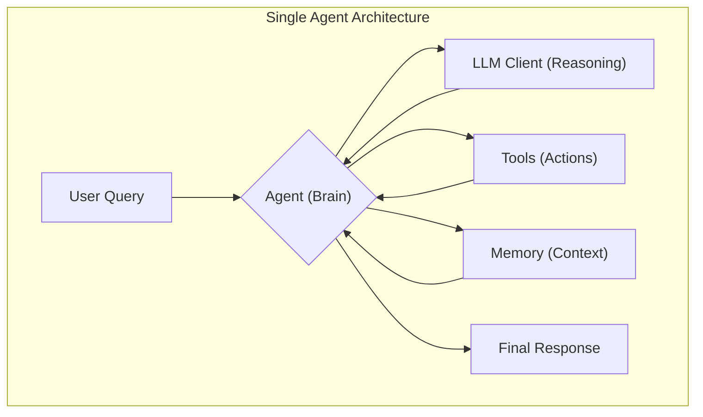
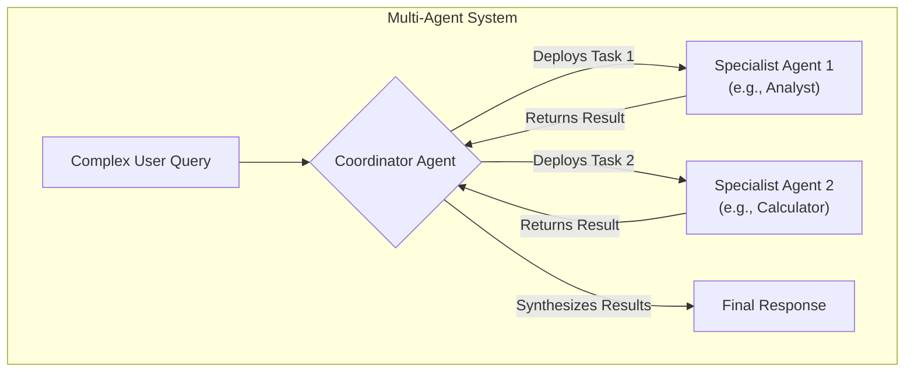

# Guida completa: creare agenti AI con datapizzai

## Panoramica

Questa guida illustra come costruire e orchestrare agenti AI utilizzando la libreria `datapizzai` (>= 3.0.8). L'obiettivo è fornire una comprensione chiara del funzionamento degli agenti, con un focus sulla loro configurazione e interazione in sistemi complessi.

Per un'esplorazione esaustiva di tutte le funzionalità, il file `Agents/agent_complete.py` resta il riferimento completo.

## Indice

- [Setup ambiente](#setup-ambiente)
- [1. Creare un agente](#1-creare-un-agente)
  - [Parametri di input](#parametri-di-input)
- [2. Eseguire un agente](#2-eseguire-un-agente)
- [3. Creare un sistema multi-agente](#3-creare-un-sistema-multi-agente)
- [4. Esempio minimale funzionante](#4-esempio-minimale-funzionante)
- [Informazioni aggiuntive](#informazioni-aggiuntive)

## Setup ambiente

Prima di iniziare, è necessario installare le librerie e configurare le credenziali.

1.  **Installazione**:
    ```bash
    pip install datapizzai python-dotenv
    ```

2.  **Credenziali**:
    Crea un file `.env` nella root del progetto e inserisci le tue chiavi API.
    ```env
    # .env
    OPENAI_API_KEY="sk-..."
    GOOGLE_API_KEY="AIza..."
    # ...altre chiavi...
    ```

## 1. Creare un agente

Un agente è un'entità autonoma che utilizza un modello linguistico (LLM) per ragionare, usare strumenti (`tools`) e mantenere una memoria conversazionale per risolvere problemi.



La sua creazione richiede la configurazione di diversi parametri che ne definiscono il comportamento.

```python
from datapizzai.agents import Agent

agent = Agent(
    name="Assistente_Calcoli",
    client=openai_client,
    system_prompt="Sei un assistente specializzato in calcoli matematici.",
    tools=[calculator_tool],
    max_steps=5,
    memory=memoria_conversazionale,
    stateless=False,
    terminate_on_text=True,
    planning_interval=0,
)
```

### Parametri di input

Ogni parametro dell'agente ha un ruolo specifico:

- `name` (`str`): Un nome identificativo, utile per il logging e nei sistemi multi-agente.
- `client` (`Client`): L'istanza del client LLM (es. `OpenAIClient`, `GoogleClient`) che l'agente userà per "pensare". Viene creato tramite `ClientFactory`.
- `system_prompt` (`str`): Le istruzioni di base che definiscono la personalità, il ruolo e le direttive dell'agente. È l'elemento più importante per guidarne il comportamento.
- `tools` (`List[Tool]`): Una lista di strumenti (funzioni Python decorate con `@tool`) che l'agente può decidere di usare per compiere azioni (es. calcoli, ricerche su file, API esterne).
- `max_steps` (`int`): Il numero massimo di passaggi di ragionamento (pensiero -> azione) che l'agente può compiere prima di fermarsi. Utile per evitare loop infiniti.
- `memory` (`Memory`): Un'istanza di `Memory` per mantenere il contesto delle conversazioni passate. Se non fornita, l'agente opera senza memoria di interazioni precedenti.
- `stateless` (`bool`): Se `True`, la memoria non viene aggiornata automaticamente tra una chiamata `.run()` e l'altra. Di default è `False` quando si fornisce una memoria.
- `terminate_on_text` (`bool`): Se `True`, l'agente si ferma non appena produce una risposta testuale finale, senza tentare di usare altri strumenti.
- `planning_interval` (`int`): Se impostato a un valore `> 0`, l'agente si ferma ogni `N` passi per rivedere il suo piano d'azione, migliorando l'efficacia su task complessi. `0` disattiva il planning esplicito.

## 2. Eseguire un agente

Una volta configurato, l'agente può essere eseguito in diverse modalità:

- **Sincrona**: Esecuzione bloccante che attende la risposta finale.
  ```python
  response = agent.run("Calcola 25 * 4 + 100")
  ```
- **Asincrona**: Per operazioni I/O non bloccanti, ideale in applicazioni web.
  ```python
  response = await agent.a_run("Spiega cos'è l'AI")
  ```
- **Streaming**: Riceve la risposta un pezzo alla volta (chunk), mostrando sia i passaggi intermedi sia il testo finale.
  ```python
  for chunk in agent.stream_invoke("Racconta una barzelletta"):
      if isinstance(chunk, str):
          print("Testo finale:", chunk)
      else:
          print("Step intermedio:", type(chunk).__name__)
  ```

## 3. Creare un sistema multi-agente

Per problemi complessi, è efficace combinare più agenti specializzati. Un agente "coordinatore" riceve la richiesta, la scompone e delega i sotto-compiti agli agenti più adatti.

Questo si ottiene tramite il parametro `can_call`.



```python
# Agente 1: specializzato in analisi testuale
analyst_agent = Agent(name="Analyst_Agent", tools=[text_analysis_tool], ...)

# Agente 2: specializzato in calcoli
calculator_agent = Agent(name="Calculator_Agent", tools=[calculator_tool], ...)

# Agente 3: coordinatore
coordinator = Agent(
    name="Coordinator_Agent",
    system_prompt="Analizza la richiesta e delega ai tuoi agenti specializzati.",
    can_call=[analyst_agent, calculator_agent] # Può "chiamare" gli altri due
)

# Il coordinatore decide a chi affidare i task
response = coordinator.run("Analizza il testo 'AI is powerful' e calcola 1024 / 256")
```

- `can_call` (`List[Agent]`): Rende gli agenti nella lista disponibili come "strumenti" per il coordinatore, che può quindi invocarli passandogli un compito specifico.

## 4. Esempio minimale funzionante

Questo script completo e funzionante mostra come creare e usare un agente base. Assicurati di avere un file `.env` con la tua `OPENAI_API_KEY`.

```python
import os
from dotenv import load_dotenv
from datapizzai.clients import ClientFactory
from datapizzai.clients.factory import Provider
from datapizzai.tools import tool
from datapizzai.agents import Agent
from datapizzai.memory import Memory

# 1. Carica le variabili d'ambiente (da file .env)
load_dotenv()

# 2. Definisci un tool semplice
@tool(name="calculator", description="Esegue calcoli matematici")
def calculator(expression: str) -> str:
    """Calcola un'espressione matematica in modo sicuro."""
    try:
        allowed_chars = set('0123456789+-*/.() ')
        if not all(c in allowed_chars for c in expression):
            return "Errore: caratteri non validi."
        return f"Risultato: {eval(expression)}"
    except Exception as e:
        return f"Errore nel calcolo: {str(e)}"

# 3. Configura il client per l'LLM
try:
    api_key = os.getenv("OPENAI_API_KEY")
    if not api_key:
        raise ValueError("OPENAI_API_KEY non trovata. Controlla il file .env")

    client = ClientFactory.create(
        provider=Provider.OPENAI,
        api_key=api_key,
        model="gpt-4o",
    )
except ValueError as e:
    print(e)
    exit()

# 4. Crea l'agente
assistente_agente = Agent(
    name="Assistente_AI",
    client=client,
    system_prompt="Sei un assistente AI. Rispondi in italiano e usa il calcolatore quando necessario.",
    tools=[calculator],
    memory=Memory(),
    max_steps=3
)

# 5. Esegui l'agente
query = "Quanto fa (100 + 50) / 2?"
print(f"Query: {query}")

response = assistente_agente.run(query)
print(f"Risposta: {response}")

```

## Informazioni aggiuntive

- **Client e Tool**: Per semplicità, questa guida omette la definizione dettagliata di `ClientFactory` e `@tool`. Questi componenti sono essenziali ma il loro funzionamento è analogo a quello visto in altre guide. Il file `agent_complete.py` contiene implementazioni complete.
- **Troubleshooting**: Se `MockClient` viene attivato, significa che la chiave API non è stata trovata. Controlla che il file `.env` sia presente, leggibile e che il nome della variabile sia corretto.


