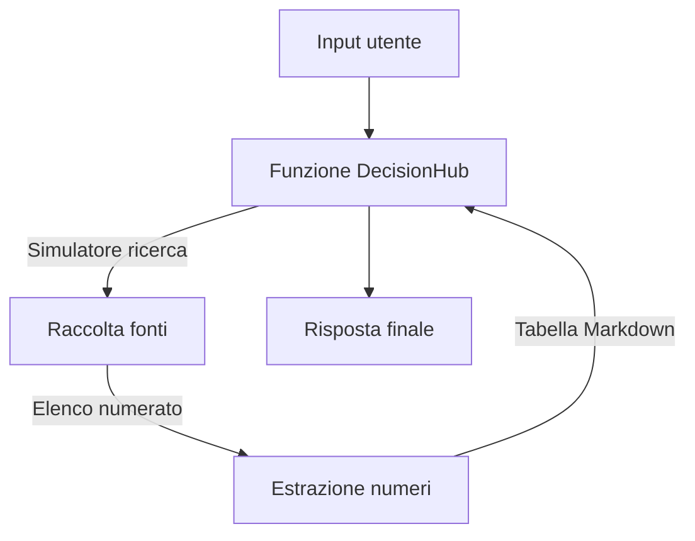
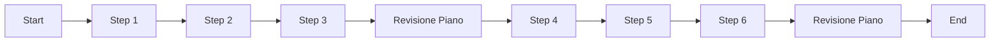

# Guida completa: creare agenti AI con datapizzai

## Panoramica

Questa guida illustra come costruire e orchestrare agenti AI utilizzando la libreria `datapizzai` (>= 3.0.8). L'obiettivo è una comprensione chiara del funzionamento degli agenti e della loro interazione in sistemi complessi, con esempi minimali e pratici.

## Indice

- [1. Creare un agente](#1-creare-un-agente)
- [2. Eseguire un agente](#2-eseguire-un-agente)
- [3. Sistema multi‑agente](#3-sistema-multiagente)
- [4. Planning interval](#4-planning-interval)

## 1. Creare un agente

Un agente è un'entità autonoma che utilizza un LLM per ragionare, usare strumenti (`tools`) e risolvere problemi. La sua creazione richiede la configurazione di diversi parametri che ne definiscono il comportamento.

```python
import os
from dotenv import load_dotenv
from datapizzai.clients import OpenAIClient
from datapizzai.tools import tool
from datapizzai.tools.google import google_search_tool
from datapizzai.agents import Agent  # in alternativa: from datapizzai.agents import Agent, ClientManager

load_dotenv()

# Client OpenAI
openai_client = OpenAIClient(
    api_key=os.getenv("OPENAI_API_KEY"),
    model="gpt-4o",
    system_prompt="Sei un assistente AI utile.",
    temperature=0.7,
)

# Tool
@tool
def get_weather(location: str, when: str) -> str:
    """Retrieves weather information for a specified location and time."""
    return "25 °C"

# Agent collegato al client
agent = Agent(
    name="WeatherAgent",
    client=openai_client,
    system_prompt="Sei un assistente meteo. Usa i tool quando servono e rispondi in italiano.",
    tools=[get_weather],
    terminate_on_text=True,
)
response = agent.run("Che tempo ci sarà lunedì prossimo a Milano?")
print(response)
```

## 2. Eseguire un agente

Una volta configurato, l'agente può essere eseguito in diverse modalità:

- **Sincrona**: Esecuzione bloccante che attende la risposta finale.
  ```python
  response = agent.run("Calcola 25 * 4 + 100")
  ```
- **Asincrona**: Per operazioni I/O non bloccanti, ideale in applicazioni web.
  ```python
  response = await agent.a_run("Spiega cos'è l'AI")
  ```
- **Streaming**: Riceve la risposta un pezzo alla volta (chunk), mostrando sia i passaggi intermedi sia il testo finale.
  ```python
  for chunk in agent.stream_invoke("Racconta una barzelletta"):
      if isinstance(chunk, str):
          print("Testo finale:", chunk)
      else:
          print("Step intermedio:", type(chunk).__name__)
  ```

## 3. Sistema multi‑agente

In molti scenari è sufficiente coordinare componenti specializzati senza ricorrere a piani complessi. L'esempio seguente mostra una funzione `decision_hub_pipeline` che:
1. Recupera (per ora in modo simulato, in attesa del tool DuckDuckGo) un elenco numerato di fonti tramite l'agente `Ricerche`.
2. Estrae i valori numerici principali e costruisce una tabella Markdown.
3. Restituisce un riepilogo finale pronto da mostrare all'utente.



```python
import os
import re
from textwrap import dedent
from dotenv import load_dotenv

from datapizzai.clients import OpenAIClient

load_dotenv()

openai_client = OpenAIClient(
    api_key=os.getenv("OPENAI_API_KEY"),
    model="gpt-4o-mini",
    temperature=0.2,
)

SIMULATED_RESULTS = {
    "fintech": [
        "1. McKinsey 2025 – Investimenti generative AI nel fintech a 18B€",
        "2. Deloitte Insight – Riduzione costi media del 22% nei prestiti automatizzati",
        "3. BCE Tech Watch – Rischi chiave: compliance e privacy dei dati",
    ],
    "default": [
        "1. Industry Report – Adozione enterprise AI +30% YoY",
        "2. Vendor Study – Automazione documentale con ROI medio 180%",
        "3. Regolatore UE – Linee guida per gestione dati sensibili",
    ],
}

def simulated_web_search(query: str, top_k: int = 3) -> list[str]:
    """Restituisce un elenco numerato di fonti (placeholder in attesa del tool DuckDuckGo)."""
    bucket = SIMULATED_RESULTS["fintech" if "fintech" in query.lower() else "default"]
    return bucket[: max(1, top_k)]

def build_numeric_table(entries: list[str]) -> str:
    pattern = re.compile(r"[-+]?\d+[\d,.]*\s?(?:%|€|eur|m|k|b)?", re.IGNORECASE)
    rows = []
    for item in entries:
        matches = pattern.findall(item)
        if matches:
            cleaned = [match.replace(',', '.').strip() for match in matches]
            rows.append((item, ", ".join(cleaned)))
    if not rows:
        return "| Voce | Valore |
| --- | --- |
| Nessun numero individuato | - |"
    table = ["| Voce | Valore |", "| --- | --- |"]
    table += [f"| {voice} | {value} |" for voice, value in rows]
    return "
".join(table)

def synthesize_overview(entries: list[str]) -> str:
    if not entries:
        return "Nessuna informazione disponibile."
    prompt = dedent(
        """
        Fornisci due frasi di commento strategico sulle fonti seguenti, evidenziando opportunità e rischi.
        Fonti:
        {bullet_list}
        """
    ).format(bullet_list="
".join(entries))
    response = openai_client.invoke(prompt)
    return response.text.strip()

def decision_hub_pipeline(user_query: str, top_k: int = 3) -> str:
    sources = simulated_web_search(user_query, top_k)
    overview = synthesize_overview(sources)
    table = build_numeric_table(sources)

    return (
        f"### Aggiornamento su '{user_query}'

"
        f"{overview}

"
        f"{table}

"
        "---
"
        "Fonti simulate (sostituisci con DuckDuckGo quando sarà disponibile)."
    )

user_query = "Serve un aggiornamento sulle opportunità commerciali dell'AI generativa in fintech e un check dei rischi."
print(decision_hub_pipeline(user_query))
```

- Una volta pubblicato il tool DuckDuckGo sarà sufficiente sostituire `simulated_web_search` con la nuova integrazione e rimuovere la nota sulla simulazione.
## 4. Planning interval

Con `planning_interval=N` l’agente rivede il piano ogni N passi. È utile per task lunghi/ramificati.

```python
from datapizzai.agents import Agent

agent = Agent(
    client=client,
    planning_interval=3,  # pianifica ogni 3 step
)

response = agent.run("Scrivi un piano per migrare un monolite a microservizi e stimane l'effort")
print(response)
```

Esecuzione concettuale (planning ogni 3 step):


