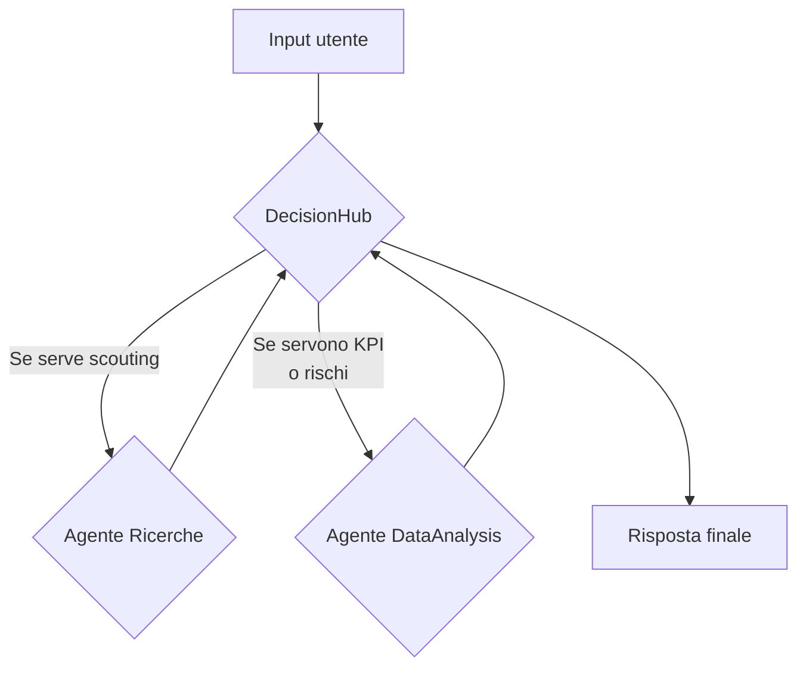
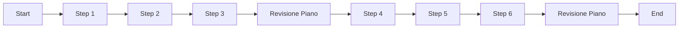

# Guida completa: creare agenti AI con datapizzai

## Panoramica

Questa guida illustra come costruire e orchestrare agenti AI utilizzando la libreria `datapizzai` (>= 3.0.8). L'obiettivo è una comprensione chiara del funzionamento degli agenti e della loro interazione in sistemi complessi, con esempi minimali e pratici.

## Indice

- [1. Creare un agente](#1-creare-un-agente)
- [2. Eseguire un agente](#2-eseguire-un-agente)
- [3. Sistema multi‑agente](#3-sistema-multi-agente)
- [4. Planning interval](#4-planning-interval)

## 1. Creare un agente

Un agente è un'entità autonoma che utilizza un LLM per ragionare, usare strumenti (`tools`) e risolvere problemi. La sua creazione richiede la configurazione di diversi parametri che ne definiscono il comportamento.

```python
import os
from dotenv import load_dotenv
from datapizzai.clients import OpenAIClient
from datapizzai.tools import tool
from datapizzai.agents import Agent  # in alternativa: from datapizzai.agents import Agent, ClientManager

load_dotenv()

# Client OpenAI
openai_client = OpenAIClient(
    api_key=os.getenv("OPENAI_API_KEY"),
    model="gpt-4o",
    system_prompt="Sei un assistente AI utile.",
    temperature=0.7,
)

# Tool
@tool
def get_weather(location: str, when: str) -> str:
    """Retrieves weather information for a specified location and time."""
    return "25 °C"

# Agent collegato al client
agent = Agent(
    name="WeatherAgent",
    client=openai_client,
    system_prompt="Sei un assistente meteo. Usa i tool quando servono e rispondi in italiano.",
    tools=[get_weather],
    terminate_on_text=True,
)
response = agent.run("Che tempo ci sarà lunedì prossimo a Milano?")
print(response)
```

## 2. Eseguire un agente

Una volta configurato, l'agente può essere eseguito in diverse modalità:

- **Sincrona**: Esecuzione bloccante che attende la risposta finale.
  ```python
  response = agent.run("Calcola 25 * 4 + 100")
  ```
- **Asincrona**: Per operazioni I/O non bloccanti, ideale in applicazioni web.
  ```python
  response = await agent.a_run("Spiega cos'è l'AI")
  ```
- **Streaming**: Riceve la risposta un pezzo alla volta (chunk), mostrando sia i passaggi intermedi sia il testo finale.
  ```python
  for chunk in agent.stream_invoke("Racconta una barzelletta"):
      if isinstance(chunk, str):
          print("Testo finale:", chunk)
      else:
          print("Step intermedio:", type(chunk).__name__)
  ```

## 3. Sistema multi‑agente

Per gestire richieste eterogenee basta un agente orchestratore che inoltra la domanda agli specialisti e poi costruisce la risposta finale. Nel flusso seguente chiamiamo questo agente "DecisionHub": decide se coinvolgere gli specialisti disponibili (ricerche, analisi) e unisce i risultati in un'unica risposta strutturata.



```python
import os
from dotenv import load_dotenv

from datapizzai.agents import Agent
from datapizzai.clients import ClientFactory
from datapizzai.tools import tool

load_dotenv()

base_client = ClientFactory.create(
    provider="openai",
    api_key=os.getenv("OPENAI_API_KEY"),
    model="gpt-4o-mini",
    temperature=0.4,
)

@tool
def web_digest(topic: str, top_k: int = 3) -> str:
    """Restituisce un elenco sintetico di top_k trend o fonti rilevanti."""
    return (
        "1. Report Gartner 2025 su trend AI\n"
        "2. Studio interno DatapizzAI sul ROI dei modelli small\n"
        "3. Nota di regolamentazione UE sugli AI Act sandbox"
    )

@tool
def compute_metrics(raw_numbers: str) -> str:
    """Calcola KPI chiave a partire da dati testuali (es. ricavi, costi, margini)."""
    return "KPI: ricavi 4.2M€, margine 28%, crescita +12% QoQ"

@tool
def risk_matrix(context: str) -> str:
    """Elenca rischi principali e livello di impatto."""
    return "Rischi: conformità medio, sicurezza alto, reputazione medio"

research_agent = Agent(
    name="Ricerche",
    client=base_client,
    system_prompt=(
        "Sei lo specialista di scouting informativo. Usa web_digest per recuperare non più di top_k punti\n"
        "e restituisci sempre un elenco numerato con breve giustificazione."
    ),
    tools=[web_digest],
    terminate_on_text=True,
)

analysis_agent = Agent(
    name="DataAnalysis",
    client=base_client,
    system_prompt=(
        "Ricevi dati grezzi o appunti dal collega DecisionHub e rispondi con insight quantitativi."
        " Se presenti numeri, usa compute_metrics; per aspetti qualitativi integra risk_matrix."
    ),
    tools=[compute_metrics, risk_matrix],
    terminate_on_text=True,
)

decision_hub = Agent(
    name="DecisionHub",
    client=base_client,
    system_prompt=(
        "Sei l'orchestratore."
        " 1) Valuta la richiesta e chiama Ricerche e/o DataAnalysis quando serve."
        " 2) Dopo ogni chiamata, riassumi i risultati in un elenco strutturato."
        " 3) Fornisci una risposta finale con sezioni 'Scenario' e 'Prossimi passi'."
    ),
    terminate_on_text=True,
)
decision_hub.can_call([research_agent, analysis_agent])

user_query = (
    "Serve un aggiornamento sulle opportunità commerciali dell'AI generativa in fintech e un check dei rischi."
)
final_answer = decision_hub.run(user_query)
print(final_answer)
```

- `can_call` (`List[Agent]`): consente a un agente di invocare altri agenti come fossero tool, passando di volta in volta il sotto-compito opportuno.

## 4. Planning interval

Con `planning_interval=N` l’agente rivede il piano ogni N passi. È utile per task lunghi/ramificati.

```python
from datapizzai.agents import Agent

agent = Agent(
    client=client,
    planning_interval=3,  # pianifica ogni 3 step
)

response = agent.run("Scrivi un piano per migrare un monolite a microservizi e stimane l'effort")
print(response)
```

Esecuzione concettuale (planning ogni 3 step):


