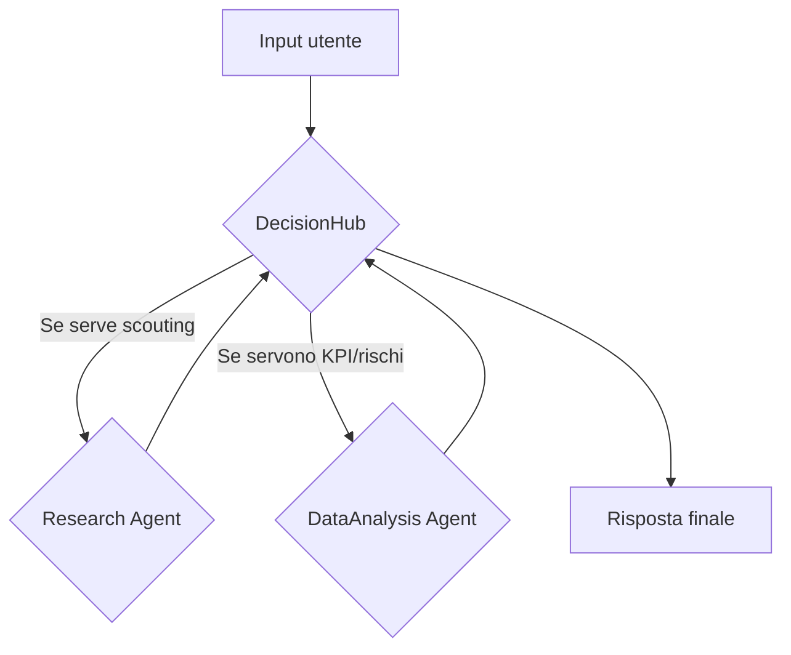
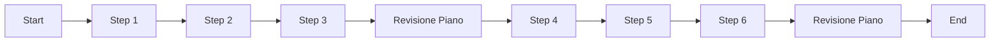

# Guida completa: creare agenti AI con datapizzai

## Panoramica

Questa guida illustra come costruire e orchestrare agenti AI utilizzando la libreria `datapizzai` (>= 3.0.8). L'obiettivo è una comprensione chiara del funzionamento degli agenti e della loro interazione in sistemi complessi, con esempi minimali e pratici.

## Indice

- [1. Creare un agente](#1-creare-un-agente)
- [2. Eseguire un agente](#2-eseguire-un-agente)
- [3. Sistema multi‑agente](#3-sistema-multiagente)
- [4. Planning interval](#4-planning-interval)

## 1. Creare un agente

Un agente è un'entità autonoma che utilizza un LLM per ragionare, usare strumenti (`tools`) e risolvere problemi. La sua creazione richiede la configurazione di diversi parametri che ne definiscono il comportamento.

```python
import os
from dotenv import load_dotenv
from datapizzai.clients import OpenAIClient
from datapizzai.tools import tool
from datapizzai.tools.google import google_search_tool
from datapizzai.agents import Agent  # in alternativa: from datapizzai.agents import Agent, ClientManager

load_dotenv()

# Client OpenAI
openai_client = OpenAIClient(
    api_key=os.getenv("OPENAI_API_KEY"),
    model="gpt-4o",
    system_prompt="Sei un assistente AI utile.",
    temperature=0.7,
)

# Tool
@tool
def get_weather(location: str, when: str) -> str:
    """Retrieves weather information for a specified location and time."""
    return "25 °C"

# Agent collegato al client
agent = Agent(
    name="WeatherAgent",
    client=openai_client,
    system_prompt="Sei un assistente meteo. Usa i tool quando servono e rispondi in italiano.",
    tools=[get_weather],
    terminate_on_text=True,
)
response = agent.run("Che tempo ci sarà lunedì prossimo a Milano?")
print(response)
```

## 2. Eseguire un agente

Una volta configurato, l'agente può essere eseguito in diverse modalità:

- **Sincrona**: Esecuzione bloccante che attende la risposta finale.
  ```python
  response = agent.run("Calcola 25 * 4 + 100")
  ```
- **Asincrona**: Per operazioni I/O non bloccanti, ideale in applicazioni web.
  ```python
  response = await agent.a_run("Spiega cos'è l'AI")
  ```
- **Streaming**: Riceve la risposta un pezzo alla volta (chunk), mostrando sia i passaggi intermedi sia il testo finale.
  ```python
  for chunk in agent.stream_invoke("Racconta una barzelletta"):
      if isinstance(chunk, str):
          print("Testo finale:", chunk)
      else:
          print("Step intermedio:", type(chunk).__name__)
  ```

## 3. Sistema multi‑agente

Un sistema multi-agente sofisticato richiede routing intelligente basato sulla natura della richiesta. Il pattern `DecisionHub` analizza le query in arrivo e le instrada condizionalmente agli agenti specializzati:



```python
import os
import re
from textwrap import dedent
from dotenv import load_dotenv

from datapizzai.agents import Agent
from datapizzai.clients import OpenAIClient
from datapizzai.tools import tool

load_dotenv()

openai_client = OpenAIClient(
    api_key=os.getenv("OPENAI_API_KEY"),
    model="gpt-4o-mini",
    temperature=0.2,
)

@tool
def simulated_web_search(query: str, top_k: int = 3) -> str:
    """Restituisce un elenco numerato di fonti (in attesa del tool DuckDuckGo reale)."""
    canonical_results = {
        "fintech": [
            "1. McKinsey 2025 – Investimenti generative AI nel fintech a 18B€",
            "2. Deloitte Insight – Riduzione costi media del 22% nei processi di prestito",
            "3. BCE Tech Watch – Rischi chiave: compliance e privacy dei dati",
        ],
        "default": [
            "1. Industry Report – Adozione enterprise AI +30% YoY",
            "2. Vendor Study – Automazione documentale con ROI medio 180%",
            "3. Regolatore UE – Linee guida per gestione dati sensibili",
        ],
    }
    bucket = canonical_results["fintech" if "fintech" in query.lower() else "default"]
    return "".join(bucket[: max(1, top_k)])

@tool
def extract_numeric_table(raw_text: str) -> str:
    """Estrae valori numerici dal testo e produce un'analisi Markdown completa."""
    pattern = re.compile(r"[-+]?\d+[\d,.]*\s?(?:%|€|eur|m|k|b|miliardi|milioni)?", re.IGNORECASE)
    rows = []
    for line in raw_text.splitlines():
        matches = pattern.findall(line)
        if matches:
            cleaned = [match.replace(',', '.').strip() for match in matches]
            rows.append((line.strip(), ", ".join(cleaned)))
    
    if not rows:
        return """## Analisi quantitativa
        
| Metrica | Valore | Valutazione |
| --- | --- | --- |
| Dati quantificabili non trovati | - | Dati insufficienti per l'analisi |

**Implicazioni strategiche**: L'analisi richiede più fonti quantitative."""
    
    # Costruisce analisi completa
    analysis = ["## Analisi quantitativa", ""]
    analysis.append("| Metrica | Valore | Valutazione |")
    analysis.append("| --- | --- | --- |")
    
    for entry, values in rows:
        # Analizza i valori per contesto strategico
        assessment = "Monitorare trend"
        if any(char in values.lower() for char in ['%']):
            if any(int(re.findall(r'\d+', val)[0]) > 20 for val in values.split(',') if re.findall(r'\d+', val)):
                assessment = "Indicatore ad alto impatto"
            else:
                assessment = "Segnale di crescita moderata"
        elif any(char in values.lower() for char in ['b', 'miliardi']):
            assessment = "Grande opportunità di mercato"
        elif any(char in values.lower() for char in ['€', 'eur']):
            assessment = "KPI finanziario - tracciare ROI"
            
        analysis.append(f"| {entry[:50]}... | {values} | {assessment} |")
    
    return "\n".join(analysis)

research_agent = Agent(
    name="Ricerche",
    client=openai_client,
    system_prompt=(
        "Sei lo specialista di scouting: chiama simulated_web_search esattamente una volta e "
        "riporta l'elenco numerato senza commenti aggiuntivi."
    ),
    tools=[simulated_web_search],
    terminate_on_text=True,
    max_steps=2,
)

analysis_agent = Agent(
    name="DataAnalysis",
    client=openai_client,
    system_prompt=(
        "Sei un analista strategico dei dati. Estrai insight quantitativi usando il tuo tool, "
        "poi fornisci analisi di livello executive con: (1) Riepilogo dei risultati chiave, "
        "(2) Valutazione dei rischi, (3) Raccomandazioni strategiche, (4) Includi la tabella dettagliata."
    ),
    tools=[extract_numeric_table],
    terminate_on_text=True,
    max_steps=3,
)

# DecisionHub coordination tools
@tool
def call_research_agent(query: str, top_k: int = 3) -> str:
    """Delega la raccolta di intelligence di mercato al ricercatore specializzato."""
    try:
        prompt = f"Raccogli intelligence su: {query}. Fornisci massimo {top_k} fonti numerate."
        result = research_agent.run(prompt)
        return result if result is not None else "L'agente di ricerca non ha restituito risultati."
    except Exception as e:
        return f"Errore agente di ricerca: {str(e)}"

@tool
def call_analysis_agent(research_data: str) -> str:
    """Delega l'analisi quantitativa allo specialista di analisi dati.
    Richiede dati di ricerca reali, non solo una stringa di query."""
    try:
        # Valida che abbiamo dati di ricerca sostanziali
        if len(research_data.strip()) < 50 or not any(char.isdigit() or char in "%.€$" for char in research_data):
            return (
                f"Dati di ricerca insufficienti per l'analisi. Ricevuto: '{research_data[:100]}...' "
                "Raccogli prima intelligence di mercato usando call_research_agent."
            )
        
        prompt = dedent(f"""
            Fornisci analisi di livello executive sui dati di ricerca sottostanti:
            1. Estrai insight quantitativi usando il tuo tool di analisi
            2. Riassumi i risultati chiave
            3. Valuta rischi e opportunità
            4. Fornisci raccomandazioni strategiche
            
            DATI DI RICERCA:
            {research_data}
        """).strip()
        result = analysis_agent.run(prompt)
        return result if result is not None else "L'agente di analisi non ha restituito risultati."
    except Exception as e:
        return f"Errore agente di analisi: {str(e)}"

# DecisionHub come Agente  
decision_hub_agent = Agent(
    name="DecisionHub",
    client=openai_client,
    system_prompt=(
        "Sei un agente di coordinamento intelligente che instrada query complesse ad agenti specializzati. "
        "Segui questa sequenza ESATTA per query complete: "
        "1. PRIMA: Chiama sempre call_research_agent per raccogliere intelligence di mercato e fonti dati "
        "2. POI: Se serve analisi quantitativa, chiama call_analysis_agent con i risultati della ricerca "
        "3. NON chiamare mai call_analysis_agent solo con la query originale - ha bisogno di dati di ricerca reali "
        "4. Sintetizza tutti i risultati in un brief esecutivo completo "
        "Per query su trend, opportunità, rischi o intelligence di mercato, inizia SEMPRE con la raccolta di ricerca."
    ),
    tools=[call_research_agent, call_analysis_agent],
    terminate_on_text=True,
    max_steps=5,
)

# Test del sistema con gestione errori
user_query = "Serve un aggiornamento sulle opportunità commerciali dell'AI generativa in fintech e una valutazione completa dei rischi."

try:
    final_answer = decision_hub_agent.run(user_query)
    if final_answer is None:
        final_answer = "L'agente DecisionHub non ha restituito una risposta. Verifica la configurazione."
    print(final_answer)
except Exception as e:
    print(f"Errore di sistema: {str(e)}")
    print("Assicurati che tutti gli agenti siano configurati correttamente con chiavi API e modelli validi.")
```

### Note sulla gestione errori

I tool di coordinamento includono gestione errori appropriata per prevenire ritorni `None` che possono causare errori di rendering della console Rich. Assicurati sempre che:
- Le risposte degli agenti siano validate prima di essere passate ai sistemi di visualizzazione
- La gestione delle eccezioni avvolga tutte le chiamate agli agenti  
- Siano forniti messaggi di fallback quando gli agenti non riescono a rispondere

- Una volta pubblicato il tool DuckDuckGo sarà sufficiente sostituire `simulated_web_search` con la nuova integrazione e rimuovere la nota sulla simulazione.
## 4. Planning interval

Con `planning_interval=N` l’agente rivede il piano ogni N passi. È utile per task lunghi/ramificati.

```python
from datapizzai.agents import Agent

agent = Agent(
    client=client,
    planning_interval=3,  # pianifica ogni 3 step
)

response = agent.run("Scrivi un piano per migrare un monolite a microservizi e stimane l'effort")
print(response)
```

Esecuzione concettuale (planning ogni 3 step):


