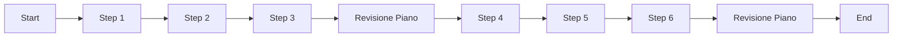

# Guida completa: creare agenti AI con datapizzai

## Panoramica

Questa guida illustra come costruire e orchestrare agenti AI utilizzando la libreria `datapizzai` (>= 3.0.8). L'obiettivo è una comprensione chiara del funzionamento degli agenti e della loro interazione in sistemi complessi, con esempi minimali e pratici.

## Indice

- [1. Creare un agente](#1-creare-un-agente)
- [2. Eseguire un agente](#2-eseguire-un-agente)
- [3. Sistema multi‑agente](#3-sistema-multiagente)
- [4. Planning interval](#4-planning-interval)

## 1. Creare un agente

Un agente è un'entità autonoma che utilizza un LLM per ragionare, usare strumenti (`tools`) e risolvere problemi. La sua creazione richiede la configurazione di diversi parametri che ne definiscono il comportamento.

```python
import os
from dotenv import load_dotenv
from datapizzai.clients import OpenAIClient
from datapizzai.tools import tool
from datapizzai.tools.google import google_search_tool
from datapizzai.agents import Agent  # in alternativa: from datapizzai.agents import Agent, ClientManager

load_dotenv()

# Client OpenAI
openai_client = OpenAIClient(
    api_key=os.getenv("OPENAI_API_KEY"),
    model="gpt-4o",
    system_prompt="Sei un assistente AI utile.",
    temperature=0.7,
)

# Tool
@tool
def get_weather(location: str, when: str) -> str:
    """Retrieves weather information for a specified location and time."""
    return "25 °C"

# Agent collegato al client
agent = Agent(
    name="WeatherAgent",
    client=openai_client,
    system_prompt="Sei un assistente meteo. Usa i tool quando servono e rispondi in italiano.",
    tools=[get_weather],
    terminate_on_text=True,
)
response = agent.run("Che tempo ci sarà lunedì prossimo a Milano?")
print(response)
```

## 2. Eseguire un agente

Una volta configurato, l'agente può essere eseguito in diverse modalità:

- **Sincrona**: Esecuzione bloccante che attende la risposta finale.
  ```python
  response = agent.run("Calcola 25 * 4 + 100")
  ```
- **Asincrona**: Per operazioni I/O non bloccanti, ideale in applicazioni web.
  ```python
  response = await agent.a_run("Spiega cos'è l'AI")
  ```
- **Streaming**: Riceve la risposta un pezzo alla volta (chunk), mostrando sia i passaggi intermedi sia il testo finale.
  ```python
  for chunk in agent.stream_invoke("Racconta una barzelletta"):
      if isinstance(chunk, str):
          print("Testo finale:", chunk)
      else:
          print("Step intermedio:", type(chunk).__name__)
  ```

## 3. Sistema multi‑agente

Per orchestrare analisi complesse possiamo usare un "agente di agenti". Il coordinatore `StrategicPlanner` usa due specialisti come strumenti: `AnalystAgent` e `RiskAgent`. Il primo estrae KPI numerici con un'unica chiamata al tool `extract_kpi`, il secondo individua rischi operativi tramite `identify_risks`. Entrambi sono incapsulati in tool riutilizzabili che il planner invoca in sequenza per consegnare un report con **Sintesi KPI**, **Aree di Rischio** e una **Raccomandazione** finale.

```python
import os
import re
from dotenv import load_dotenv

from datapizzai.agents import Agent
from datapizzai.clients import ClientFactory
from datapizzai.tools import tool

# --- 1. Configurazione e Client Condiviso ---
load_dotenv()
shared_client = ClientFactory.create(
    provider="openai",
    api_key=os.getenv("OPENAI_API_KEY"),
    model="gpt-4o-mini",
    temperature=0.0,
)

# --- 2. Tool e Agenti Specializzati ---

@tool
def extract_kpi(context: str) -> str:
    """Estrae KPI e metriche quantitative dal testo."""
    patterns = {
        "Fatturato": r"(?:revenue|fatturato)[:\s]*([€$]?\d+[\d,.]*[MBK]?)",
        "Crescita": r"(\d+[\d,.]*%)\s*(?:growth|yoy)",
    }
    metrics = [
        f"{name}: {match.group(1)}"
        for name, pattern in patterns.items()
        if (match := re.search(pattern, context, re.IGNORECASE))
    ]
    return " | ".join(metrics) if metrics else "Nessun KPI numerico rilevato."


@tool
def identify_risks(context: str) -> str:
    """Identifica rischi basandosi su parole chiave nel testo."""
    risk_map = {"Compliance": ["gdpr", "normativa"], "Budget": ["budget", "costo"]}
    risks = [name for name, keywords in risk_map.items() if any(k in context.lower() for k in keywords)]
    return " | ".join(risks) if risks else "Nessun rischio operativo evidente."


analyst_agent = Agent(
    name="AnalystAgent",
    client=shared_client,
    system_prompt=(
        "Chiama ESATTAMENTE UNA VOLTA il tool `extract_kpi(context=<<TESTO>>)`.\n"
        "Subito dopo, emetti un UNICO messaggio di testo con ESATTAMENTE il contenuto "
        "restituito dal tool.\nÈ VIETATO richiamare altri tool dopo il primo.\n"
        "Formato d'uscita:\n{{RISULTATO_TOOL}}\n"
    ),
    tools=[extract_kpi],
    terminate_on_text=True,
    max_steps=3,
)


risk_agent = Agent(
    name="RiskAgent",
    client=shared_client,
    system_prompt=(
        "Chiama ESATTAMENTE UNA VOLTA il tool `identify_risks(context=<<TESTO>>)`.\n"
        "Subito dopo EMETTI un UNICO messaggio di testo che contiene ESATTAMENTE "
        "l'output del tool. Poi FERMATI. È VIETATO richiamare altri tool."
    ),
    tools=[identify_risks],
    terminate_on_text=True,
    max_steps=3,
)


@tool
def run_kpi_analysis(query: str) -> str:
    """Delega l'analisi dei KPI all'agente specializzato."""
    print("  -> Delegating to AnalystAgent...")
    result = analyst_agent.run(query)
    return result or "Analisi KPI non completata."


@tool
def run_risk_assessment(query: str) -> str:
    """Delega la valutazione dei rischi all'agente specializzato."""
    print("  -> Delegating to RiskAgent...")
    result = risk_agent.run(query)
    return result or "Valutazione rischi non completata."


strategic_planner_agent = Agent(
    name="StrategicPlanner",
    client=shared_client,
    system_prompt=(
        "Sei un consulente strategico. Orchestra un'analisi di business seguendo questi passi:\n"
        "1. Invoca `run_kpi_analysis` sulla richiesta originale per ottenere le metriche.\n"
        "2. Invoca `run_risk_assessment` sulla richiesta originale per identificare i rischi.\n"
        "3. Sintetizza i risultati in un report finale con **Sintesi KPI**, **Aree di Rischio**, e "
        "una **Raccomandazione** strategica di una riga."
    ),
    tools=[run_kpi_analysis, run_risk_assessment],
    terminate_on_text=True,
    max_steps=5,
)


if __name__ == "__main__":
    scenarios = [
        "Prodotto fintech con crescita 30% YoY, fatturato 2M€ e necessità di compliance GDPR.",
        "Adozione AI per supporto: costo 500K€, ROI 180%, deadline 6 mesi.",
    ]

    for scenario in scenarios:
        print(f"{'-' * 60}\n>> Query per lo Strategic Planner: \"{scenario}\"")
        final_report = strategic_planner_agent.run(scenario)
        print(f"\nReport finale generato:\n{final_report or 'Impossibile generare il report finale.'}\n")
```

### Note di orchestrazione

- I prompt degli agenti specializzati forzano una singola invocazione del rispettivo tool per evitare loop.
- `run_kpi_analysis` e `run_risk_assessment` trasformano gli agenti in strumenti componibili che il planner può richiamare come funzioni.
- Un valore basso di `max_steps` limita il numero di turni e contiene costi e tempi di esecuzione.

## 4. Planning interval

Con `planning_interval=N` l’agente rivede il piano ogni N passi. È utile per task lunghi/ramificati.

```python
from datapizzai.agents import Agent

agent = Agent(
    client=client,
    planning_interval=3,  # pianifica ogni 3 step
)

response = agent.run("Scrivi un piano per migrare un monolite a microservizi e stimane l'effort")
print(response)
```

Esecuzione concettuale (planning ogni 3 step):


