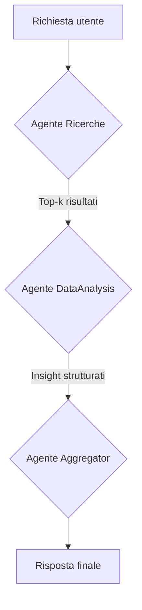
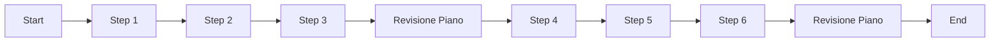

# Guida completa: creare agenti AI con datapizzai

## Panoramica

Questa guida illustra come costruire e orchestrare agenti AI utilizzando la libreria `datapizzai` (>= 3.0.8). L'obiettivo è una comprensione chiara del funzionamento degli agenti e della loro interazione in sistemi complessi, con esempi minimali e pratici.

## Indice

- [1. Creare un agente](#1-creare-un-agente)
- [2. Eseguire un agente](#2-eseguire-un-agente)
- [3. Sistema multi‑agente](#3-sistema-multi-agente)
- [4. Planning interval](#4-planning-interval)

## 1. Creare un agente

Un agente è un'entità autonoma che utilizza un LLM per ragionare, usare strumenti (`tools`) e risolvere problemi. La sua creazione richiede la configurazione di diversi parametri che ne definiscono il comportamento.

```python
import os
from dotenv import load_dotenv
from datapizzai.clients import OpenAIClient
from datapizzai.tools import tool
from datapizzai.agents import Agent  # in alternativa: from datapizzai.agents import Agent, ClientManager

load_dotenv()

# Client OpenAI
openai_client = OpenAIClient(
    api_key=os.getenv("OPENAI_API_KEY"),
    model="gpt-4o",
    system_prompt="Sei un assistente AI utile.",
    temperature=0.7,
)

# Tool
@tool
def get_weather(location: str, when: str) -> str:
    """Retrieves weather information for a specified location and time."""
    return "25 °C"

# Agent collegato al client
agent = Agent(
    name="WeatherAgent",
    client=openai_client,
    system_prompt="Sei un assistente meteo. Usa i tool quando servono e rispondi in italiano.",
    tools=[get_weather],
    terminate_on_text=True,
)
response = agent.run("Che tempo ci sarà lunedì prossimo a Milano?")
print(response)
```

## 2. Eseguire un agente

Una volta configurato, l'agente può essere eseguito in diverse modalità:

- **Sincrona**: Esecuzione bloccante che attende la risposta finale.
  ```python
  response = agent.run("Calcola 25 * 4 + 100")
  ```
- **Asincrona**: Per operazioni I/O non bloccanti, ideale in applicazioni web.
  ```python
  response = await agent.a_run("Spiega cos'è l'AI")
  ```
- **Streaming**: Riceve la risposta un pezzo alla volta (chunk), mostrando sia i passaggi intermedi sia il testo finale.
  ```python
  for chunk in agent.stream_invoke("Racconta una barzelletta"):
      if isinstance(chunk, str):
          print("Testo finale:", chunk)
      else:
          print("Step intermedio:", type(chunk).__name__)
  ```

## 3. Sistema multi‑agente

Per problemi complessi, è efficace combinare agenti specializzati che collaborano tra loro. Nel flusso seguente un agente "Ricerche" raccoglie le fonti, un agente "DataAnalysis" sintetizza gli insight principali e un agente "Aggregator" produce la risposta finale.



```python
import os
from dotenv import load_dotenv

from datapizzai.agents import Agent
from datapizzai.clients import ClientFactory
from datapizzai.tools import tool

load_dotenv()

base_client = ClientFactory.create(
    provider="openai",
    api_key=os.getenv("OPENAI_API_KEY"),
    model="gpt-4o-mini",
    temperature=0.4,
)

@tool
def fetch_research(topic: str, top_k: int = 3) -> str:
    """Restituisce un elenco di top_k spunti rilevanti per il topic richiesto."""
    return (
        "1. Studio ESA sui nanosatelliti\n"
        "2. Report NASA sulla propulsione elettrica\n"
        "3. Articolo IEEE su costellazioni commerciali"
    )

@tool
def analyse_findings(items: str) -> str:
    """Analizza i risultati forniti e sintetizza metriche e rischi principali."""
    return (
        "Sintesi: crescita investimenti +45% YoY;"
        " principali rischi: congestione orbitale, debris."
    )

research_agent = Agent(
    name="Ricerche",
    client=base_client,
    system_prompt=(
        "Sei il decision maker per la fase di ricerca.\n"
        "Usa il tool fetch_research per reperire fonti e restituisci sempre esattamente top_k voci"
        " numerate con breve motivazione."
    ),
    tools=[fetch_research],
    terminate_on_text=True,
)

analysis_agent = Agent(
    name="DataAnalysis",
    client=base_client,
    system_prompt=(
        "Ricevi un elenco di spunti dal collega Ricerche.\n"
        "Usa analyse_findings per produrre insight quantitativi e raccomandazioni operative concise."
    ),
    tools=[analyse_findings],
    terminate_on_text=True,
)

aggregator_agent = Agent(
    name="Aggregator",
    client=base_client,
    system_prompt=(
        "Coordini la pipeline.\n"
        "1) Chiedi a Ricerche i top_k risultati pertinenti.\n"
        "2) Passa l'elenco a DataAnalysis per l'elaborazione.\n"
        "3) Redigi la risposta finale integrando motivazioni e prossimi passi."
    ),
    can_call=[research_agent, analysis_agent],
    terminate_on_text=True,
)

prompt = "Aggiorna il team sulle novità riguardo i cubesat per telecomunicazioni."
final_answer = aggregator_agent.run(prompt)
print(final_answer)
```

- `can_call` (`List[Agent]`): rende gli agenti nella lista disponibili come "strumenti" per l'aggregatore, che li invoca passando un sotto-compito specifico.

## 4. Planning interval

Con `planning_interval=N` l’agente rivede il piano ogni N passi. È utile per task lunghi/ramificati.

```python
from datapizzai.agents import Agent

agent = Agent(
    client=client,
    planning_interval=3,  # pianifica ogni 3 step
)

response = agent.run("Scrivi un piano per migrare un monolite a microservizi e stimane l'effort")
print(response)
```

Esecuzione concettuale (planning ogni 3 step):


