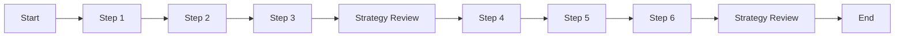

# Complete Guide: Building AI Agents with datapizza-ai

## Overview

This guide demonstrates how to build and orchestrate AI agents using the `datapizza-ai` library (>= 3.0.8). You'll gain a thorough, hands-on understanding of how agents operate and collaborate in complex systems through concise, practical examples.

## Table of contents

- [1. Create an agent](#1-create-an-agent)
- [2. Run an agent](#2-run-an-agent)
- [3. Multi‑agent system](#3-multi-agent-system)
- [4. Planning interval](#4-planning-interval)

## 1. Create an agent

An agent is an autonomous entity that leverages an LLM to reason, operate tools, and solve problems. Creating one involves configuring the parameters that define its behavior and capabilities.

```python
import os
from dotenv import load_dotenv

load_dotenv()

from datapizza.agents import Agent
from datapizza.clients.openai import OpenAIClient
from datapizza.tools import tool

# OpenAI client
openai_client = OpenAIClient(
    api_key=os.getenv("OPENAI_API_KEY"),
    model="gpt-4o",
    temperature=0.3,
)

# Tool
@tool
def get_weather(location: str, when: str) -> str:
    """Retrieves weather information for a specified location and time."""
    return "25 °C"

# Agent wired to the client
agent = Agent(
    name="WeatherAgent",
    client=openai_client,
    system_prompt="You are a weather assistant. Use tools when needed and reply in English.",
    tools=[get_weather],
    terminate_on_text=True,
)
response = agent.run("What will the weather be next Monday in Milan?")
print(response)
```

### Input parameters

Each agent parameter serves a specific purpose:

- `name` (`str`): An identifier useful for logging and debugging multi-agent systems.
- `client` (`Client`): The LLM client instance (e.g., `OpenAIClient`, `GoogleClient`) that powers the agent's reasoning. Created via `ClientFactory`.
- `system_prompt` (`str`): Core instructions defining the agent's personality, role, and behavior patterns. This is the most critical element for directing agent actions.
- `tools` (`List[Tool]`): Python functions decorated with `@tool` that the agent can invoke to perform actions (calculations, file operations, API calls, etc.).
- `max_steps` (`int`): Maximum reasoning cycles (thought → action) before termination. Prevents infinite loops.
- `memory` (`Memory`): Maintains conversation context across interactions. Without this, the agent is stateless.
- `stateless` (`bool`): When `True`, memory isn't automatically updated between `.run()` calls. Defaults to `False` when memory is provided.
- `terminate_on_text` (`bool`): When `True`, stops execution immediately after generating a text response, bypassing further tool use.
- `planning_interval` (`int`): When `> 0`, pauses every N steps to reassess strategy. Improves performance on complex, multi-step tasks. Set to `0` to disable.

## 2. Run an agent

Once configured, you can execute the agent in several modes:

- **Synchronous**: Blocking execution that waits for complete response.
  ```python
  response = agent.run("Calculate 25 * 4 + 100")
  ```
- **Asynchronous**: Non-blocking I/O operations, perfect for web applications.
  ```python
  response = await agent.a_run("Explain what AI is")
  ```
- **Streaming**: Real-time response chunks, revealing both intermediate reasoning steps and final output.
  ```python
  for chunk in agent.stream_invoke("Tell me a joke"):
      if isinstance(chunk, str):
          print("Final text:", chunk)
      else:
          print("Intermediate step:", type(chunk).__name__)
  ```

## 3. Multi‑agent system

An "agent-of-agents" orchestrator coordinates two specialists: `AnalystAgent` (extracts KPI signals) and `RiskAgent` (surfaces operational risks). Each specialist is wrapped as a tool so the planner can call them in sequence and produce a report with **KPI Summary**, **Risk Areas**, and a one-line **Recommendation**.


```python
import os
import re
from dotenv import load_dotenv
load_dotenv()
from datapizza.agents import Agent
from datapizza.clients import ClientFactory
from datapizza.tools import tool
shared_client = ClientFactory.create(
    provider="openai",
    api_key=os.getenv("OPENAI_API_KEY"),
    model="gpt-4o-mini",
    temperature=0.0,
)
@tool
def extract_kpi(context: str) -> str:
    """Extracts KPIs and quantitative metrics from raw text."""
    patterns = {
        "Revenue": r"(?:revenue|fatturato)[:\s]*([€$]?\d+[\d,.]*[MBK]?)",
        "Growth": r"(\d+[\d,.]*%)\s*(?:growth|yoy)",
    }
    metrics = [
        f"{name}: {match.group(1)}"
        for name, pattern in patterns.items()
        if (match := re.search(pattern, context, re.IGNORECASE))
    ]
    return " | ".join(metrics) if metrics else "No numeric KPI detected."

@tool
def identify_risks(context: str) -> str:
    """Flags risks by scanning for domain keywords."""
    risk_map = {"Compliance": ["gdpr", "normativa"], "Budget": ["budget", "costo"]}
    risks = [name for name, keywords in risk_map.items() if any(k in context.lower() for k in keywords)]
    return " | ".join(risks) if risks else "No material operational risk identified."

analyst_agent = Agent(
    name="AnalystAgent",
    client=shared_client,
    system_prompt=(
        "Call the tool `extract_kpi(context=<<TEXT>>) EXACTLY ONCE.`\n"
        "Immediately after, send a SINGLE text message that repeats the tool output verbatim.\n"
        "You MUST NOT call any other tool.\n"
        "Output format:\n{{TOOL_RESULT}}\n"
    ),
    tools=[extract_kpi],
    terminate_on_text=True,
    max_steps=3,
)

risk_agent = Agent(
    name="RiskAgent",
    client=shared_client,
    system_prompt=(
        "Call the tool `identify_risks(context=<<TEXT>>) EXACTLY ONCE.`\n"
        "Then send a SINGLE text message that contains the tool output verbatim.\n"
        "Stop immediately afterwards. No further tool calls are allowed."
    ),
    tools=[identify_risks],
    terminate_on_text=True,
    max_steps=3,
)

@tool
def run_kpi_analysis(query: str) -> str:
    """Delegates KPI extraction to the specialist agent."""
    print("  -> Delegating to AnalystAgent...")
    result = analyst_agent.run(query)
    return result or "KPI analysis did not complete."

@tool
def run_risk_assessment(query: str) -> str:
    """Delegates risk screening to the specialist agent."""
    print("  -> Delegating to RiskAgent...")
    result = risk_agent.run(query)
    return result or "Risk assessment did not complete."

strategic_planner_agent = Agent(
    name="StrategicPlanner",
    client=shared_client,
    system_prompt=(
        "You are a strategic consultant. Produce a business review by following these steps:\n"
        "1. Call `run_kpi_analysis` on the original request to capture metrics.\n"
        "2. Call `run_risk_assessment` on the same request to uncover risks.\n"
        "3. Merge the findings into a final report with **KPI Summary**, **Risk Areas**, and a one-line **Recommendation**."
    ),
    tools=[run_kpi_analysis, run_risk_assessment],
    terminate_on_text=True,
    max_steps=5,
)
if __name__ == "__main__":
    scenarios = [
        "Fintech product growing 30% YoY, €2M revenue, needs GDPR compliance roadmap.",
        "AI adoption program: €500K budget, 180% ROI target, six-month deadline.",
    ]

    for scenario in scenarios:
        print(f"{'-' * 60}\n>> Strategic Planner query: \"{scenario}\"")
        final_report = strategic_planner_agent.run(scenario)
        print(f"\nFinal report:\n{final_report or 'Unable to produce the final report.'}\n")
```

### Orchestration notes

- The specialist prompts enforce a single tool call to avoid runaway loops.
- Wrapping `AnalystAgent` and `RiskAgent` as tools makes them easy to reuse across planners.
- Keeping `max_steps` low caps the number of LLM turns and helps manage latency and cost.

## 4. Planning interval

Setting `planning_interval=N` forces the agent to reassess its strategy every N steps. This is particularly valuable for complex, multi-phase tasks.

```python
from datapizza.agents import Agent


agent = Agent(
    client=client,
    planning_interval=3,  # plan every 3 steps
)

response = agent.run("Write a migration plan from monolith to microservices and estimate the effort")
print(response)
```

Conceptual execution flow (reassessing strategy every 3 steps):


<!--
## Additional information

- The `agent_complete.py` file contains complete implementations and advanced scenarios.
-->
