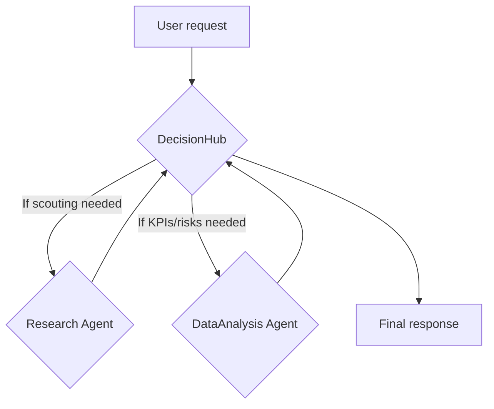
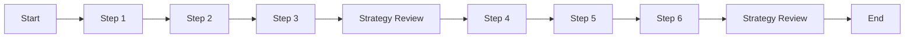

# Complete Guide: Building AI Agents with datapizzai

## Overview

This guide demonstrates how to build and orchestrate AI agents using the `datapizzai` library (>= 3.0.8). You'll gain a thorough, hands-on understanding of how agents operate and collaborate in complex systems through concise, practical examples.

## Table of contents

- [1. Create an agent](#1-create-an-agent)
- [2. Run an agent](#2-run-an-agent)
- [3. Multi‑agent system](#3-multi-agent-system)
- [4. Planning interval](#4-planning-interval)

## 1. Create an agent

An agent is an autonomous entity that leverages an LLM to reason, operate tools, and solve problems. Creating one involves configuring the parameters that define its behavior and capabilities.

```python
import os
from dotenv import load_dotenv
from datapizzai.clients import OpenAIClient
from datapizzai.tools import tool
from datapizzai.tools.google import google_search_tool
from datapizzai.agents import Agent  # alternatively: from datapizzai.agents import Agent, ClientManager

load_dotenv()

# OpenAI client
openai_client = OpenAIClient(
    api_key=os.getenv("OPENAI_API_KEY"),
    model="gpt-4o",
    temperature=0.3,
)

# Tool
@tool
def get_weather(location: str, when: str) -> str:
    """Retrieves weather information for a specified location and time."""
    return "25 °C"

# Agent wired to the client
agent = Agent(
    name="WeatherAgent",
    client=openai_client,
    system_prompt="You are a weather assistant. Use tools when needed and reply in English.",
    tools=[get_weather],
    terminate_on_text=True,
)
response = agent.run("What will the weather be next Monday in Milan?")
print(response)
```

### Input parameters

Each agent parameter serves a specific purpose:

- `name` (`str`): An identifier useful for logging and debugging multi-agent systems.
- `client` (`Client`): The LLM client instance (e.g., `OpenAIClient`, `GoogleClient`) that powers the agent's reasoning. Created via `ClientFactory`.
- `system_prompt` (`str`): Core instructions defining the agent's personality, role, and behavior patterns. This is the most critical element for directing agent actions.
- `tools` (`List[Tool]`): Python functions decorated with `@tool` that the agent can invoke to perform actions (calculations, file operations, API calls, etc.).
- `max_steps` (`int`): Maximum reasoning cycles (thought → action) before termination. Prevents infinite loops.
- `memory` (`Memory`): Maintains conversation context across interactions. Without this, the agent is stateless.
- `stateless` (`bool`): When `True`, memory isn't automatically updated between `.run()` calls. Defaults to `False` when memory is provided.
- `terminate_on_text` (`bool`): When `True`, stops execution immediately after generating a text response, bypassing further tool use.
- `planning_interval` (`int`): When `> 0`, pauses every N steps to reassess strategy. Improves performance on complex, multi-step tasks. Set to `0` to disable.

## 2. Run an agent

Once configured, you can execute the agent in several modes:

- **Synchronous**: Blocking execution that waits for complete response.
  ```python
  response = agent.run("Calculate 25 * 4 + 100")
  ```
- **Asynchronous**: Non-blocking I/O operations, perfect for web applications.
  ```python
  response = await agent.a_run("Explain what AI is")
  ```
- **Streaming**: Real-time response chunks, revealing both intermediate reasoning steps and final output.
  ```python
  for chunk in agent.stream_invoke("Tell me a joke"):
      if isinstance(chunk, str):
          print("Final text:", chunk)
      else:
          print("Intermediate step:", type(chunk).__name__)
  ```

## 3. Multi‑agent system

A sophisticated multi-agent system requires intelligent routing based on the nature of the request. The `DecisionHub` pattern below analyzes incoming queries and conditionally routes them to specialized agents:



```python
import os
import re
from textwrap import dedent
from dotenv import load_dotenv

from datapizzai.agents import Agent
from datapizzai.clients import OpenAIClient
from datapizzai.tools import tool

load_dotenv()

openai_client = OpenAIClient(
    api_key=os.getenv("OPENAI_API_KEY"),
    model="gpt-4o-mini",
    temperature=0.2,
)

@tool
def simulated_web_search(query: str, top_k: int = 3) -> str:
    """Returns a numbered list of sources (placeholder until the DuckDuckGo tool is available)."""
    canonical_results = {
        "fintech": [
            "1. McKinsey 2025 – Generative AI investments in fintech at €18B",
            "2. Deloitte Insight – Lending processes average 22% cost reduction",
            "3. ECB Tech Watch – Key risks: compliance and data privacy",
        ],
        "default": [
            "1. Industry Report – Enterprise AI adoption +30% YoY",
            "2. Vendor Study – Document automation ROI averages 180%",
            "3. EU Regulator – Guidelines for handling sensitive data",
        ],
    }
    bucket = canonical_results["fintech" if "fintech" in query.lower() else "default"]
    return "\n".join(bucket[: max(1, top_k)])

@tool
def extract_numeric_table(raw_text: str) -> str:
    """Extracts numeric values from text and outputs a comprehensive Markdown analysis."""
    pattern = re.compile(r"[-+]?\d+[\d,.]*\s?(?:%|€|eur|m|k|b|billion|million)?", re.IGNORECASE)
    rows = []
    for line in raw_text.splitlines():
        matches = pattern.findall(line)
        if matches:
            cleaned = [match.replace(',', '.').strip() for match in matches]
            rows.append((line.strip(), ", ".join(cleaned)))
    
    if not rows:
        return """## Quantitative Analysis
        
| Metric | Value | Assessment |
| --- | --- | --- |
| No quantifiable data found | - | Insufficient data for analysis |

**Strategic Implications**: Analysis requires more quantitative sources."""
    
    # Build comprehensive analysis
    analysis = ["## Quantitative Analysis", ""]
    analysis.append("| Metric | Value | Assessment |")
    analysis.append("| --- | --- | --- |")
    
    for entry, values in rows:
        # Analyze the values for strategic context
        assessment = "Monitor trend"
        if any(char in values.lower() for char in ['%']):
            if any(int(re.findall(r'\d+', val)[0]) > 20 for val in values.split(',') if re.findall(r'\d+', val)):
                assessment = "High impact indicator"
            else:
                assessment = "Moderate growth signal"
        elif any(char in values.lower() for char in ['b', 'billion']):
            assessment = "Major market opportunity"
        elif any(char in values.lower() for char in ['€', 'eur']):
            assessment = "Financial KPI - track ROI"
            
        analysis.append(f"| {entry[:50]}... | {values} | {assessment} |")
    
    return "\n".join(analysis)

# Specialized agents
research_agent = Agent(
    name="Research",
    client=openai_client,
    system_prompt=(
        "You handle market intelligence: call simulated_web_search exactly once and return "
        "the numbered list without additional commentary."
    ),
    tools=[simulated_web_search],
    terminate_on_text=True,
    max_steps=2,
)

analysis_agent = Agent(
    name="DataAnalysis",
    client=openai_client,
    system_prompt=(
        "You are a strategic data analyst. Extract quantitative insights using your tool, "
        "then provide executive-level analysis with: (1) Key findings summary, "
        "(2) Risk assessment, (3) Strategic recommendations, (4) Include the detailed data table."
    ),
    tools=[extract_numeric_table],
    terminate_on_text=True,
    max_steps=3,
)

# DecisionHub coordination tools
@tool
def call_research_agent(query: str, top_k: int = 3) -> str:
    """Delegate market intelligence gathering to the research specialist."""
    prompt = f"Gather intelligence on: {query}. Provide up to {top_k} numbered sources."
    return research_agent.run(prompt)

@tool
def call_analysis_agent(research_data: str) -> str:
    """Delegate quantitative analysis to the data analysis specialist."""
    prompt = dedent(f"""
        Provide executive-level analysis of the research data below:
        1. Extract quantitative insights using your analysis tool
        2. Summarize key findings 
        3. Assess risks and opportunities
        4. Provide strategic recommendations
        
        RESEARCH DATA:
        {research_data}
    """).strip()
    return analysis_agent.run(prompt)

# DecisionHub as an Agent
decision_hub_agent = Agent(
    name="DecisionHub",
    client=openai_client,
    system_prompt=(
        "You are an intelligent coordination agent that routes complex queries to specialized agents. "
        "Analyze the user's request and determine which agents to engage: "
        "- Use call_research_agent for market intelligence, trends, opportunities, competitive landscape "
        "- Use call_analysis_agent for quantitative analysis, KPIs, risk assessment, data interpretation "
        "Always synthesize results from multiple agents into a comprehensive executive brief."
    ),
    tools=[call_research_agent, call_analysis_agent],
    terminate_on_text=True,
    max_steps=5,
)

# Test the system
user_query = "We need an update on generative AI commercial opportunities in fintech and a comprehensive risk assessment."
final_answer = decision_hub_agent.run(user_query)
print(final_answer)
```

- Once the DuckDuckGo tool becomes available, simply replace `simulated_web_search` with the real integration and remove the simulation disclaimer.
## 4. Planning interval

Setting `planning_interval=N` forces the agent to reassess its strategy every N steps. This is particularly valuable for complex, multi-phase tasks.

```python
from datapizzai.agents import Agent

agent = Agent(
    client=client,
    planning_interval=3,  # plan every 3 steps
)

response = agent.run("Write a migration plan from monolith to microservices and estimate the effort")
print(response)
```

Conceptual execution flow (reassessing strategy every 3 steps):


<!--
## Additional information

- The `agent_complete.py` file contains complete implementations and advanced scenarios.
-->
