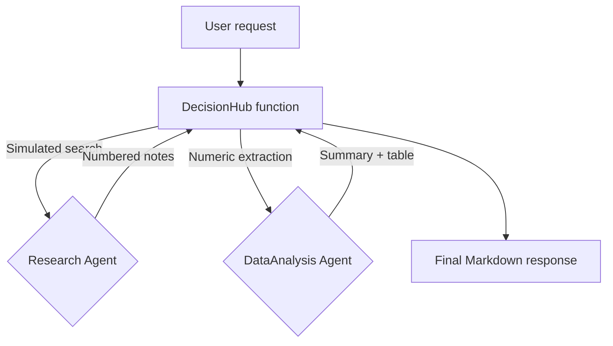
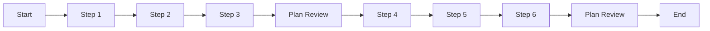

# Complete Guide: Building AI Agents with datapizzai

## Overview

This guide shows how to build and orchestrate AI agents using the `datapizzai` library (>= 3.0.8). The goal is a clear, hands‑on understanding of how agents work and interact in complex systems, with minimal, practical examples.

## Table of contents

- [1. Create an agent](#1-create-an-agent)
- [2. Run an agent](#2-run-an-agent)
- [3. Multi‑agent system](#3-multi-agent-system)
- [4. Planning interval](#4-planning-interval)

## 1. Create an agent

An agent is an autonomous entity that uses a LLM to reason, operate tools, and solve problems. Creating one means configuring the parameters that shape its behaviour.

```python
import os
from dotenv import load_dotenv
from datapizzai.clients import OpenAIClient
from datapizzai.tools import tool
from datapizzai.tools.google import google_search_tool
from datapizzai.agents import Agent  # alternatively: from datapizzai.agents import Agent, ClientManager

load_dotenv()

# OpenAI client
openai_client = OpenAIClient(
    api_key=os.getenv("OPENAI_API_KEY"),
    model="gpt-4o",
    temperature=0.3,
)

# Tool
@tool
def get_weather(location: str, when: str) -> str:
    """Retrieves weather information for a specified location and time."""
    return "25 °C"

# Agent wired to the client
agent = Agent(
    name="WeatherAgent",
    client=openai_client,
    system_prompt="You are a weather assistant. Use tools when needed and reply in English.",
    tools=[get_weather],
    terminate_on_text=True,
)
response = agent.run("What will the weather be next Monday in Milan?")
print(response)
```

### Input parameters

Each agent parameter has a specific role:

- `name` (`str`): An identifying name, useful for logging and in multi-agent systems.
- `client` (`Client`): The instance of the LLM client (e.g., `OpenAIClient`, `GoogleClient`) that the agent will use to "think". It is created via `ClientFactory`.
- `system_prompt` (`str`): The basic instructions that define the agent's personality, role, and directives. It is the most important element for guiding its behavior.
- `tools` (`List[Tool]`): A list of tools (Python functions decorated with `@tool`) that the agent can decide to use to perform actions (e.g., calculations, file searches, external APIs).
- `max_steps` (`int`): The maximum number of reasoning steps (thought -> action) the agent can take before stopping. Useful for preventing infinite loops.
- `memory` (`Memory`): A `Memory` instance to maintain the context of past conversations. If not provided, the agent operates without a memory of previous interactions.
- `stateless` (`bool`): If `True`, the memory is not automatically updated between `.run()` calls. It defaults to `False` when a memory is provided.
- `terminate_on_text` (`bool`): If `True`, the agent stops as soon as it produces a final text response, without attempting to use other tools.
- `planning_interval` (`int`): If set to a value `> 0`, the agent stops every `N` steps to review its action plan, improving effectiveness on complex tasks. `0` disables explicit planning.

## 2. Run an agent

Once configured, the agent can be run in different modes:

- **Synchronous**: A blocking execution that waits for the final response.
  ```python
  response = agent.run("Calculate 25 * 4 + 100")
  ```
- **Asynchronous**: For non-blocking I/O operations, ideal for web applications.
  ```python
  response = await agent.a_run("Explain what AI is")
  ```
- **Streaming**: Receives the response one piece at a time (chunk), showing both intermediate steps and the final text.
  ```python
  for chunk in agent.stream_invoke("Tell me a joke"):
      if isinstance(chunk, str):
          print("Final text:", chunk)
      else:
          print("Intermediate step:", type(chunk).__name__)
  ```

## 3. Multi‑agent system

A lightweight function can coordinate specialised agents without introducing nested plans. In the example below the `decision_hub_pipeline` function:
1. Simulates a web search via the `Research` agent, returning a numbered list of sources.
2. Hands the notes to the `DataAnalysis` agent, which extracts the figures with a dedicated tool and produces a Markdown table.
3. Returns a ready-to-display final answer.



```python
import os
import re
from dotenv import load_dotenv

from datapizzai.agents import Agent
from datapizzai.clients import GoogleClient
from datapizzai.tools import tool

load_dotenv()

google_client = GoogleClient(
    api_key=os.getenv("GOOGLE_API_KEY"),
    model="gemini-2.5-flash",
    temperature=0.2,
)

@tool
def simulated_web_search(query: str, top_k: int = 3) -> str:
    """Simulates a web search returning a numbered list of sources."""
    database = {
        "fintech": [
            "1. McKinsey 2025: Generative AI investments reach €18B",
            "2. Deloitte Insight: Lending workflows save 22% costs on average",
            "3. ECB Brief: Compliance and privacy flagged as key risks",
        ],
        "default": [
            "1. Industry Report 2024: AI adoption up 30%",
            "2. Vendor X Study: Document automation ROI at 180%",
            "3. Regulatory Note: Guidance on sensitive data handling",
        ],
    }
    key = "fintech" if "fintech" in query.lower() else "default"
    return "
".join(database[key][:top_k])

@tool
def extract_numeric_table(raw_text: str) -> str:
    """Extracts numeric values and organises them in a Markdown table."""
    pattern = re.compile(r"[-+]?\d+[\d,.]*\s?(?:%|€|eur|m|k)?", re.IGNORECASE)
    rows = []
    for line in raw_text.splitlines():
        matches = pattern.findall(line)
        if matches:
            cleaned = [m.replace(',', '.').strip() for m in matches]
            rows.append((line.strip(), ", ".join(cleaned)))
    if not rows:
        return "| Item | Value |
| --- | --- |
| No numeric data found | - |"
    table = ["| Item | Value |", "| --- | --- |"]
    table += [f"| {item} | {value} |" for item, value in rows]
    return "
".join(table)

research_agent = Agent(
    name="Research",
    client=google_client,
    system_prompt=(
        "You act as a research specialist. Use the simulated_web_search tool ONCE and return only the numbered list "
        "(1., 2., 3.) produced by the tool."
    ),
    tools=[simulated_web_search],
    terminate_on_text=True,
    max_steps=2,
)

analysis_agent = Agent(
    name="DataAnalysis",
    client=google_client,
    system_prompt=(
        "You receive the research notes and must extract every figure or percentage. "
        "You must call extract_numeric_table exactly once, then provide a two-sentence overview and paste the table."
    ),
    tools=[extract_numeric_table],
    terminate_on_text=True,
    max_steps=3,
)

def decision_hub_pipeline(user_query: str, top_k: int = 3) -> str:
    research_prompt = (
        f"Collect up to {top_k} numbered bullet points (1., 2., 3.) about: {user_query}. "
        "Reply with the list only."
    )
    research_notes = research_agent.run(research_prompt)

    analysis_prompt = (
        "Summarise the list below. Extract the relevant numbers, call extract_numeric_table, "
        "then provide an overview and the table."
    )
    structured_output = analysis_agent.run(
        f"{analysis_prompt}

RESEARCH NOTES:
{research_notes}"
    )

    return (
        f"### Update on '{user_query}'

"
        f"{structured_output}

"
        "---
"
        "Sources simulated via simulated_web_search."
    )

user_query = "Share a commercial outlook for generative AI in fintech and highlight potential risks."
final_answer = decision_hub_pipeline(user_query)
print(final_answer)
```

- The orchestrator can integrate additional routing logic (classification, rule engines, user feedback) before deciding which agents to call.
## 4. Planning interval

With `planning_interval=N` the agent reviews its plan every N steps. Useful for long/branched tasks.

```python
from datapizzai.agents import Agent

agent = Agent(
    client=client,
    planning_interval=3,  # plan every 3 steps
)

response = agent.run("Write a plan to migrate a monolith to microservices and estimate the effort")
print(response)
```

Conceptual execution (planning every 3 steps):


<!--
## Additional information

- The `agent_complete.py` file contains complete implementations and advanced scenarios.
-->
