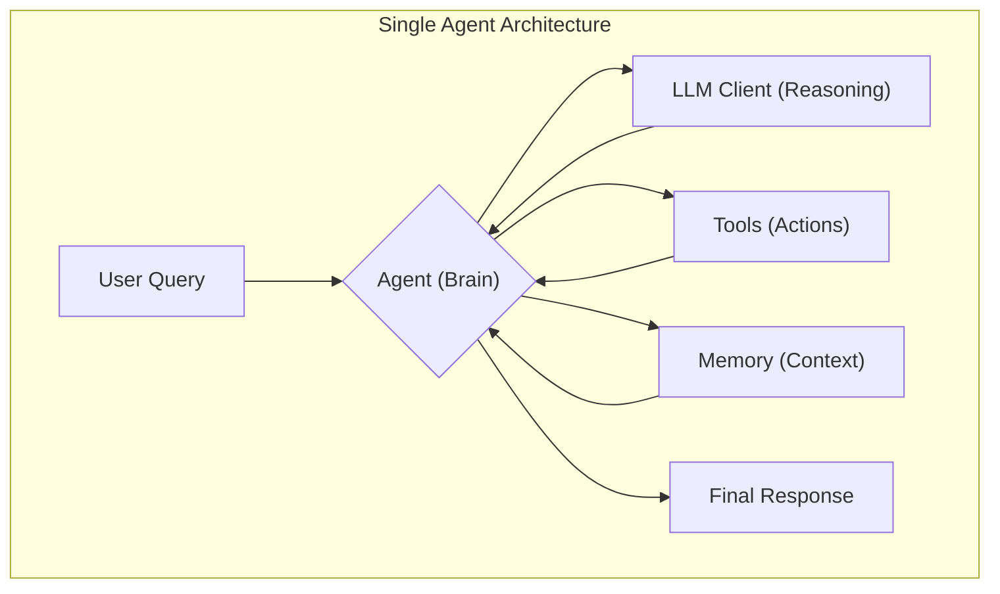
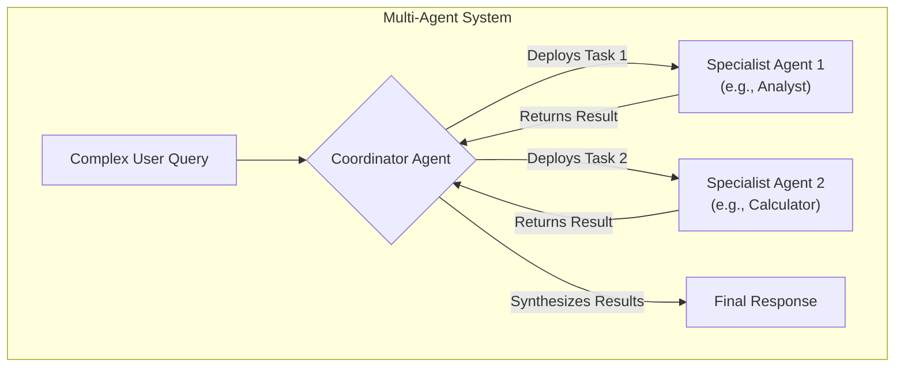

# Complete guide: creating AI agents with datapizzai

## Overview

This guide explains how to build and orchestrate AI agents using the `datapizzai` library (>= 3.0.8). The goal is to provide a clear understanding of how agents work, focusing on their configuration and interaction in complex systems.

For a comprehensive exploration of all features, the `Agents/agent_complete.py` file remains the complete reference.

## Table of contents

- [Environment setup](#environment-setup)
- [1. Create an agent](#1-create-an-agent)
  - [Input parameters](#input-parameters)
- [2. Run an agent](#2-run-an-agent)
- [3. Create a multi-agent system](#3-create-a-multi-agent-system)
- [4. Minimal working example](#4-minimal-working-example)
- [Additional information](#additional-information)

## Environment setup

Before you begin, you need to install the libraries and configure your credentials.

1.  **Installation**:
    ```bash
    pip install datapizzai python-dotenv
    ```

2.  **Credentials**:
    Create a `.env` file in the project root and enter your API keys.
    ```env
    # .env
    OPENAI_API_KEY="sk-..."
    GOOGLE_API_KEY="AIza..."
    # ...other keys...
    ```

## 1. Create an agent

An agent is an autonomous entity that uses a language model (LLM) to reason, use tools, and maintain conversational memory to solve problems.



Its creation requires configuring several parameters that define its behavior.

```python
from datapizzai.agents import Agent

agent = Agent(
    name="Calculation_Assistant",
    client=openai_client,
    system_prompt="You are an assistant specialized in mathematical calculations.",
    tools=[calculator_tool],
    max_steps=5,
    memory=conversational_memory,
    stateless=False,
    terminate_on_text=True,
    planning_interval=0,
)
```

### Input parameters

Each agent parameter has a specific role:

- `name` (`str`): An identifying name, useful for logging and in multi-agent systems.
- `client` (`Client`): The instance of the LLM client (e.g., `OpenAIClient`, `GoogleClient`) that the agent will use to "think". It is created via `ClientFactory`.
- `system_prompt` (`str`): The basic instructions that define the agent's personality, role, and directives. It is the most important element for guiding its behavior.
- `tools` (`List[Tool]`): A list of tools (Python functions decorated with `@tool`) that the agent can decide to use to perform actions (e.g., calculations, file searches, external APIs).
- `max_steps` (`int`): The maximum number of reasoning steps (thought -> action) the agent can take before stopping. Useful for preventing infinite loops.
- `memory` (`Memory`): A `Memory` instance to maintain the context of past conversations. If not provided, the agent operates without a memory of previous interactions.
- `stateless` (`bool`): If `True`, the memory is not automatically updated between `.run()` calls. It defaults to `False` when a memory is provided.
- `terminate_on_text` (`bool`): If `True`, the agent stops as soon as it produces a final text response, without attempting to use other tools.
- `planning_interval` (`int`): If set to a value `> 0`, the agent stops every `N` steps to review its action plan, improving effectiveness on complex tasks. `0` disables explicit planning.

## 2. Run an agent

Once configured, the agent can be run in different modes:

- **Synchronous**: A blocking execution that waits for the final response.
  ```python
  response = agent.run("Calculate 25 * 4 + 100")
  ```
- **Asynchronous**: For non-blocking I/O operations, ideal for web applications.
  ```python
  response = await agent.a_run("Explain what AI is")
  ```
- **Streaming**: Receives the response one piece at a time (chunk), showing both intermediate steps and the final text.
  ```python
  for chunk in agent.stream_invoke("Tell me a joke"):
      if isinstance(chunk, str):
          print("Final text:", chunk)
      else:
          print("Intermediate step:", type(chunk).__name__)
  ```

## 3. Create a multi-agent system

For complex problems, it is effective to combine multiple specialized agents. A "coordinator" agent receives the request, breaks it down, and delegates the sub-tasks to the most suitable agents.

This is achieved through the `can_call` parameter.



```python
# Agent 1: specialized in text analysis
analyst_agent = Agent(name="Analyst_Agent", tools=[text_analysis_tool], ...)

# Agent 2: specialized in calculations
calculator_agent = Agent(name="Calculator_Agent", tools=[calculator_tool], ...)

# Agent 3: coordinator
coordinator = Agent(
    name="Coordinator_Agent",
    system_prompt="Analyze the request and delegate to your specialized agents.",
    can_call=[analyst_agent, calculator_agent] # Can "call" the other two
)

# The coordinator decides who to assign tasks to
response = coordinator.run("Analyze the text 'AI is powerful' and calculate 1024 / 256")
```

- `can_call` (`List[Agent]`): Makes the agents in the list available as "tools" for the coordinator, who can then invoke them by passing a specific task.

## 4. Minimal working example

This complete and functional script shows how to create and use a basic agent. Make sure you have a `.env` file with your `OPENAI_API_KEY`.

```python
import os
from dotenv import load_dotenv
from datapizzai.clients import ClientFactory
from datapizzai.clients.factory import Provider
from datapizzai.tools import tool
from datapizzai.agents import Agent
from datapizzai.memory import Memory

# 1. Load environment variables (from .env file)
load_dotenv()

# 2. Define a simple tool
@tool(name="calculator", description="Performs mathematical calculations")
def calculator(expression: str) -> str:
    """Safely evaluates a mathematical expression."""
    try:
        allowed_chars = set('0123456789+-*/.() ')
        if not all(c in allowed_chars for c in expression):
            return "Error: invalid characters."
        return f"Result: {eval(expression)}"
    except Exception as e:
        return f"Calculation error: {str(e)}"

# 3. Configure the client for the LLM
try:
    api_key = os.getenv("OPENAI_API_KEY")
    if not api_key:
        raise ValueError("OPENAI_API_KEY not found. Check your .env file")

    client = ClientFactory.create(
        provider=Provider.OPENAI,
        api_key=api_key,
        model="gpt-4o",
    )
except ValueError as e:
    print(e)
    exit()

# 4. Create the agent
assistant_agent = Agent(
    name="AI_Assistant",
    client=client,
    system_prompt="You are an AI assistant. Use the calculator when necessary.",
    tools=[calculator],
    memory=Memory(),
    max_steps=3
)

# 5. Run the agent
query = "What is (100 + 50) / 2?"
print(f"Query: {query}")

response = assistant_agent.run(query)
print(f"Response: {response}")

```

## Additional information

- **Client and Tool**: For simplicity, this guide omits the detailed definition of `ClientFactory` and `@tool`. These components are essential, but their operation is similar to that seen in other guides. The `agent_complete.py` file contains complete implementations.
- **Troubleshooting**: If `MockClient` is activated, it means the API key was not found. Check that the `.env` file is present, readable, and that the variable name is correct.
