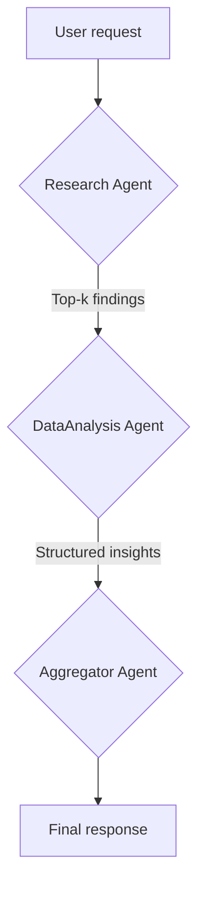
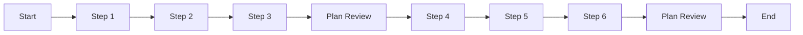

# Complete Guide: Building AI Agents with datapizzai

## Overview

This guide shows how to build and orchestrate AI agents using the `datapizzai` library (>= 3.0.8). The goal is a clear, hands‑on understanding of how agents work and interact in complex systems, with minimal, practical examples.

## Table of contents

- [1. Create an agent](#1-create-an-agent)
- [2. Run an agent](#2-run-an-agent)
- [3. Multi‑agent system](#3-multi-agent-system)
- [4. Planning interval](#4-planning-interval)

## 1. Create an agent

An agent is an autonomous entity that uses a LLM to reason, operate tools, and solve problems. Creating one means configuring the parameters that shape its behaviour.

```python
import os
from dotenv import load_dotenv
from datapizzai.clients import OpenAIClient
from datapizzai.tools import tool
from datapizzai.agents import Agent  # alternatively: from datapizzai.agents import Agent, ClientManager

load_dotenv()

# OpenAI client
openai_client = OpenAIClient(
    api_key=os.getenv("OPENAI_API_KEY"),
    model="gpt-4o",
    temperature=0.3,
)

# Tool
@tool
def get_weather(location: str, when: str) -> str:
    """Retrieves weather information for a specified location and time."""
    return "25 °C"

# Agent wired to the client
agent = Agent(
    name="WeatherAgent",
    client=openai_client,
    system_prompt="You are a weather assistant. Use tools when needed and reply in English.",
    tools=[get_weather],
    terminate_on_text=True,
)
response = agent.run("What will the weather be next Monday in Milan?")
print(response)
```

### Input parameters

Each agent parameter has a specific role:

- `name` (`str`): An identifying name, useful for logging and in multi-agent systems.
- `client` (`Client`): The instance of the LLM client (e.g., `OpenAIClient`, `GoogleClient`) that the agent will use to "think". It is created via `ClientFactory`.
- `system_prompt` (`str`): The basic instructions that define the agent's personality, role, and directives. It is the most important element for guiding its behavior.
- `tools` (`List[Tool]`): A list of tools (Python functions decorated with `@tool`) that the agent can decide to use to perform actions (e.g., calculations, file searches, external APIs).
- `max_steps` (`int`): The maximum number of reasoning steps (thought -> action) the agent can take before stopping. Useful for preventing infinite loops.
- `memory` (`Memory`): A `Memory` instance to maintain the context of past conversations. If not provided, the agent operates without a memory of previous interactions.
- `stateless` (`bool`): If `True`, the memory is not automatically updated between `.run()` calls. It defaults to `False` when a memory is provided.
- `terminate_on_text` (`bool`): If `True`, the agent stops as soon as it produces a final text response, without attempting to use other tools.
- `planning_interval` (`int`): If set to a value `> 0`, the agent stops every `N` steps to review its action plan, improving effectiveness on complex tasks. `0` disables explicit planning.

## 2. Run an agent

Once configured, the agent can be run in different modes:

- **Synchronous**: A blocking execution that waits for the final response.
  ```python
  response = agent.run("Calculate 25 * 4 + 100")
  ```
- **Asynchronous**: For non-blocking I/O operations, ideal for web applications.
  ```python
  response = await agent.a_run("Explain what AI is")
  ```
- **Streaming**: Receives the response one piece at a time (chunk), showing both intermediate steps and the final text.
  ```python
  for chunk in agent.stream_invoke("Tell me a joke"):
      if isinstance(chunk, str):
          print("Final text:", chunk)
      else:
          print("Intermediate step:", type(chunk).__name__)
  ```

## 3. Multi‑agent system

For complex problems it is useful to orchestrate specialised agents. In the following pipeline a "Research" agent collects the top findings, a "DataAnalysis" agent extracts the core insights, and an "Aggregator" drafts the final answer.



```python
import os
from dotenv import load_dotenv

from datapizzai.agents import Agent
from datapizzai.clients import ClientFactory
from datapizzai.tools import tool

load_dotenv()

base_client = ClientFactory.create(
    provider="openai",
    api_key=os.getenv("OPENAI_API_KEY"),
    model="gpt-4o-mini",
    temperature=0.4,
)

@tool
def fetch_research(topic: str, top_k: int = 3) -> str:
    """Returns a shortlist of top_k relevant findings for the requested topic."""
    return (
        "1. ESA study on nanosatellites\n"
        "2. NASA report on electric propulsion\n"
        "3. IEEE article on commercial constellations"
    )

@tool
def analyse_findings(items: str) -> str:
    """Analyses the supplied findings and surfaces metrics plus key risks."""
    return (
        "Summary: investments up 45% YoY;"
        " key risks: orbital congestion, debris management."
    )

research_agent = Agent(
    name="Research",
    client=base_client,
    system_prompt=(
        "You make go/no-go decisions for the discovery phase.\n"
        "Use the fetch_research tool to collect sources and always return exactly top_k numbered"
        " items with a short justification."
    ),
    tools=[fetch_research],
    terminate_on_text=True,
)

analysis_agent = Agent(
    name="DataAnalysis",
    client=base_client,
    system_prompt=(
        "You receive the shortlist from the Research agent.\n"
        "Use analyse_findings to produce quantitative insights and concise operational advice."
    ),
    tools=[analyse_findings],
    terminate_on_text=True,
)

aggregator_agent = Agent(
    name="Aggregator",
    client=base_client,
    system_prompt=(
        "Coordinate the pipeline.\n"
        "1) Ask Research for the relevant top_k findings.\n"
        "2) Hand the list to DataAnalysis for processing.\n"
        "3) Deliver the final answer, citing decisions and suggested next steps."
    ),
    can_call=[research_agent, analysis_agent],
    terminate_on_text=True,
)

prompt = "Update the team on the latest cubesat developments for telecommunications."
final_answer = aggregator_agent.run(prompt)
print(final_answer)
```

- `can_call` (`List[Agent]`): makes the listed agents available as "tools" for the aggregator, which delegates specific subtasks to them.

## 4. Planning interval

With `planning_interval=N` the agent reviews its plan every N steps. Useful for long/branched tasks.

```python
from datapizzai.agents import Agent

agent = Agent(
    client=client,
    planning_interval=3,  # plan every 3 steps
)

response = agent.run("Write a plan to migrate a monolith to microservices and estimate the effort")
print(response)
```

Conceptual execution (planning every 3 steps):


<!--
## Additional information

- The `agent_complete.py` file contains complete implementations and advanced scenarios.
-->
