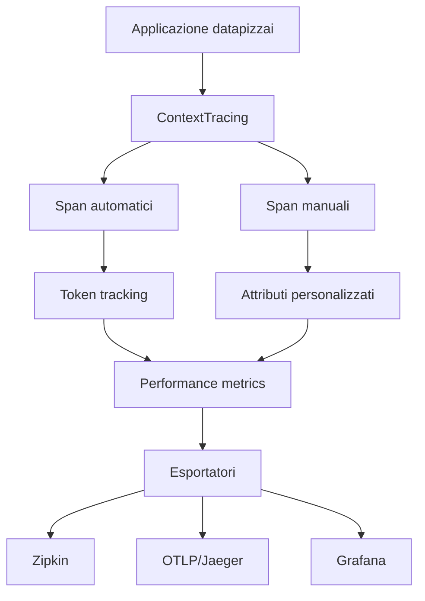

# Monitoring con datapizzai

Questa cartella contiene guide ed esempi completi per implementare il monitoring con la libreria datapizzai.

## File disponibili

### Guide

- **`README_MONITORING_GUIDE.md`** - Guida completa in italiano
- **`README_MONITORING_GUIDE_EV.md`** - Guida completa in inglese

### Esempi

- **`monitoring_complete_example.py`** - Esempio pratico funzionante
- **`.env.example`** - Template di configurazione

## Quick start

### 1. Installazione dipendenze

```bash
pip install datapizzai opentelemetry-api opentelemetry-sdk
pip install opentelemetry-exporter-zipkin opentelemetry-exporter-otlp
pip install psutil python-dotenv
```

### 2. Configurazione

```bash
cp .env.example .env
# Modifica .env con le tue API keys
```

### 3. Esecuzione esempio

```bash
python monitoring_complete_example.py
```

## Funzionalità dimostrate

L'esempio pratico dimostra:

- ✅ Tracing automatico dei client datapizzai
- ✅ Creazione manuale di span personalizzati
- ✅ Attributi personalizzati negli span
- ✅ Monitoring delle performance
- ✅ Integrazione con esportatori esterni (Zipkin, OTLP)
- ✅ Report dettagliati delle metriche
- ✅ Gestione errori nel monitoring

## Integrazione con sistemi esterni

### Zipkin

Per visualizzare i trace in Zipkin:

1. Avvia Zipkin: `docker run -d -p 9411:9411 openzipkin/zipkin`
2. Configura `ZIPKIN_ENDPOINT=http://localhost:9411/api/v2/spans`
3. Visualizza su http://localhost:9411

### Grafana + Tempo

Per monitoring avanzato con Grafana:

1. Usa il docker-compose.yml nelle guide
2. Configura `OTLP_ENDPOINT=http://localhost:4317`
3. Visualizza su http://localhost:3000

## Struttura del monitoring



## Metriche tracciate

Il sistema di monitoring traccia automaticamente:

- **Token usage**: prompt, completion, cached tokens
- **Performance**: durata operazioni, throughput
- **Memory**: utilizzo memoria dell'applicazione  
- **Errors**: rate di errore e dettagli
- **Custom**: attributi personalizzati per span

## Support

Per domande o problemi:
- Consulta le guide complete
- Controlla i log dell'esempio
- Verifica la configurazione delle variabili d'ambiente
