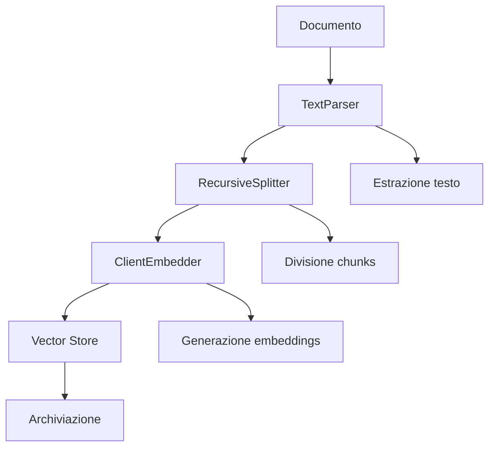
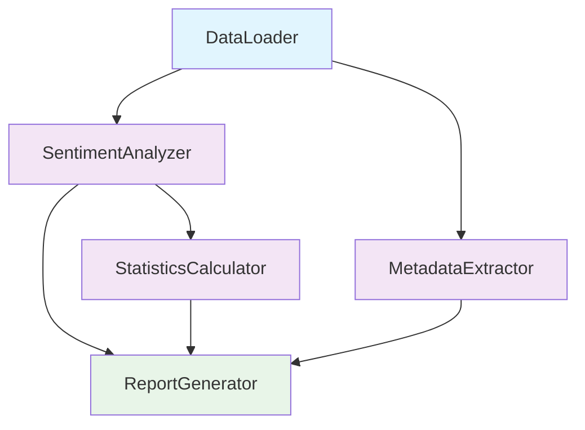
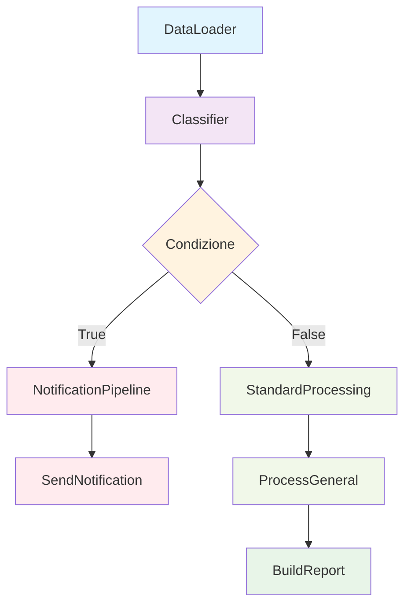

# Guida alle pipeline DatapizzAI

Questa guida fornisce esempi pratici per utilizzare le tre tipologie di pipeline disponibili in DatapizzAI:

- **IngestionPipeline**: per processare e ingerire documenti in vector stores
- **DagPipeline**: per creare grafi di dipendenze tra componenti  
- **FunctionalPipeline**: per pipeline funzionali con branching, cicli e dipendenze

## Indice

- [1. Ingestion pipeline](#1-ingestion-pipeline)
  - [Descrizione](#descrizione)
  - [Componenti principali](#componenti-principali)
  - [Esempio pratico](#esempio-pratico)
  - [Diagramma di flusso](#diagramma-di-flusso)
  - [Script completo](#script-completo)
- [2. Dag pipeline](#2-dag-pipeline)
  - [Descrizione](#descrizione-1)
  - [Caratteristiche principali](#caratteristiche-principali)
  - [Esempio pratico](#esempio-pratico-1)
  - [Diagramma di flusso](#diagramma-di-flusso-1)
  - [Script completo](#script-completo-1)
- [3. Functional pipeline](#3-functional-pipeline)
  - [Descrizione](#descrizione-2)
  - [Caratteristiche avanzate](#caratteristiche-avanzate)
  - [Esempio pratico](#esempio-pratico-2)
  - [Diagramma di flusso](#diagramma-di-flusso-2)
  - [Script completo](#script-completo-2)
- [Configurazione YAML](#configurazione-yaml)
  - [Esempio per DagPipeline](#esempio-per-dagpipeline)
  - [Esempio per FunctionalPipeline](#esempio-per-functionalpipeline)
- [Confronto delle pipeline](#confronto-delle-pipeline)
- [Best practices](#best-practices)
  - [Scelta della pipeline](#scelta-della-pipeline)
  - [Gestione degli errori](#gestione-degli-errori)
  - [Performance](#performance)
- [Esempi completi](#esempi-completi)

## 1. Ingestion pipeline

### Descrizione

L'IngestionPipeline è progettata per processare documenti e ingerirli in vector stores. È ideale per costruire knowledge bases e sistemi RAG.

### Componenti principali

- **Parser**: estrazione del contenuto dai documenti
- **Splitter**: divisione del contenuto in chunks
- **Embedder**: generazione di embeddings vettoriali
- **Vector store**: archiviazione dei chunks con embeddings

### Esempio pratico

```python
from datapizzai.pipeline import IngestionPipeline
from datapizzai.modules.parsers import TextParser
from datapizzai.modules.splitters import RecursiveSplitter
from datapizzai.embedders import ClientEmbedder
from datapizzai.clients import OpenAIClient

# Configura componenti
client = OpenAIClient(api_key="your_key", model="gpt-4o-mini")
components = [
    TextParser(),
    RecursiveSplitter(chunk_size=200, chunk_overlap=50),
    ClientEmbedder(client=client, model="text-embedding-3-small")
]

# Crea pipeline
pipeline = IngestionPipeline(modules=components)

# Esegui processamento
chunks = pipeline.run("documento.txt", metadata={"source": "esempio"})
```

### Diagramma di flusso



### Script completo

Vedi `examples/ingestion_example.py` per un esempio completo funzionante.

## 2. Dag pipeline

### Descrizione

La DagPipeline permette di creare grafi di dipendenze (DAG - Directed Acyclic Graph) tra componenti, dove ogni nodo può dipendere dai risultati di nodi precedenti.

### Caratteristiche principali

- **Nodi**: componenti che eseguono operazioni specifiche
- **Connessioni**: definiscono le dipendenze tra nodi
- **Esecuzione parallela**: nodi indipendenti vengono eseguiti in parallelo
- **Gestione degli errori**: propagazione controllata degli errori nel grafo

### Esempio pratico

```python
from datapizzai.pipeline import DagPipeline
from datapizzai.core.models import PipelineComponent

class DataLoader(PipelineComponent):
    def run(self, **kwargs):
        return {"data": ["testo1", "testo2", "testo3"]}

class SentimentAnalyzer(PipelineComponent):
    def run(self, data, **kwargs):
        # Logica di analisi sentiment
        return {"results": [{"text": t, "sentiment": "positive"} for t in data]}

# Crea pipeline DAG
pipeline = DagPipeline()
pipeline.add_module("loader", DataLoader())
pipeline.add_module("analyzer", SentimentAnalyzer())

# Definisci connessioni
pipeline.connect(
    source_node="loader",
    target_node="analyzer",
    source_key="data",
    target_key="data"
)

# Esegui
results = pipeline.run({})
```

### Diagramma di flusso



### Script completo

Vedi `examples/dag_example.py` per un esempio di analisi sentiment con grafo delle dipendenze.

## 3. Functional pipeline

### Descrizione

La FunctionalPipeline offre un approccio funzionale alla costruzione di pipeline con supporto per branching condizionale, cicli e dipendenze complesse.

### Caratteristiche avanzate

- **Branching**: esecuzione condizionale di sottopipeline
- **Foreach**: iterazione su collezioni di dati
- **Dipendenze**: gestione esplicita delle dipendenze tra nodi
- **Composizione**: combinazione di pipeline complesse

### Esempio pratico

```python
from datapizzai.pipeline import FunctionalPipeline, Dependency

# Sottopipeline per notifiche
notification_pipeline = FunctionalPipeline().run(
    name="notify",
    node=NotificationSender()
)

# Pipeline principale con branching
pipeline = (
    FunctionalPipeline()
    .run(name="load", node=DataLoader())
    .then(name="classify", node=Classifier(), target_key="data")
    .branch(
        condition=lambda ctx: ctx.get("classify", {}).get("has_urgent", False),
        dependencies=[Dependency(node_name="classify")],
        if_true=notification_pipeline,
        if_false=standard_processing_pipeline
    )
)

# Esegui
results = pipeline.execute()
```

### Diagramma di flusso



### Script completo

Vedi `examples/functional_example.py` per un esempio completo con branching e foreach.

## Configurazione YAML

Tutte le pipeline supportano la configurazione tramite file YAML per maggiore flessibilità e riutilizzo.

### Esempio per DagPipeline

```yaml
dag_pipeline:
  clients:
    openai_client:
      provider: "openai"
      api_key: "${OPENAI_API_KEY}"
      model: "gpt-4o-mini"
  
  modules:
    - name: "data_loader"
      module: "mymodules.loaders"
      type: "CSVLoader"
      params:
        file_path: "data.csv"
    
    - name: "analyzer"
      module: "mymodules.analysis"
      type: "TextAnalyzer"
      params:
        client: "openai_client"
  
  connections:
    - from: "data_loader"
      to: "analyzer"
      source_key: "data"
      target_key: "texts"
```

### Esempio per FunctionalPipeline

```yaml
modules:
  - name: "loader"
    module: "mymodules.loaders"
    type: "DocumentLoader"
  
  - name: "processor"
    module: "mymodules.processors"  
    type: "TextProcessor"

pipeline:
  - type: "run"
    name: "load_data"
    node: "loader"
  
  - type: "then"
    name: "process"
    node: "processor"
    target_key: "documents"
    dependencies:
      - node_name: "load_data"
```

## Confronto delle pipeline

| Caratteristica | IngestionPipeline | DagPipeline | FunctionalPipeline |
|---------------|-------------------|-------------|-------------------|
| **Caso d'uso** | Processamento documenti | Grafi dipendenze | Pipeline complesse |
| **Complessità** | Bassa | Media | Alta |
| **Branching** | No | No | Sì |
| **Cicli** | No | No | Sì (foreach) |
| **Parallellismo** | Sequenziale | Automatico | Controllato |
| **Vector store** | Integrato | Manuale | Manuale |

## Best practices

### Scelta della pipeline

- **IngestionPipeline**: per RAG, knowledge bases, processamento documenti
- **DagPipeline**: per workflow con dipendenze complesse, analisi multi-step  
- **FunctionalPipeline**: per logica di business complessa, routing condizionale

### Gestione degli errori

```python
# Sempre gestire eccezioni nei componenti
class SafeProcessor(PipelineComponent):
    def run(self, **kwargs):
        try:
            return self.process_data(kwargs)
        except Exception as e:
            return {"error": str(e), "success": False}
```

### Performance

- Usa componenti asincroni quando possibile
- Minimizza le dipendenze nelle DagPipeline
- Cache risultati intermedi per pipeline complesse

## Esempi completi

Gli script di esempio completi e funzionanti sono disponibili in:

- `examples/ingestion_example.py`
- `examples/dag_example.py`  
- `examples/functional_example.py`

Ogni script include dati di esempio e può essere eseguito direttamente per testare le funzionalità.
