# Guida alle pipeline Datapizza-AI

Questa guida fornisce esempi pratici per utilizzare le tre tipologie di pipeline disponibili in Datapizza-AI:

- **IngestionPipeline**: per processare e ingerire documenti in vector stores
- **DagPipeline**: per creare grafi di dipendenze tra componenti  
- **FunctionalPipeline**: per pipeline funzionali con branching, cicli e dipendenze

## Indice

- [1. Ingestion pipeline](#1-ingestion-pipeline)
  - [Descrizione](#descrizione)
  - [Componenti principali](#componenti-principali)
  - [Esempio pratico](#esempio-pratico)
  - [Diagramma di flusso](#diagramma-di-flusso)
- [2. Dag pipeline](#2-dag-pipeline)
  - [Descrizione](#descrizione-1)
  - [Caratteristiche principali](#caratteristiche-principali)
  - [Esempio pratico](#esempio-pratico-1)
  - [Diagramma di flusso](#diagramma-di-flusso-1)
- [3. Functional pipeline](#3-functional-pipeline)
  - [Descrizione](#descrizione-2)
  - [Caratteristiche avanzate](#caratteristiche-avanzate)
  - [Esempio pratico](#esempio-pratico-2)
  - [Diagramma di flusso](#diagramma-di-flusso-2)
- [Configurazione YAML](#configurazione-yaml)
  - [Esempio configurazione YAML](#esempio-configurazione-yaml)
  - [Utilizzo da Python](#utilizzo-da-python)
- [Confronto delle pipeline](#confronto-delle-pipeline)

## 1. Ingestion pipeline

### Descrizione

L'IngestionPipeline è progettata per processare documenti e ingerirli in vector stores. È ideale per costruire knowledge bases e sistemi RAG.

### Componenti principali

- **Parser**: estrazione del contenuto dai documenti
- **Splitter**: divisione del contenuto in chunks
- **Embedder**: generazione di embeddings vettoriali
- **Vector store**: archiviazione dei chunks con embeddings

### Esempio pratico

```python
import os
from dotenv import load_dotenv

load_dotenv()

from datapizza.clients import OpenAIClient

class FileReader(PipelineComponent):
    def _run(self, file_path: str, **kwargs) -> str:
        with open(file_path, 'r', encoding='utf-8') as f:
            return f.read()
    
    async def _a_run(self, file_path: str, **kwargs) -> str:
        with open(file_path, 'r', encoding='utf-8') as f:
            return f.read()

client = OpenAIClient(
    api_key=os.getenv("OPENAI_API_KEY"), 
    model="text-embedding-3-small"
)

components = [
    FileReader(),
    TextSplitter(
        max_char=200,
        overlap=50
    ),
    NodeEmbedder(
        client=client,
        model_name="text-embedding-3-small"
    )
]

pipeline = IngestionPipeline(
    modules=components,
    vector_store=None,
    collection_name=None
)

chunks = pipeline.run(
    file_path="document.txt",
    metadata={"source": "esempio"}
)

print(f"Generati {len(chunks)} chunks dal documento")
```

### Note importanti

Ci sono alcune precisazioni che pensiamo siano importanti prima di procedere alla prossima tipologia di Pipeline:
- **NodeEmbedder vs ClientEmbedder**: usa `NodeEmbedder` nelle pipeline perché lavora con liste di oggetti `Chunk`. `ClientEmbedder` è per singole stringhe.
- **Metadata**: vengono applicati dall'`IngestionPipeline.run()` dopo la creazione dei chunks, non durante lo splitting
- **Embeddings**: `NodeEmbedder` aggiunge gli embeddings agli oggetti `Chunk` esistenti, non crea nuovi oggetti

### Diagramma di flusso




## 2. Dag pipeline

### Descrizione

La DagPipeline permette di creare grafi di dipendenze (DAG - Directed Acyclic Graph) tra componenti, dove ogni nodo può dipendere dai risultati di nodi precedenti.

### Caratteristiche principali

- **Nodi**: componenti che eseguono operazioni specifiche
- **Connessioni**: definiscono le dipendenze tra nodi
- **Esecuzione parallela**: nodi indipendenti vengono eseguiti in parallelo
- **Gestione degli errori**: propagazione controllata degli errori nel grafo

### Esempio pratico

```python

class DataLoader(PipelineComponent):
    def _run(self, **kwargs):
        return {"reviews": ["Prodotto eccellente!", "Non mi piace", "Nella media"]}
    async def _a_run(self, **kwargs):
        return self._run(**kwargs)

class SentimentAnalyzer(PipelineComponent):
    def _run(self, reviews, **kwargs):
        analyzed = [{"text": r, "sentiment": "positive" if "eccellente" in r else "negative" if "non" in r.lower() else "neutral"} for r in reviews]
        return {"sentiment_results": analyzed}
    async def _a_run(self, reviews, **kwargs):
        return self._run(reviews=reviews, **kwargs)

class StatisticsCalculator(PipelineComponent):
    def _run(self, sentiment_results, **kwargs):
        sentiments = [r["sentiment"] for r in sentiment_results]
        stats = {
            "positive": sentiments.count("positive"),
            "negative": sentiments.count("negative"), 
            "neutral": sentiments.count("neutral")
        }
        return {"statistics": stats}
    async def _a_run(self, sentiment_results, **kwargs):
        return self._run(sentiment_results=sentiment_results, **kwargs)

class MetadataExtractor(PipelineComponent):
    def _run(self, reviews, **kwargs):
        metadata = {
            "total_reviews": len(reviews),
            "avg_length": sum(len(r) for r in reviews) / len(reviews),
            "timestamp": "2025-09-15"
        }
        return {"metadata": metadata}
    async def _a_run(self, reviews, **kwargs):
        return self._run(reviews=reviews, **kwargs)

class ReportGenerator(PipelineComponent):
    def _run(self, sentiment_results, statistics, metadata, **kwargs):
        report = f"""
REPORT ANALISI - {metadata['timestamp']}
Recensioni totali: {metadata['total_reviews']}
Lunghezza media: {metadata['avg_length']:.1f}

SENTIMENT:
- Positive: {statistics['positive']}
- Negative: {statistics['negative']}
- Neutral: {statistics['neutral']}

DETTAGLI:
{chr(10).join(f"- {r['text']}: {r['sentiment']}" for r in sentiment_results)}
        """
        return {"final_report": report.strip()}
    async def _a_run(self, sentiment_results, statistics, metadata, **kwargs):
        return self._run(sentiment_results=sentiment_results, statistics=statistics, metadata=metadata, **kwargs)

pipeline = DagPipeline()

pipeline.add_module("data_loader", DataLoader())
pipeline.add_module("sentiment_analyzer", SentimentAnalyzer())
pipeline.add_module("statistics_calculator", StatisticsCalculator())
pipeline.add_module("metadata_extractor", MetadataExtractor())
pipeline.add_module("report_generator", ReportGenerator())

pipeline.connect(
    source_node="data_loader",
    target_node="sentiment_analyzer",
    source_key="reviews",
    target_key="reviews"
)

pipeline.connect(
    source_node="sentiment_analyzer",
    target_node="statistics_calculator",
    source_key="sentiment_results",
    target_key="sentiment_results"
)

pipeline.connect(
    source_node="data_loader",
    target_node="metadata_extractor",
    source_key="reviews",
    target_key="reviews"
)

pipeline.connect(
    source_node="sentiment_analyzer",
    target_node="report_generator",
    source_key="sentiment_results",
    target_key="sentiment_results"
)

pipeline.connect(
    source_node="statistics_calculator",
    target_node="report_generator", 
    source_key="statistics",
    target_key="statistics"
)

pipeline.connect(
    source_node="metadata_extractor",
    target_node="report_generator",
    source_key="metadata",
    target_key="metadata"
)

results = pipeline.run({})
print(results["report_generator"]["final_report"])
```

### Diagramma di flusso




## 3. Functional pipeline

### Descrizione

La FunctionalPipeline offre un approccio funzionale alla costruzione di pipeline con supporto per branching condizionale, cicli e dipendenze complesse.

### Caratteristiche avanzate

- **Branching**: esecuzione condizionale di sottopipeline
- **Foreach**: iterazione su collezioni di dati
- **Dipendenze**: gestione esplicita delle dipendenze tra nodi
- **Composizione**: combinazione di pipeline complesse

### Esempio pratico

```python

class DataLoader(PipelineComponent):
    def _run(self, **kwargs):
        documents = [
            {"id": 1, "title": "Bug Critical", "content": "Sistema in crash", "priority": "urgent"},
            {"id": 2, "title": "Feature Request", "content": "Nuova funzionalità", "priority": "normal"},
            {"id": 3, "title": "Security Issue", "content": "Vulnerabilità trovata", "priority": "urgent"}
        ]
        return {"documents": documents}
    async def _a_run(self, **kwargs):
        return self._run(**kwargs)

class Classifier(PipelineComponent):
    def _run(self, documents, **kwargs):
        if isinstance(documents, dict) and "documents" in documents:
            documents = documents["documents"]
        elif documents is None:
            documents = []
        
        urgent_docs = [d for d in documents if isinstance(d, dict) and d.get("priority") == "urgent"]
        has_urgent = len(urgent_docs) > 0
        
        return {
            "classified_documents": documents,
            "urgent_documents": urgent_docs,
            "has_urgent": has_urgent
        }
    async def _a_run(self, documents, **kwargs):
        return self._run(documents=documents, **kwargs)

class NotificationSender(PipelineComponent):
    def _run(self, **kwargs):
        return {
            "notification_sent": True,
            "message": "⚠️ Documenti urgenti rilevati! Notifica inviata al team.",
            "timestamp": "2025-09-15T10:00:00Z"
        }
    async def _a_run(self, **kwargs):
        return self._run(**kwargs)

class DocumentProcessor(PipelineComponent):
    def _run(self, document, **kwargs):
        processed = {
            **document,
            "processed": True,
            "word_count": len(document["content"].split()),
            "processing_time": "2025-09-15T10:00:00Z"
        }
        return processed
    async def _a_run(self, document, **kwargs):
        return self._run(document=document, **kwargs)

class ReportGenerator(PipelineComponent):
    def _run(self, classified_documents, **kwargs):
        total = len(classified_documents)
        urgent_count = sum(1 for d in classified_documents if d.get("priority") == "urgent")
        normal_count = total - urgent_count
        
        report = f"""
DOCUMENTO ANALYSIS REPORT
========================
Totale documenti: {total}
Documenti urgenti: {urgent_count}
Documenti normali: {normal_count}

DETTAGLI:
{chr(10).join(f"- {d['title']}: {d['priority']}" for d in classified_documents)}
        """
        
        return {
            "final_report": report.strip(),
            "statistics": {
                "total": total,
                "urgent": urgent_count,
                "normal": normal_count
            }
        }
    async def _a_run(self, classified_documents, **kwargs):
        return self._run(classified_documents=classified_documents, **kwargs)

notification_pipeline = FunctionalPipeline().run(
    name="send_notification",
    node=NotificationSender()
)

standard_processing_pipeline = (
    FunctionalPipeline()
    .foreach(
        name="process_documents",
        dependencies=[Dependency(node_name="classified_documents", target_key=None)],
        do=DocumentProcessor()
    )
    .then(
        name="generate_report",
        node=ReportGenerator(),
        target_key="classified_documents",
        dependencies=[Dependency(node_name="classify", target_key="classified_documents")]
    )
)

pipeline = (
    FunctionalPipeline()
    .run(
        name="load_data", 
        node=DataLoader()
    )
    .then(
        name="classify",
        node=Classifier(),
        target_key="documents"
    )
    .branch(
        condition=lambda ctx: ctx.get("classify", {}).get("has_urgent", False),
        dependencies=[Dependency(node_name="classify")],
        if_true=notification_pipeline,
        if_false=standard_processing_pipeline
    )
)

results = pipeline.execute()

if "send_notification" in results:
    print("BRANCH URGENTE ESEGUITO:")
    print(results["send_notification"]["message"])
else:
    print("BRANCH STANDARD ESEGUITO:")
    print(results["generate_report"]["final_report"])
```

### Note sul flusso dati

- **Passaggio dati**: nella FunctionalPipeline, `target_key="documents"` passa l'INTERO risultato del nodo precedente (es. `{"documents": [...]}`) al parametro `documents` del nodo successivo
- **Gestione input**: i componenti devono gestire sia dizionari che liste come input per essere flessibili
- **Context access**: usa `lambda ctx: ctx.get("node_name", {}).get("key")` per accedere ai dati nel branching

### Diagramma di flusso




## Configurazione YAML

Tutte le pipeline supportano la configurazione tramite file YAML per maggiore flessibilità e riutilizzo.


### Esempio configurazione YAML

Esempio di configurazione YAML per la functional pipeline con branching condizionale:

```yaml
name: "document_processing_pipeline"
description: "Pipeline funzionale con branching condizionale"

steps:
  - name: "load_data"
    component: "DataLoader"
  - name: "classify"  
    component: "Classifier"
    depends_on: "load_data"
    input_key: "documents"
  - name: "notification_branch"
    type: "conditional_branch"
    condition: "has_urgent_documents"  
    depends_on: "classify"
    if_true:
      - name: "send_notification"
        component: "NotificationSender"
    if_false:
      - name: "process_documents"
        component: "DocumentProcessor"
        type: "foreach"
      - name: "generate_report"
        component: "ReportGenerator"

components:
  DataLoader:
    class: "pipeline_components.DataLoader"
    output_keys: ["documents"]
  Classifier:
    class: "pipeline_components.Classifier" 
    output_keys: ["classified_documents", "has_urgent"]
  NotificationSender:
    class: "pipeline_components.NotificationSender"
  DocumentProcessor:
    class: "pipeline_components.DocumentProcessor"
  ReportGenerator:
    class: "pipeline_components.ReportGenerator"
```

Vedi `functional_pipeline_example.yaml` per il file di configurazione completo con tutti i parametri e dati di esempio.

### Utilizzo da Python

Per utilizzare la configurazione YAML da Python:

```python

pipeline = FunctionalPipeline.from_yaml("functional_pipeline_example.yaml")

results = pipeline.execute()

if "send_notification" in results:
    print("BRANCH URGENTE ESEGUITO:")
    print(results["send_notification"]["message"])
else:
    print("BRANCH STANDARD ESEGUITO:")
    print(results["generate_report"]["final_report"])
```


## Confronto delle pipeline

| Caratteristica | IngestionPipeline | DagPipeline | FunctionalPipeline |
|---------------|-------------------|-------------|-------------------|
| **Caso d'uso** | Processamento documenti | Grafi dipendenze | Pipeline complesse |
| **Complessità** | Bassa | Media | Alta |
| **Branching** | No | No | Sì |
| **Cicli** | No | No | Sì (foreach) |
| **Parallellismo** | Sequenziale | Automatico | Controllato |
| **Vector store** | Integrato | Manuale | Manuale |
