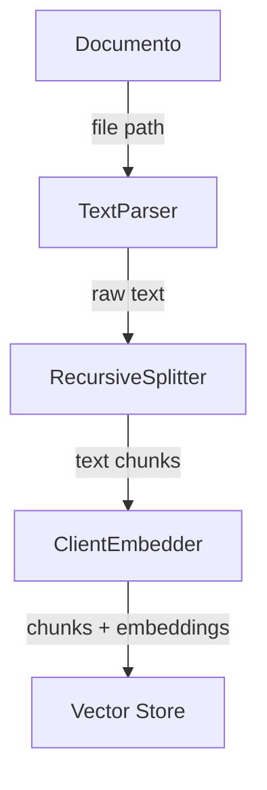
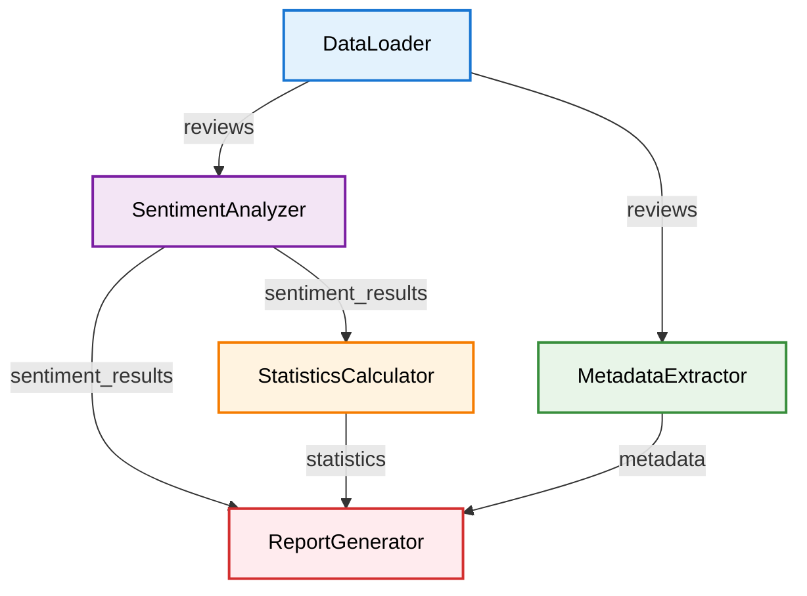
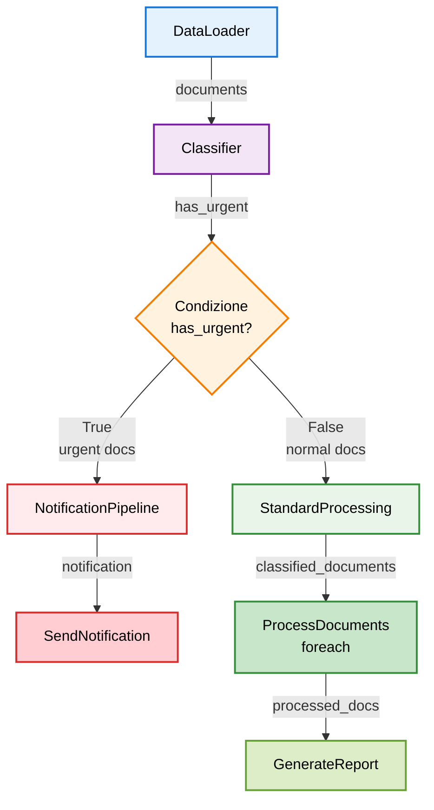

# Guida alle pipeline DatapizzAI

Questa guida fornisce esempi pratici per utilizzare le tre tipologie di pipeline disponibili in DatapizzAI:

- **IngestionPipeline**: per processare e ingerire documenti in vector stores
- **DagPipeline**: per creare grafi di dipendenze tra componenti  
- **FunctionalPipeline**: per pipeline funzionali con branching, cicli e dipendenze

## Indice

- [1. Ingestion pipeline](#1-ingestion-pipeline)
  - [Descrizione](#descrizione)
  - [Componenti principali](#componenti-principali)
  - [Esempio pratico](#esempio-pratico)
  - [Diagramma di flusso](#diagramma-di-flusso)
  - [Script completo](#script-completo)
- [2. Dag pipeline](#2-dag-pipeline)
  - [Descrizione](#descrizione-1)
  - [Caratteristiche principali](#caratteristiche-principali)
  - [Esempio pratico](#esempio-pratico-1)
  - [Diagramma di flusso](#diagramma-di-flusso-1)
  - [Script completo](#script-completo-1)
- [3. Functional pipeline](#3-functional-pipeline)
  - [Descrizione](#descrizione-2)
  - [Caratteristiche avanzate](#caratteristiche-avanzate)
  - [Esempio pratico](#esempio-pratico-2)
  - [Diagramma di flusso](#diagramma-di-flusso-2)
  - [Script completo](#script-completo-2)
- [Configurazione YAML](#configurazione-yaml)
  - [Esempio per DagPipeline](#esempio-per-dagpipeline)
  - [Esempio per FunctionalPipeline](#esempio-per-functionalpipeline)
- [Confronto delle pipeline](#confronto-delle-pipeline)
- [Best practices](#best-practices)
  - [Scelta della pipeline](#scelta-della-pipeline)
  - [Gestione degli errori](#gestione-degli-errori)
  - [Performance](#performance)
- [Esempi completi](#esempi-completi)

## 1. Ingestion pipeline

### Descrizione

L'IngestionPipeline è progettata per processare documenti e ingerirli in vector stores. È ideale per costruire knowledge bases e sistemi RAG.

### Componenti principali

- **Parser**: estrazione del contenuto dai documenti
- **Splitter**: divisione del contenuto in chunks
- **Embedder**: generazione di embeddings vettoriali
- **Vector store**: archiviazione dei chunks con embeddings

### Esempio pratico

```python
import os
from datapizzai.pipeline import IngestionPipeline
from datapizzai.modules.splitters import TextSplitter
from datapizzai.embedders import NodeEmbedder
from datapizzai.clients import OpenAIClient
from datapizzai.core.models import PipelineComponent

# Componente personalizzato per leggere file di testo
class FileReader(PipelineComponent):
    def _run(self, file_path: str, **kwargs) -> str:
        with open(file_path, 'r', encoding='utf-8') as f:
            return f.read()
    
    async def _a_run(self, file_path: str, **kwargs) -> str:
        with open(file_path, 'r', encoding='utf-8') as f:
            return f.read()

# 1. Configura client per embeddings  
client = OpenAIClient(
    api_key=os.getenv("OPENAI_API_KEY"), 
    model="text-embedding-3-small"  # Modello per embeddings
)

# 2. Definisci componenti della pipeline in ordine di esecuzione
components = [
    FileReader(),          # Legge il contenuto del file
    TextSplitter(
        max_char=200,      # Dimensione massima di ogni chunk in caratteri
        overlap=50         # Sovrapposizione tra chunks consecutivi
    ),
    NodeEmbedder(
        client=client,                    # Client per generare embeddings
        model_name="text-embedding-3-small"  # Nome del modello embedding
    )
]

# 3. Crea pipeline senza vector store (restituisce chunks processati)
pipeline = IngestionPipeline(
    modules=components,    # Lista dei componenti da eseguire
    vector_store=None,     # None = non salva automaticamente
    collection_name=None   # Nome collezione nel vector store (non usato se vector_store=None)
)

# 4. Esegui processamento con metadata opzionale
chunks = pipeline.run(
    file_path="documento.txt",           # Percorso del documento da processare
    metadata={"source": "esempio"}      # Metadata aggiuntivo da allegare ai chunks (OPZIONALE)
)

# Il risultato è una lista di oggetti Chunk con testo, embeddings e metadata
print(f"Generati {len(chunks)} chunks dal documento")
```

### Parametri dettagliati

- **max_char**: numero massimo di caratteri per chunk. Chunks più piccoli = maggiore precisione, più chunks
- **overlap**: caratteri condivisi tra chunks consecutivi per mantenere contesto
- **metadata**: dizionario opzionale allegato a tutti i chunks dal metodo `run()`. Utile per tracciare fonte, data, categoria, etc.
- **model_name**: nome del modello embedding da usare (deve essere supportato dal client)
- **vector_store**: se `None` restituisce i chunks processati, altrimenti li salva automaticamente nel database
- **collection_name**: obbligatorio solo se si specifica un vector_store

### Note importanti
Ci sono alcune precisazioni che pensiamo siano importanti prima di procedere alla prossima tipologia di Pipeline
- **NodeEmbedder vs ClientEmbedder**: usa `NodeEmbedder` nelle pipeline perché lavora con liste di oggetti `Chunk`. `ClientEmbedder` è per singole stringhe.
- **Metadata**: vengono applicati dall'`IngestionPipeline.run()` dopo la creazione dei chunks, non durante lo splitting
- **Embeddings**: `NodeEmbedder` aggiunge gli embeddings agli oggetti `Chunk` esistenti, non crea nuovi oggetti

### Diagramma di flusso



### Script completo

Vedi `examples/ingestion_example.py` per un esempio completo funzionante.

## 2. Dag pipeline

### Descrizione

La DagPipeline permette di creare grafi di dipendenze (DAG - Directed Acyclic Graph) tra componenti, dove ogni nodo può dipendere dai risultati di nodi precedenti.

### Caratteristiche principali

- **Nodi**: componenti che eseguono operazioni specifiche
- **Connessioni**: definiscono le dipendenze tra nodi
- **Esecuzione parallela**: nodi indipendenti vengono eseguiti in parallelo
- **Gestione degli errori**: propagazione controllata degli errori nel grafo

### Esempio pratico

```python
from datapizzai.pipeline import DagPipeline
from datapizzai.core.models import PipelineComponent

# 1. Definisci tutti i componenti del grafo
class DataLoader(PipelineComponent):
    def _run(self, **kwargs):
        return {"reviews": ["Prodotto eccellente!", "Non mi piace", "Nella media"]}

class SentimentAnalyzer(PipelineComponent):
    def _run(self, reviews, **kwargs):
        # Simula analisi sentiment
        analyzed = [{"text": r, "sentiment": "positive" if "eccellente" in r else "negative" if "non" in r.lower() else "neutral"} for r in reviews]
        return {"sentiment_results": analyzed}

class StatisticsCalculator(PipelineComponent):
    def _run(self, sentiment_results, **kwargs):
        sentiments = [r["sentiment"] for r in sentiment_results]
        stats = {
            "positive": sentiments.count("positive"),
            "negative": sentiments.count("negative"), 
            "neutral": sentiments.count("neutral")
        }
        return {"statistics": stats}

class MetadataExtractor(PipelineComponent):
    def _run(self, reviews, **kwargs):
        metadata = {
            "total_reviews": len(reviews),
            "avg_length": sum(len(r) for r in reviews) / len(reviews),
            "timestamp": "2024-01-01"
        }
        return {"metadata": metadata}

class ReportGenerator(PipelineComponent):
    def _run(self, sentiment_results, statistics, metadata, **kwargs):
        report = f"""
REPORT ANALISI - {metadata['timestamp']}
Recensioni totali: {metadata['total_reviews']}
Lunghezza media: {metadata['avg_length']:.1f}

SENTIMENT:
- Positive: {statistics['positive']}
- Negative: {statistics['negative']}
- Neutral: {statistics['neutral']}

DETTAGLI:
{chr(10).join(f"- {r['text']}: {r['sentiment']}" for r in sentiment_results)}
        """
        return {"final_report": report.strip()}

# 2. Crea pipeline DAG
pipeline = DagPipeline()

# 3. Aggiungi tutti i nodi
pipeline.add_module("data_loader", DataLoader())
pipeline.add_module("sentiment_analyzer", SentimentAnalyzer())
pipeline.add_module("statistics_calculator", StatisticsCalculator())
pipeline.add_module("metadata_extractor", MetadataExtractor())
pipeline.add_module("report_generator", ReportGenerator())

# 4. Definisci connessioni (come nel diagramma)
# DataLoader -> SentimentAnalyzer
pipeline.connect(
    source_node="data_loader",
    target_node="sentiment_analyzer",
    source_key="reviews",      # Chiave nel risultato del nodo sorgente
    target_key="reviews"       # Parametro del nodo destinazione
)

# SentimentAnalyzer -> StatisticsCalculator  
pipeline.connect(
    source_node="sentiment_analyzer",
    target_node="statistics_calculator",
    source_key="sentiment_results",
    target_key="sentiment_results"
)

# DataLoader -> MetadataExtractor
pipeline.connect(
    source_node="data_loader",
    target_node="metadata_extractor",
    source_key="reviews",
    target_key="reviews"
)

# Tutti convergono in ReportGenerator
pipeline.connect(
    source_node="sentiment_analyzer",
    target_node="report_generator",
    source_key="sentiment_results",
    target_key="sentiment_results"
)

pipeline.connect(
    source_node="statistics_calculator",
    target_node="report_generator", 
    source_key="statistics",
    target_key="statistics"
)

pipeline.connect(
    source_node="metadata_extractor",
    target_node="report_generator",
    source_key="metadata",
    target_key="metadata"
)

# 5. Esegui pipeline
results = pipeline.run({})
print(results["report_generator"]["final_report"])
```

### Parametri dettagliati

- **source_key**: chiave specifica nel dizionario restituito dal nodo sorgente. Se `None`, passa tutto il risultato
- **target_key**: nome del parametro nel metodo `run()` del nodo destinazione
- **add_module()**: registra un componente nel grafo con un nome univoco
- **connect()**: crea una dipendenza direzionale tra due nodi esistenti

### Diagramma di flusso



### Script completo

Vedi `examples/dag_example.py` per un esempio di analisi sentiment con grafo delle dipendenze.

## 3. Functional pipeline

### Descrizione

La FunctionalPipeline offre un approccio funzionale alla costruzione di pipeline con supporto per branching condizionale, cicli e dipendenze complesse.

### Caratteristiche avanzate

- **Branching**: esecuzione condizionale di sottopipeline
- **Foreach**: iterazione su collezioni di dati
- **Dipendenze**: gestione esplicita delle dipendenze tra nodi
- **Composizione**: combinazione di pipeline complesse

### Esempio pratico

```python
from datapizzai.pipeline import FunctionalPipeline, Dependency
from datapizzai.core.models import PipelineComponent

# 1. Definisci tutti i componenti necessari
class DataLoader(PipelineComponent):
    def _run(self, **kwargs):
        documents = [
            {"id": 1, "title": "Bug Critical", "content": "Sistema in crash", "priority": "urgent"},
            {"id": 2, "title": "Feature Request", "content": "Nuova funzionalità", "priority": "normal"},
            {"id": 3, "title": "Security Issue", "content": "Vulnerabilità trovata", "priority": "urgent"}
        ]
        return {"documents": documents}

class Classifier(PipelineComponent):
    def _run(self, documents, **kwargs):
        # Classifica documenti per urgenza
        urgent_docs = [d for d in documents if d["priority"] == "urgent"]
        has_urgent = len(urgent_docs) > 0
        
        return {
            "classified_documents": documents,
            "urgent_documents": urgent_docs,
            "has_urgent": has_urgent
        }

class NotificationSender(PipelineComponent):
    def _run(self, **kwargs):
        return {
            "notification_sent": True,
            "message": "⚠️ Documenti urgenti rilevati! Notifica inviata al team.",
            "timestamp": "2024-01-01T10:00:00Z"
        }

class DocumentProcessor(PipelineComponent):
    def _run(self, document, **kwargs):
        # Processa un singolo documento
        processed = {
            **document,
            "processed": True,
            "word_count": len(document["content"].split()),
            "processing_time": "2024-01-01T10:00:00Z"
        }
        return processed

class ReportGenerator(PipelineComponent):
    def _run(self, classified_documents, **kwargs):
        # Genera report finale
        total = len(classified_documents)
        urgent_count = sum(1 for d in classified_documents if d.get("priority") == "urgent")
        normal_count = total - urgent_count
        
        report = f"""
DOCUMENTO ANALYSIS REPORT
========================
Totale documenti: {total}
Documenti urgenti: {urgent_count}
Documenti normali: {normal_count}

DETTAGLI:
{chr(10).join(f"- {d['title']}: {d['priority']}" for d in classified_documents)}
        """
        
        return {
            "final_report": report.strip(),
            "statistics": {
                "total": total,
                "urgent": urgent_count,
                "normal": normal_count
            }
        }

# 2. Crea sottopipeline per notifiche (documenti urgenti)
notification_pipeline = FunctionalPipeline().run(
    name="send_notification",
    node=NotificationSender()
)

# 3. Crea sottopipeline per processamento standard (documenti normali)
standard_processing_pipeline = (
    FunctionalPipeline()
    .foreach(
        name="process_documents",
        dependencies=[Dependency(node_name="classified_documents", target_key=None)],
        do=DocumentProcessor()
    )
    .then(
        name="generate_report",
        node=ReportGenerator(),
        target_key="classified_documents",
        dependencies=[Dependency(node_name="classify", target_key="classified_documents")]
    )
)

# 4. Pipeline principale con branching condizionale
pipeline = (
    FunctionalPipeline()
    # Carica documenti
    .run(
        name="load_data", 
        node=DataLoader()
    )
    # Classifica per urgenza
    .then(
        name="classify",
        node=Classifier(),
        target_key="documents"  # Passa risultato di "load_data" come parametro "documents"
    )
    # Branch condizionale basato su presenza documenti urgenti
    .branch(
        condition=lambda ctx: ctx.get("classify", {}).get("has_urgent", False),
        dependencies=[Dependency(node_name="classify")],
        if_true=notification_pipeline,      # Se urgenti -> invia notifica
        if_false=standard_processing_pipeline  # Altrimenti -> processa normalmente
    )
)

# 5. Esegui pipeline
results = pipeline.execute()

# 6. Mostra risultati in base al branch eseguito
if "send_notification" in results:
    print("BRANCH URGENTE ESEGUITO:")
    print(results["send_notification"]["message"])
else:
    print("BRANCH STANDARD ESEGUITO:")
    print(results["generate_report"]["final_report"])
```

### Parametri dettagliati

- **target_key**: nome del parametro nel nodo successivo dove passare l'intero risultato del nodo precedente
- **dependencies**: lista di `Dependency` che specifica da quali nodi dipendere e come mappare i dati
- **Dependency(node_name, target_key)**: mappa l'intero risultato di `node_name` al parametro `target_key` del nodo corrente
- **condition**: funzione lambda che riceve il contesto completo e restituisce True/False per il branching
- **foreach**: esegue il componente `do` per ogni elemento della collezione specificata dalle dipendenze
- **execute()**: avvia l'esecuzione e restituisce dizionario con risultati di tutti i nodi eseguiti

### Note sul flusso dati

- **Passaggio dati**: nella FunctionalPipeline, `target_key="documents"` passa l'INTERO risultato del nodo precedente (es. `{"documents": [...]}`) al parametro `documents` del nodo successivo
- **Gestione input**: i componenti devono gestire sia dizionari che liste come input per essere flessibili
- **Context access**: usa `lambda ctx: ctx.get("node_name", {}).get("key")` per accedere ai dati nel branching

### Diagramma di flusso



### Script completo

Vedi `examples/functional_example.py` per un esempio completo con branching e foreach.

## Configurazione YAML

Tutte le pipeline supportano la configurazione tramite file YAML per maggiore flessibilità e riutilizzo.

### Esempio per DagPipeline

```yaml
dag_pipeline:
  clients:
    openai_client:
      provider: "openai"
      api_key: "${OPENAI_API_KEY}"
      model: "gpt-4o-mini"
  
  modules:
    - name: "data_loader"
      module: "mymodules.loaders"
      type: "CSVLoader"
      params:
        file_path: "data.csv"
    
    - name: "analyzer"
      module: "mymodules.analysis"
      type: "TextAnalyzer"
      params:
        client: "openai_client"
  
  connections:
    - from: "data_loader"
      to: "analyzer"
      source_key: "data"
      target_key: "texts"
```

### Esempio per FunctionalPipeline

```yaml
modules:
  - name: "loader"
    module: "mymodules.loaders"
    type: "DocumentLoader"
  
  - name: "processor"
    module: "mymodules.processors"  
    type: "TextProcessor"

pipeline:
  - type: "run"
    name: "load_data"
    node: "loader"
  
  - type: "then"
    name: "process"
    node: "processor"
    target_key: "documents"
    dependencies:
      - node_name: "load_data"
```

## Confronto delle pipeline

| Caratteristica | IngestionPipeline | DagPipeline | FunctionalPipeline |
|---------------|-------------------|-------------|-------------------|
| **Caso d'uso** | Processamento documenti | Grafi dipendenze | Pipeline complesse |
| **Complessità** | Bassa | Media | Alta |
| **Branching** | No | No | Sì |
| **Cicli** | No | No | Sì (foreach) |
| **Parallellismo** | Sequenziale | Automatico | Controllato |
| **Vector store** | Integrato | Manuale | Manuale |

## Best practices

### Scelta della pipeline

- **IngestionPipeline**: per RAG, knowledge bases, processamento documenti
- **DagPipeline**: per workflow con dipendenze complesse, analisi multi-step  
- **FunctionalPipeline**: per logica di business complessa, routing condizionale

### Gestione degli errori

```python
# Sempre gestire eccezioni nei componenti
class SafeProcessor(PipelineComponent):
    def _run(self, **kwargs):
        try:
            return self.process_data(kwargs)
        except Exception as e:
            return {"error": str(e), "success": False}
```

### Performance

- Usa componenti asincroni quando possibile
- Minimizza le dipendenze nelle DagPipeline
- Cache risultati intermedi per pipeline complesse

## Esempi completi

Gli script di esempio completi e funzionanti sono disponibili in:

- `examples/ingestion_example.py`
- `examples/dag_example.py`  
- `examples/functional_example.py`

Ogni script include dati di esempio e può essere eseguito direttamente per testare le funzionalità.
