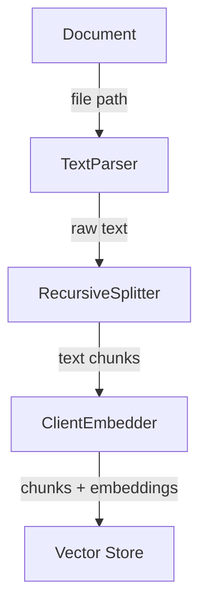
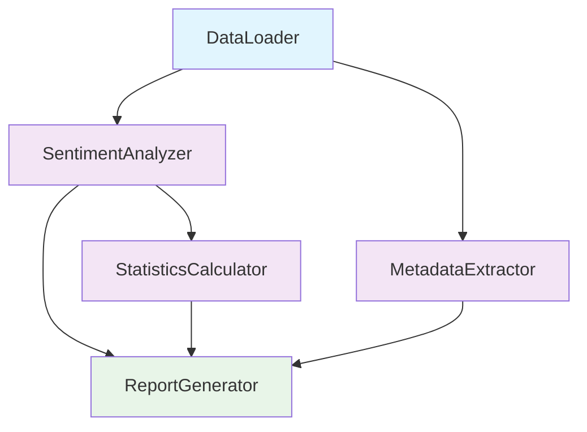
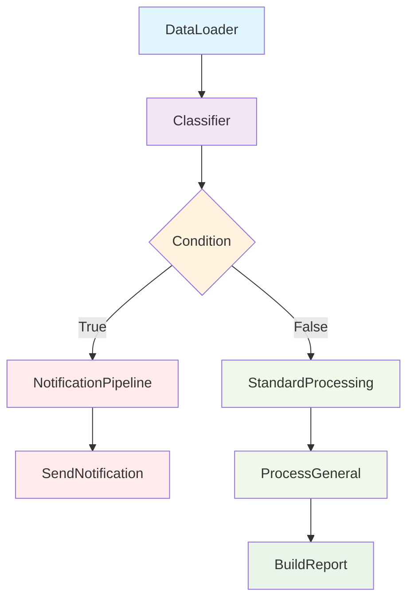

# DatapizzAI pipeline guide

This guide provides practical examples for using the three pipeline types available in DatapizzAI:

- **IngestionPipeline**: for processing and ingesting documents into vector stores
- **DagPipeline**: for creating dependency graphs between components  
- **FunctionalPipeline**: for functional pipelines with branching, loops, and dependencies

## Table of Contents

- [1. Ingestion pipeline](#1-ingestion-pipeline)
  - [Description](#description)
  - [Main components](#main-components)
  - [Practical example](#practical-example)
  - [Flow diagram](#flow-diagram)
  - [Complete script](#complete-script)
- [2. Dag pipeline](#2-dag-pipeline)
  - [Description](#description-1)
  - [Main features](#main-features)
  - [Practical example](#practical-example-1)
  - [Flow diagram](#flow-diagram-1)
  - [Complete script](#complete-script-1)
- [3. Functional pipeline](#3-functional-pipeline)
  - [Description](#description-2)
  - [Advanced features](#advanced-features)
  - [Practical example](#practical-example-2)
  - [Flow diagram](#flow-diagram-2)
  - [Complete script](#complete-script-2)
- [YAML configuration](#yaml-configuration)
  - [Example for DagPipeline](#example-for-dagpipeline)
  - [Example for FunctionalPipeline](#example-for-functionalpipeline)
- [Pipeline comparison](#pipeline-comparison)
- [Best practices](#best-practices)
  - [Pipeline selection](#pipeline-selection)
  - [Error handling](#error-handling)
  - [Performance](#performance)
- [Complete examples](#complete-examples)

## 1. Ingestion pipeline

### Description

The IngestionPipeline is designed to process documents and ingest them into vector stores. It's ideal for building knowledge bases and RAG systems.

### Main components

- **Parser**: content extraction from documents
- **Splitter**: content division into chunks
- **Embedder**: vector embeddings generation
- **Vector store**: chunk storage with embeddings

### Practical example

```python
import os
from datapizzai.pipeline import IngestionPipeline
from datapizzai.modules.splitters import TextSplitter
from datapizzai.embedders import NodeEmbedder
from datapizzai.clients import OpenAIClient
from datapizzai.core.models import PipelineComponent

# Custom component to read text files
class FileReader(PipelineComponent):
    def _run(self, file_path: str, **kwargs) -> str:
        with open(file_path, 'r', encoding='utf-8') as f:
            return f.read()
    
    async def _a_run(self, file_path: str, **kwargs) -> str:
        with open(file_path, 'r', encoding='utf-8') as f:
            return f.read()

# 1. Configure client for embeddings  
client = OpenAIClient(
    api_key=os.getenv("OPENAI_API_KEY"), 
    model="text-embedding-3-small"  # Model for embeddings
)

# 2. Define pipeline components in execution order
components = [
    FileReader(),          # Reads file content
    TextSplitter(
        max_char=200,      # Maximum chunk size in characters
        overlap=50         # Overlap between consecutive chunks
    ),
    NodeEmbedder(
        client=client,                    # Client to generate embeddings
        model_name="text-embedding-3-small"  # Embedding model name
    )
]

# 3. Create pipeline without vector store (returns processed chunks)
pipeline = IngestionPipeline(
    modules=components,    # List of components to execute
    vector_store=None,     # None = doesn't save automatically
    collection_name=None   # Collection name in vector store (not used if vector_store=None)
)

# 4. Execute processing with optional metadata
chunks = pipeline.run(
    file_path="document.txt",           # Path to document to process
    metadata={"source": "example"}     # Additional metadata to attach to chunks (OPTIONAL)
)

# Result is a list of Chunk objects with text, embeddings and metadata
print(f"Generated {len(chunks)} chunks from document")
```

### Detailed parameters

- **max_char**: maximum number of characters per chunk. Smaller chunks = higher precision, more chunks
- **overlap**: shared characters between consecutive chunks to maintain context
- **metadata**: optional dictionary attached to all chunks by the `run()` method. Useful for tracking source, date, category, etc.
- **model_name**: name of the embedding model to use (must be supported by the client)
- **vector_store**: if `None` returns processed chunks, otherwise saves them automatically to the database
- **collection_name**: required only if a vector_store is specified

### Important notes

- **NodeEmbedder vs ClientEmbedder**: use `NodeEmbedder` in pipelines because it works with lists of `Chunk` objects. `ClientEmbedder` is for single strings.
- **Metadata**: applied by `IngestionPipeline.run()` after chunk creation, not during splitting
- **Embeddings**: `NodeEmbedder` adds embeddings to existing `Chunk` objects, doesn't create new ones

### Flow diagram



### Complete script

See `examples/ingestion_example.py` for a complete working example.

## 2. Dag pipeline

### Description

The DagPipeline allows creating dependency graphs (DAG - Directed Acyclic Graph) between components, where each node can depend on the results of previous nodes.

### Main features

- **Nodes**: components that perform specific operations
- **Connections**: define dependencies between nodes
- **Parallel execution**: independent nodes are executed in parallel
- **Error handling**: controlled error propagation through the graph

### Practical example

```python
from datapizzai.pipeline import DagPipeline
from datapizzai.core.models import PipelineComponent

class DataLoader(PipelineComponent):
    def _run(self, **kwargs):
        return {"data": ["text1", "text2", "text3"]}

class SentimentAnalyzer(PipelineComponent):
    def _run(self, data, **kwargs):
        # Sentiment analysis logic
        return {"results": [{"text": t, "sentiment": "positive"} for t in data]}

# Create DAG pipeline
pipeline = DagPipeline()
pipeline.add_module("loader", DataLoader())
pipeline.add_module("analyzer", SentimentAnalyzer())

# Define connections
pipeline.connect(
    source_node="loader",
    target_node="analyzer",
    source_key="data",
    target_key="data"
)

# Execute
results = pipeline.run({})
```

### Flow diagram



### Complete script

See `examples/dag_example.py` for a sentiment analysis example with dependency graph.

## 3. Functional pipeline

### Description

The FunctionalPipeline offers a functional approach to pipeline construction with support for conditional branching, loops, and complex dependencies.

### Advanced features

- **Branching**: conditional execution of sub-pipelines
- **Foreach**: iteration over data collections
- **Dependencies**: explicit dependency management between nodes
- **Composition**: combination of complex pipelines

### Practical example

```python
from datapizzai.pipeline import FunctionalPipeline, Dependency

# Sub-pipeline for notifications
notification_pipeline = FunctionalPipeline().run(
    name="notify",
    node=NotificationSender()
)

# Main pipeline with branching
pipeline = (
    FunctionalPipeline()
    .run(name="load", node=DataLoader())
    .then(name="classify", node=Classifier(), target_key="data")
    .branch(
        condition=lambda ctx: ctx.get("classify", {}).get("has_urgent", False),
        dependencies=[Dependency(node_name="classify")],
        if_true=notification_pipeline,
        if_false=standard_processing_pipeline
    )
)

# Execute
results = pipeline.execute()
```

### Flow diagram



### Detailed parameters

- **target_key**: name of the parameter in the next node where to pass the entire result of the previous node
- **dependencies**: list of `Dependency` specifying which nodes to depend on and how to map data
- **Dependency(node_name, target_key)**: maps the entire result of `node_name` to the parameter `target_key` of the current node
- **condition**: lambda function that receives the complete context and returns True/False for branching
- **foreach**: executes the `do` component for each element in the collection specified by dependencies
- **execute()**: starts execution and returns dictionary with results from all executed nodes

### Data flow notes

- **Data passing**: in FunctionalPipeline, `target_key="documents"` passes the ENTIRE result of the previous node (e.g. `{"documents": [...]}`) to the `documents` parameter of the next node
- **Input handling**: components should handle both dictionaries and lists as input to be flexible
- **Context access**: use `lambda ctx: ctx.get("node_name", {}).get("key")` to access data in branching

### Complete script

See `examples/functional_example.py` for a complete example with branching and foreach.

## YAML configuration

All pipelines support YAML configuration for greater flexibility and reusability.

### Example for DagPipeline

```yaml
dag_pipeline:
  clients:
    openai_client:
      provider: "openai"
      api_key: "${OPENAI_API_KEY}"
      model: "gpt-4o-mini"
  
  modules:
    - name: "data_loader"
      module: "mymodules.loaders"
      type: "CSVLoader"
      params:
        file_path: "data.csv"
    
    - name: "analyzer"
      module: "mymodules.analysis"
      type: "TextAnalyzer"
      params:
        client: "openai_client"
  
  connections:
    - from: "data_loader"
      to: "analyzer"
      source_key: "data"
      target_key: "texts"
```

### Example for FunctionalPipeline

```yaml
modules:
  - name: "loader"
    module: "mymodules.loaders"
    type: "DocumentLoader"
  
  - name: "processor"
    module: "mymodules.processors"  
    type: "TextProcessor"

pipeline:
  - type: "run"
    name: "load_data"
    node: "loader"
  
  - type: "then"
    name: "process"
    node: "processor"
    target_key: "documents"
    dependencies:
      - node_name: "load_data"
```

## Pipeline comparison

| Feature | IngestionPipeline | DagPipeline | FunctionalPipeline |
|---------|------------------|-------------|-------------------|
| **Use case** | Document processing | Dependency graphs | Complex pipelines |
| **Complexity** | Low | Medium | High |
| **Branching** | No | No | Yes |
| **Loops** | No | No | Yes (foreach) |
| **Parallelism** | Sequential | Automatic | Controlled |
| **Vector store** | Integrated | Manual | Manual |

## Best practices

### Pipeline selection

- **IngestionPipeline**: for RAG, knowledge bases, document processing
- **DagPipeline**: for workflows with complex dependencies, multi-step analysis  
- **FunctionalPipeline**: for complex business logic, conditional routing

### Error handling

```python
# Always handle exceptions in components
class SafeProcessor(PipelineComponent):
    def _run(self, **kwargs):
        try:
            return self.process_data(kwargs)
        except Exception as e:
            return {"error": str(e), "success": False}
```

### Performance

- Use async components when possible
- Minimize dependencies in DagPipeline
- Cache intermediate results for complex pipelines

## Complete examples

Complete and functional example scripts are available in:

- `examples/ingestion_example.py`
- `examples/dag_example.py`  
- `examples/functional_example.py`

Each script includes sample data and can be run directly to test functionality.
