# DatapizzAI pipeline guide

This guide provides practical examples for using the three pipeline types available in DatapizzAI:

- **IngestionPipeline**: for processing and ingesting documents into vector stores
- **DagPipeline**: for creating dependency graphs between components  
- **FunctionalPipeline**: for functional pipelines with branching, loops, and dependencies

## Table of Contents

- [1. Ingestion pipeline](#1-ingestion-pipeline)
  - [Description](#description)
  - [Main components](#main-components)
  - [Practical example](#practical-example)
  - [Flow diagram](#flow-diagram)
  - [Complete script](#complete-script)
- [2. Dag pipeline](#2-dag-pipeline)
  - [Description](#description-1)
  - [Main features](#main-features)
  - [Practical example](#practical-example-1)
  - [Flow diagram](#flow-diagram-1)
  - [Complete script](#complete-script-1)
- [3. Functional pipeline](#3-functional-pipeline)
  - [Description](#description-2)
  - [Advanced features](#advanced-features)
  - [Practical example](#practical-example-2)
  - [Flow diagram](#flow-diagram-2)
  - [Complete script](#complete-script-2)
- [YAML configuration](#yaml-configuration)
  - [Example for DagPipeline](#example-for-dagpipeline)
  - [Example for FunctionalPipeline](#example-for-functionalpipeline)
- [Pipeline comparison](#pipeline-comparison)
- [Best practices](#best-practices)
  - [Pipeline selection](#pipeline-selection)
  - [Error handling](#error-handling)
  - [Performance](#performance)
- [Complete examples](#complete-examples)

## 1. Ingestion pipeline

### Description

The IngestionPipeline is designed to process documents and ingest them into vector stores. It's ideal for building knowledge bases and RAG systems.

### Main components

- **Parser**: content extraction from documents
- **Splitter**: content division into chunks
- **Embedder**: vector embeddings generation
- **Vector store**: chunk storage with embeddings

### Practical example

```python
import os
from dotenv import load_dotenv
from datapizzai.pipeline import IngestionPipeline
from datapizzai.modules.splitters import TextSplitter
from datapizzai.embedders import NodeEmbedder
from datapizzai.clients import OpenAIClient
from datapizzai.core.models import PipelineComponent

load_dotenv()

# Custom component to read text files
class FileReader(PipelineComponent):
    def _run(self, file_path: str, **kwargs) -> str:
        with open(file_path, 'r', encoding='utf-8') as f:
            return f.read()
    
    async def _a_run(self, file_path: str, **kwargs) -> str:
        with open(file_path, 'r', encoding='utf-8') as f:
            return f.read()

# 1. Configure client for embeddings  
client = OpenAIClient(
    api_key=os.getenv("OPENAI_API_KEY"), 
    model="text-embedding-3-small"  # Model for embeddings
)

# 2. Define pipeline components in execution order
components = [
    FileReader(),          # Reads file content
    TextSplitter(
        max_char=200,      # Maximum chunk size in characters
        overlap=50         # Overlap between consecutive chunks
    ),
    NodeEmbedder(
        client=client,                    # Client to generate embeddings
        model_name="text-embedding-3-small"  # Embedding model name
    )
]

# 3. Create pipeline without vector store (returns processed chunks)
pipeline = IngestionPipeline(
    modules=components,    # List of components to execute
    vector_store=None,     # None = doesn't save automatically
    collection_name=None   # Collection name in vector store (not used if vector_store=None)
)

# 4. Execute processing with optional metadata
chunks = pipeline.run(
    file_path="document.txt",           # Path to document to process
    metadata={"source": "example"}     # Additional metadata to attach to chunks (OPTIONAL)
)

# Result is a list of Chunk objects with text, embeddings and metadata
print(f"Generated {len(chunks)} chunks from document")
```

### Important notes

- **NodeEmbedder vs ClientEmbedder**: use `NodeEmbedder` in pipelines because it works with lists of `Chunk` objects. `ClientEmbedder` is for single strings.
- **Metadata**: applied by `IngestionPipeline.run()` after chunk creation, not during splitting
- **Embeddings**: `NodeEmbedder` adds embeddings to existing `Chunk` objects, doesn't create new ones

### Flow diagram


### Complete script

See `examples/ingestion_example.py` for a complete working example.

## 2. Dag pipeline

### Description

The DagPipeline allows creating dependency graphs (DAG - Directed Acyclic Graph) between components, where each node can depend on the results of previous nodes.

### Main features

- **Nodes**: components that perform specific operations
- **Connections**: define dependencies between nodes
- **Parallel execution**: independent nodes are executed in parallel
- **Error handling**: controlled error propagation through the graph

### Practical example

```python
from datapizzai.pipeline import DagPipeline
from datapizzai.core.models import PipelineComponent

# 1. Define all graph components
class DataLoader(PipelineComponent):
    def _run(self, **kwargs):
        return {"reviews": ["Excellent product!", "I don't like it", "Average"]}
    async def _a_run(self, **kwargs):
        return self._run(**kwargs)

class SentimentAnalyzer(PipelineComponent):
    def _run(self, reviews, **kwargs):
        analyzed = [
            {
                "text": r,
                "sentiment": "positive" if "excellent" in r.lower() else "negative" if "don't" in r.lower() else "neutral"
            }
            for r in reviews
        ]
        return {"sentiment_results": analyzed}
    async def _a_run(self, reviews, **kwargs):
        return self._run(reviews=reviews, **kwargs)

class StatisticsCalculator(PipelineComponent):
    def _run(self, sentiment_results, **kwargs):
        sentiments = [r["sentiment"] for r in sentiment_results]
        stats = {
            "positive": sentiments.count("positive"),
            "negative": sentiments.count("negative"), 
            "neutral": sentiments.count("neutral")
        }
        return {"statistics": stats}
    async def _a_run(self, sentiment_results, **kwargs):
        return self._run(sentiment_results=sentiment_results, **kwargs)

class MetadataExtractor(PipelineComponent):
    def _run(self, reviews, **kwargs):
        metadata = {
            "total_reviews": len(reviews),
            "avg_length": sum(len(r) for r in reviews) / len(reviews),
            "timestamp": "2025-09-15"
        }
        return {"metadata": metadata}
    async def _a_run(self, reviews, **kwargs):
        return self._run(reviews=reviews, **kwargs)

class ReportGenerator(PipelineComponent):
    def _run(self, sentiment_results, statistics, metadata, **kwargs):
        report = f"""
ANALYSIS REPORT - {metadata['timestamp']}
Total reviews: {metadata['total_reviews']}
Average length: {metadata['avg_length']:.1f}

SENTIMENT:
- Positive: {statistics['positive']}
- Negative: {statistics['negative']}
- Neutral: {statistics['neutral']}

DETAILS:
{chr(10).join(f"- {r['text']}: {r['sentiment']}" for r in sentiment_results)}
        """
        return {"final_report": report.strip()}
    async def _a_run(self, sentiment_results, statistics, metadata, **kwargs):
        return self._run(sentiment_results=sentiment_results, statistics=statistics, metadata=metadata, **kwargs)

# 2. Create DAG pipeline
pipeline = DagPipeline()

# 3. Register nodes
pipeline.add_module("data_loader", DataLoader())
pipeline.add_module("sentiment_analyzer", SentimentAnalyzer())
pipeline.add_module("statistics_calculator", StatisticsCalculator())
pipeline.add_module("metadata_extractor", MetadataExtractor())
pipeline.add_module("report_generator", ReportGenerator())

# 4. Define connections (as in the diagram)
# DataLoader -> SentimentAnalyzer
pipeline.connect(
    source_node="data_loader",
    target_node="sentiment_analyzer",
    source_key="reviews",
    target_key="reviews"
)

# SentimentAnalyzer -> StatisticsCalculator
pipeline.connect(
    source_node="sentiment_analyzer",
    target_node="statistics_calculator",
    source_key="sentiment_results",
    target_key="sentiment_results"
)

# DataLoader -> MetadataExtractor
pipeline.connect(
    source_node="data_loader",
    target_node="metadata_extractor",
    source_key="reviews",
    target_key="reviews"
)

# Converge into ReportGenerator
pipeline.connect(
    source_node="sentiment_analyzer",
    target_node="report_generator",
    source_key="sentiment_results",
    target_key="sentiment_results"
)

pipeline.connect(
    source_node="statistics_calculator",
    target_node="report_generator",
    source_key="statistics",
    target_key="statistics"
)

pipeline.connect(
    source_node="metadata_extractor",
    target_node="report_generator",
    source_key="metadata",
    target_key="metadata"
)

# 5. Execute pipeline
results = pipeline.run({})
print(results["report_generator"]["final_report"])
```

### Flow diagram


### Complete script

See `examples/dag_example.py` for a sentiment analysis example with dependency graph.

## 3. Functional pipeline

### Description

The FunctionalPipeline offers a functional approach to pipeline construction with support for conditional branching, loops, and complex dependencies.

### Advanced features

- **Branching**: conditional execution of sub-pipelines
- **Foreach**: iteration over data collections
- **Dependencies**: explicit dependency management between nodes
- **Composition**: combination of complex pipelines

### Practical example

```python
from datapizzai.pipeline import FunctionalPipeline, Dependency
from datapizzai.core.models import PipelineComponent

# 1. Define all required components
class DataLoader(PipelineComponent):
    def _run(self, **kwargs):
        documents = [
            {"id": 1, "title": "Bug Critical", "content": "System crash", "priority": "urgent"},
            {"id": 2, "title": "Feature Request", "content": "New feature", "priority": "normal"},
            {"id": 3, "title": "Security Issue", "content": "Vulnerability found", "priority": "urgent"}
        ]
        return {"documents": documents}
    async def _a_run(self, **kwargs):
        return self._run(**kwargs)

class Classifier(PipelineComponent):
    def _run(self, documents, **kwargs):
        # Accepts either dict {"documents": [...]} or a list of dicts
        if isinstance(documents, dict) and "documents" in documents:
            documents = documents["documents"]
        elif documents is None:
            documents = []
        
        # Classify by urgency
        urgent_docs = [d for d in documents if isinstance(d, dict) and d.get("priority") == "urgent"]
        has_urgent = len(urgent_docs) > 0
        
        return {
            "classified_documents": documents,
            "urgent_documents": urgent_docs,
            "has_urgent": has_urgent
        }
    async def _a_run(self, documents, **kwargs):
        return self._run(documents=documents, **kwargs)

class NotificationSender(PipelineComponent):
    def _run(self, **kwargs):
        return {
            "notification_sent": True,
            "message": "⚠️ Urgent documents detected! Notification sent to the team.",
            "timestamp": "2025-09-15T10:00:00Z"
        }
    async def _a_run(self, **kwargs):
        return self._run(**kwargs)

class DocumentProcessor(PipelineComponent):
    def _run(self, document, **kwargs):
        processed = {
            **document,
            "processed": True,
            "word_count": len(document["content"].split()),
            "processing_time": "2025-09-15T10:00:00Z"
        }
        return processed
    async def _a_run(self, document, **kwargs):
        return self._run(document=document, **kwargs)

class ReportGenerator(PipelineComponent):
    def _run(self, classified_documents, **kwargs):
        total = len(classified_documents)
        urgent_count = sum(1 for d in classified_documents if d.get("priority") == "urgent")
        normal_count = total - urgent_count
        
        report = f"""
DOCUMENT ANALYSIS REPORT
========================
Total documents: {total}
Urgent documents: {urgent_count}
Normal documents: {normal_count}

DETAILS:
{chr(10).join(f"- {d['title']}: {d['priority']}" for d in classified_documents)}
        """
        
        return {
            "final_report": report.strip(),
            "statistics": {
                "total": total,
                "urgent": urgent_count,
                "normal": normal_count
            }
        }
    async def _a_run(self, classified_documents, **kwargs):
        return self._run(classified_documents=classified_documents, **kwargs)

# 2. Notification sub-pipeline (urgent documents)
notification_pipeline = FunctionalPipeline().run(
    name="send_notification",
    node=NotificationSender()
)

# 3. Standard processing sub-pipeline (normal documents)
standard_processing_pipeline = (
    FunctionalPipeline()
    .foreach(
        name="process_documents",
        dependencies=[Dependency(node_name="classified_documents", target_key=None)],
        do=DocumentProcessor()
    )
    .then(
        name="generate_report",
        node=ReportGenerator(),
        target_key="classified_documents",
        dependencies=[Dependency(node_name="classify", target_key="classified_documents")]
    )
)

# 4. Main pipeline with conditional branching
pipeline = (
    FunctionalPipeline()
    .run(name="load_data", node=DataLoader())
    .then(name="classify", node=Classifier(), target_key="documents")
    .branch(
        condition=lambda ctx: ctx.get("classify", {}).get("has_urgent", False),
        dependencies=[Dependency(node_name="classify")],
        if_true=notification_pipeline,
        if_false=standard_processing_pipeline
    )
)

# Execute
results = pipeline.execute()
```

### Flow diagram


### Data flow notes

- **Data passing**: in FunctionalPipeline, `target_key="documents"` passes the ENTIRE result of the previous node (e.g. `{"documents": [...]}`) to the `documents` parameter of the next node
- **Input handling**: components should handle both dictionaries and lists as input to be flexible
- **Context access**: use `lambda ctx: ctx.get("node_name", {}).get("key")` to access data in branching

### Complete script

See `examples/functional_example.py` for a complete example with branching and foreach.

### Complete YAML example

Loading FunctionalPipeline from external YAML configuration:

```python
import os
import sys
from pathlib import Path
from datapizzai.pipeline import FunctionalPipeline

# Load pipeline from YAML file
pipeline = FunctionalPipeline.from_yaml("functional_pipeline_config.yaml")

# Execute pipeline
results = pipeline.execute()

# Show results
if "build_report" in results:
    print(results["build_report"]["final_report"])

print("Pipeline executed via YAML configuration!")
```

**Execution**:
```bash
cd examples
python3 yaml_pipeline_example.py
```

The `functional_pipeline_config.yaml` file defines a complete pipeline with 4 external modules (`DocumentLoader`, `TextProcessor`, `DataValidator`, `ReportBuilder`) and their dependencies.

This example demonstrates:
- Loading external modules from custom packages (`mymodules/`)
- Parameter configuration for each module via YAML
- Dependency definition between nodes with `target_key`
- Multi-step pipeline completely configured externally
- Python script that loads and executes the configuration

#### YAML flow diagram



## YAML configuration

All pipelines support YAML configuration for greater flexibility and reusability.

### Example for DagPipeline

Loading and using DagPipeline from YAML configuration:

```python
import os
import sys
from datapizzai.pipeline import DagPipeline

# Setup path to find mymodules (required for notebooks)
examples_dir = "/home/mcalcaterra/Documenti/GitHub/Datapizza/DatapizzAI/PizzAI/Pipeline/examples"
sys.path.insert(0, examples_dir)

# Create DagPipeline instance and load YAML configuration
dag_pipeline = DagPipeline()
dag_pipeline.from_yaml(os.path.join(examples_dir, "dag_config.yaml"))

# Execute pipeline (data generated automatically by modules)
results = dag_pipeline.run({})

# Access results from each node
print(f"Executed nodes: {list(results.keys())}")
for node_name, result in results.items():
    print(f"{node_name}: {result}")
```

The YAML file `examples/dag_config.yaml` defines custom modules (`DocumentLoader`, `TextProcessor`) and their automatic connections.

**Execution**:
```bash
cd Pipeline/examples
python3 dag_yaml_example.py
```

#### DagPipeline YAML flow diagram



### Example for FunctionalPipeline

Loading and using FunctionalPipeline from YAML configuration:

```python
import os
import sys
from datapizzai.pipeline import FunctionalPipeline

# Setup path to find mymodules (required for notebooks)
examples_dir = "/home/mcalcaterra/Documenti/GitHub/Datapizza/DatapizzAI/PizzAI/Pipeline/examples"
sys.path.insert(0, examples_dir)

# Load functional pipeline from YAML file
pipeline = FunctionalPipeline.from_yaml(os.path.join(examples_dir, "functional_pipeline_config.yaml"))

# Execute complete pipeline
results = pipeline.execute()

# Show flow results
if "build_report" in results:
    print(results["build_report"]["final_report"])
else:
    print("Pipeline completed successfully!")

print(f"Executed modules: {list(results.keys())}")
```

The YAML file defines external modules (`DocumentLoader`, `TextProcessor`, `DataValidator`, `ReportBuilder`) and dependencies between steps with `target_key`.

#### FunctionalPipeline YAML flow diagram



## Pipeline comparison

| Feature | IngestionPipeline | DagPipeline | FunctionalPipeline |
|---------|------------------|-------------|-------------------|
| **Use case** | Document processing | Dependency graphs | Complex pipelines |
| **Complexity** | Low | Medium | High |
| **Branching** | No | No | Yes |
| **Loops** | No | No | Yes (foreach) |
| **Parallelism** | Sequential | Automatic | Controlled |
| **Vector store** | Integrated | Manual | Manual |

## Best practices

### Pipeline selection

- **IngestionPipeline**: for RAG, knowledge bases, document processing
- **DagPipeline**: for workflows with complex dependencies, multi-step analysis  
- **FunctionalPipeline**: for complex business logic, conditional routing

### Error handling

```python
# Always handle exceptions in components
class SafeProcessor(PipelineComponent):
    def _run(self, **kwargs):
        try:
            return self.process_data(kwargs)
        except Exception as e:
            return {"error": str(e), "success": False}
    async def _a_run(self, **kwargs):
        return self._run(**kwargs)
```

### Performance

- Use async components when possible
- Minimize dependencies in DagPipeline
- Cache intermediate results for complex pipelines

## Complete examples

Complete and functional example scripts are available in:

- `examples/ingestion_example.py` - IngestionPipeline with FileReader and TextSplitter
- `examples/dag_example.py` - DagPipeline with complex 5-node graph
- `examples/dag_yaml_example.py` - DagPipeline loaded from YAML with external modules
- `examples/functional_example.py` - FunctionalPipeline with conditional branching
- `examples/yaml_pipeline_example.py` - FunctionalPipeline loaded from YAML with external modules

### Support files

- `examples/dag_config.yaml` - External YAML configuration for `dag_yaml_example.py`
- `examples/functional_pipeline_config.yaml` - External YAML configuration for `yaml_pipeline_example.py`
- `examples/mymodules/` - Custom modules loaded via YAML:
  - `loaders.py` - DocumentLoader and CSVLoader
  - `processors.py` - TextProcessor, DataValidator, ReportBuilder

Each script includes sample data and can be run directly. The YAML example demonstrates how to separate configuration from Python code.

### Quick test of all examples

```bash
cd Pipeline/examples

# Test IngestionPipeline (requires API key)
python3 ingestion_example.py

# Test DagPipeline (requires API key for SentimentAnalyzer)
python3 dag_example.py

# Test DagPipeline with YAML (self-contained, no API key required)
python3 dag_yaml_example.py

# Test FunctionalPipeline (requires API key)
python3 functional_example.py

# Test FunctionalPipeline with YAML (self-contained, no API key required)
python3 yaml_pipeline_example.py
```
