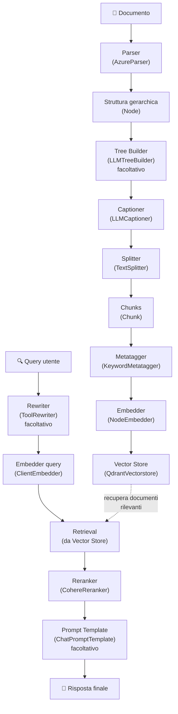

# Guida completa RAG con datapizzai

Questa guida illustra come implementare un sistema di Retrieval-Augmented Generation (RAG) completo utilizzando la libreria datapizzai. Il sistema copre l'intero flusso dalla parsing dei documenti fino alla generazione di risposte contestuali.

## Panoramica del flusso RAG

Il sistema RAG con datapizzai è composto dai seguenti componenti principali:



## 1. Setup iniziale

Prima di iniziare, assicurarsi di avere installato datapizzai e le dipendenze necessarie:

```python
from datapizzai.modules.parsers import AzureParser
from datapizzai.modules.splitters import TextSplitter
from datapizzai.modules.captioners import LLMCaptioner
from datapizzai.modules.metatagger import KeywordMetatagger
from datapizzai.modules.treebuilder import LLMTreeBuilder
from datapizzai.modules.rerankers import CohereReranker
from datapizzai.modules.rewriters import ToolRewriter
from datapizzai.modules.prompt import ChatPromptTemplate
from datapizzai.embedders import ClientEmbedder, NodeEmbedder
from datapizzai.vectorstores import QdrantVectorstore
from datapizzai.clients import OpenAIClient
```

## 2. Parsing dei documenti

Il parser converte documenti in strutture gerarchiche di nodi.

### AzureParser

Il `AzureParser` utilizza Azure AI Document Intelligence per parsing avanzato di PDF e altri documenti:

```python
# Configurazione del parser
parser = AzureParser(
    api_key="your_azure_api_key",
    endpoint="https://your-endpoint.cognitiveservices.azure.com/",
    result_type="markdown"  # oppure "text"
)

# Parsing di un documento
document_node = parser.invoke("path/to/document.pdf")
```

**Parametri principali:**
- `api_key`: chiave API per Azure Document Intelligence
- `endpoint`: endpoint del servizio Azure
- `result_type`: formato di output ("markdown" o "text")

**Output:** restituisce un oggetto `Node` con struttura gerarchica (documento → pagine → paragrafi → righe → parole).

## 3. Tree builder (facoltativo)

Il tree builder ristruttura i nodi per ottimizzare la comprensione del documento.

```python
from datapizzai.clients import OpenAIClient

# Configurazione client LLM
client = OpenAIClient(api_key="your_openai_key")

# Tree builder
tree_builder = LLMTreeBuilder(
    client=client,
    system_prompt="Riorganizza la struttura del documento per migliorare la comprensione."
)

# Applicazione del tree builder
restructured_node = tree_builder.invoke(document_node)
```

**Parametri:**
- `client`: client LLM per la ristrutturazione
- `system_prompt`: prompt per guidare la ristrutturazione

## 4. Captioning delle immagini e tabelle

Il captioner genera descrizioni testuali per elementi multimediali.

```python
captioner = LLMCaptioner(
    client=client,
    max_workers=3,  # numero di thread paralleli
    system_prompt_figure="Descrivi questa immagine in modo dettagliato e preciso.",
    system_prompt_table="Riassumi il contenuto di questa tabella evidenziando i punti chiave."
)

# Applicazione del captioner
captioned_node = captioner.invoke(document_node)
```

**Parametri:**
- `client`: client LLM per generare le caption
- `max_workers`: numero massimo di worker paralleli
- `system_prompt_figure`: prompt per descrivere le immagini
- `system_prompt_table`: prompt per descrivere le tabelle

**Funzionalità:** il captioner identifica automaticamente nodi di tipo `FIGURE` e `TABLE` e genera descrizioni testuali.

## 5. Splitting del testo

Lo splitter divide il contenuto in chunk gestibili per l'embedding.

```python
splitter = TextSplitter(
    max_char=1000,  # lunghezza massima del chunk
    overlap=100     # sovrapposizione tra chunk
)

# Conversione del nodo in testo (esempio semplificato)
text_content = document_node.content or ""
chunks = splitter.invoke(text_content)
```

**Parametri:**
- `max_char`: lunghezza massima di ciascun chunk in caratteri
- `overlap`: numero di caratteri di sovrapposizione tra chunk consecutivi

**Output:** lista di oggetti `Chunk` con ID univoci e metadati.

## 6. Metatagger

Il metatagger aggiunge tag e metadati ai chunk per migliorare il retrieval.

```python
metatagger = KeywordMetatagger(
    num_keywords=5  # numero di keyword da estrarre
)

# Applicazione del metatagger ai chunk
tagged_chunks = []
for chunk in chunks:
    tagged_chunk = metatagger.invoke(chunk.text)
    tagged_chunks.append(tagged_chunk)
```

**Parametri:**
- `num_keywords`: numero di parole chiave da estrarre per chunk

**Funzionalità:** estrae automaticamente parole chiave rilevanti dal contenuto e le aggiunge ai metadati.

## 7. Embedding generation

Gli embedder convertono i chunk in rappresentazioni vettoriali.

### NodeEmbedder

```python
# Configurazione dell'embedder
embedder = NodeEmbedder(
    client=client,
    model_name="text-embedding-3-small",
    embedding_name="openai-small",
    batch_size=100  # dimensione del batch per l'elaborazione
)

# Generazione degli embedding
embedded_chunks = embedder.invoke(tagged_chunks)
```

**Parametri:**
- `client`: client per generare embedding
- `model_name`: nome del modello di embedding
- `embedding_name`: nome identificativo per l'embedding
- `batch_size`: numero di chunk da processare per batch

### ClientEmbedder (per le query)

```python
query_embedder = ClientEmbedder(
    client=client,
    model_name="text-embedding-3-small"
)
```

## 8. Vector store

Il vector store memorizza i chunk con i loro embedding per il retrieval efficiente.

```python
# Configurazione Qdrant
vectorstore = QdrantVectorstore(
    host="localhost",
    port=6333,
    api_key=None  # se necessario
)

# Creazione della collection
collection_name = "my_documents"

# Aggiunta dei chunk al vector store
for chunk in embedded_chunks:
    vectorstore.add(chunk, collection_name=collection_name)
```

**Parametri:**
- `host`: indirizzo del server Qdrant
- `port`: porta del server Qdrant
- `api_key`: chiave API se richiesta

**Funzionalità:**
- Storage persistente di embedding
- Ricerca semantica veloce
- Supporto per embedding densi e sparsi

## 9. Query rewriting (facoltativo)

Il rewriter ottimizza le query utente per migliorare il retrieval.

```python
rewriter = ToolRewriter(
    tools=["web_search", "document_search"],  # tool disponibili
    max_rewrites=3
)

original_query = "Come funziona il machine learning?"
rewritten_query = rewriter.invoke(original_query)
```

## 10. Reranking

Il reranker riordina i risultati del retrieval per relevanza.

```python
reranker = CohereReranker(
    api_key="your_cohere_key",
    endpoint="https://api.cohere.com/v1",
    top_n=5,        # numero di risultati finali
    threshold=0.7   # soglia di rilevanza
)

# Esempio di utilizzo
query = "machine learning applications"
retrieved_chunks = vectorstore.search(query, top_k=20)

# Reranking
final_chunks = reranker.invoke({
    "query": query,
    "documents": retrieved_chunks
})
```

**Parametri:**
- `api_key`: chiave API Cohere
- `endpoint`: endpoint del servizio
- `top_n`: numero massimo di documenti da restituire
- `threshold`: soglia minima di rilevanza

## 11. Prompt templates (facoltativo)

I template strutturano l'input per il modello di generazione.

```python
prompt_template = ChatPromptTemplate(
    template="""Basandoti sui seguenti documenti, rispondi alla domanda dell'utente.

Documenti:
{context}

Domanda: {question}

Rispondi in modo preciso e completo:"""
)

# Utilizzo del template
formatted_prompt = prompt_template.format(
    context="\n".join([chunk.text for chunk in final_chunks]),
    question=query
)
```

## 12. Esempio completo end-to-end

Ecco un esempio che integra tutti i componenti:

```python
import asyncio
from datapizzai.clients import OpenAIClient

async def rag_pipeline_example():
    # 1. Setup
    client = OpenAIClient(api_key="your_key")
    
    # 2. Parsing
    parser = AzureParser(
        api_key="azure_key",
        endpoint="azure_endpoint"
    )
    document = parser.invoke("document.pdf")
    
    # 3. Captioning
    captioner = LLMCaptioner(client=client)
    captioned_doc = captioner.invoke(document)
    
    # 4. Splitting
    splitter = TextSplitter(max_char=1000, overlap=100)
    text_content = captioned_doc.content or ""
    chunks = splitter.invoke(text_content)
    
    # 5. Metatagger
    metatagger = KeywordMetatagger()
    for i, chunk in enumerate(chunks):
        chunks[i] = metatagger.invoke(chunk)
    
    # 6. Embedding
    embedder = NodeEmbedder(client=client)
    embedded_chunks = embedder.invoke(chunks)
    
    # 7. Vector Store
    vectorstore = QdrantVectorstore(host="localhost")
    collection = "documents"
    
    for chunk in embedded_chunks:
        vectorstore.add(chunk, collection_name=collection)
    
    # 8. Query processing
    query = "Qual è il contenuto principale del documento?"
    
    # 9. Retrieval
    query_embedder = ClientEmbedder(client=client)
    query_embedding = query_embedder.invoke(query)
    
    results = vectorstore.search(
        query_embedding, 
        collection_name=collection, 
        top_k=10
    )
    
    # 10. Reranking
    reranker = CohereReranker(api_key="cohere_key")
    final_results = reranker.invoke({
        "query": query,
        "documents": results
    })
    
    # 11. Response generation
    context = "\n".join([r.text for r in final_results])
    response = client.invoke([{
        "role": "user",
        "content": f"Contesto: {context}\n\nDomanda: {query}"
    }])
    
    return response

# Esecuzione
response = asyncio.run(rag_pipeline_example())
print(response.content)
```

## Considerazioni per la produzione

### Performance

- Utilizzare `batch_size` appropriato negli embedder
- Implementare caching per embedding frequenti
- Configurare Qdrant per performance ottimali

### Monitoring

```python
from datapizzai.tracing import TracingConfig

# Configurazione tracing
tracing = TracingConfig(
    enabled=True,
    export_traces=True
)
```

### Error handling

```python
try:
    chunks = embedder.invoke(text_chunks)
except Exception as e:
    logger.error(f"Errore durante embedding: {e}")
    # Implementare fallback o retry logic
```

### Best practices

- Testare diversi parametri di splitting (max_char, overlap)
- Sperimentare con diversi modelli di embedding
- Monitorare la qualità del retrieval con metriche appropriate
- Implementare logging appropriato per debug e monitoring

Questa guida fornisce una base solida per implementare sistemi RAG completi con datapizzai. Ogni componente può essere personalizzato e ottimizzato in base alle specifiche esigenze dell'applicazione.
