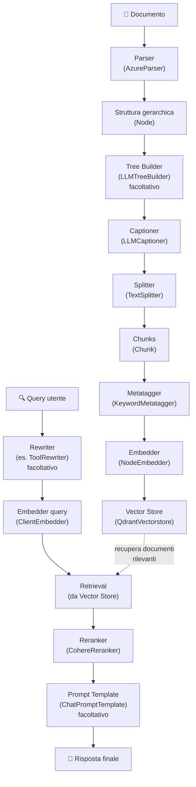

# Guida completa RAG

Questa guida illustra come implementare un sistema di Retrieval-Augmented Generation (RAG) completo utilizzando il framework datapizza-ai. Il sistema copre l'intero flusso dalla parsing dei documenti fino alla generazione di risposte contestuali.

## Indice

- [Panoramica del flusso RAG](#panoramica-del-flusso-rag)
- [Setup iniziale](#setup-iniziale) ⚠️ **Richiede Qdrant server attivo**
- [Pipeline di ingestion](#pipeline-di-ingestion)
  - [Parsing dei documenti](#parsing-dei-documenti)
  - [Tree builder (opzionale)](#tree-builder-opzionale)
  - [Captioning di immagini e tabelle](#captioning-di-immagini-e-tabelle)
  - [Splitting del testo](#splitting-del-testo)
  - [Metatagger](#metatagger)
  - [Generazione degli embedding](#generazione-degli-embedding)
  - [Persistenza nel vector store](#persistenza-nel-vector-store)
- [Pipeline di retrieval](#pipeline-di-retrieval)
  - [Riscrittura della query (facoltativa)](#riscrittura-della-query-facoltativa)
  - [Embedding della query e ricerca](#embedding-della-query-e-ricerca)
  - [Reranking](#reranking)
- [Prompt template (facoltativo)](#prompt-template-facoltativo)

## Panoramica del flusso RAG

⚠️ **PREREQUISITO**: Assicurati che Qdrant server sia attivo prima di iniziare:
```bash
docker run -p 6333:6333 qdrant/qdrant
```

Il sistema RAG con datapizza-ai è composto dai seguenti componenti principali:



## Setup iniziale

### Prerequisiti di sistema

**Qdrant vector database** (obbligatorio per il vector store):
```bash
# Avvia Qdrant server con Docker
docker run -p 6333:6333 qdrant/qdrant

# Dashboard disponibile su: http://localhost:6333/dashboard
```

### Dipendenze Python

Prima di iniziare, assicurarsi di avere installato datapizza-ai e le dipendenze necessarie:

```python
```

## Pipeline di ingestion

### Parsing dei documenti

I parser convertono testi e documenti in strutture gerarchiche di nodi.

#### TextParser (raccomandato per iniziare)

Il `TextParser` è il parser più semplice per testi puri, perfetto per iniziare:

```python

# Metodo 1: Usando la classe
parser = TextParser()
text = """Il machine learning è una branca dell'intelligenza artificiale.

Permette ai computer di apprendere dai dati senza essere programmati esplicitamente.
Utilizza algoritmi statistici per identificare pattern nei dati."""

document_node = parser.parse(text, metadata={"source": "example"})

# Metodo 2: Funzione di convenienza (più semplice)
document_node = parse_text(text)
```

**Vantaggi:**
- Nessuna API key richiesta
- Funziona offline
- Parsing intelligente in paragrafi e frasi
- Struttura gerarchica: documento → paragrafi → frasi

**Output:** oggetto `Node` con struttura `DOCUMENT` → `PARAGRAPH` → `SENTENCE`.

#### AzureParser (per PDF complessi)

Per documenti PDF con layout complessi, tabelle e immagini:

```python
import os
from dotenv import load_dotenv

load_dotenv()

# Richiede Azure Document Intelligence (servizio separato)
parser = AzureParser(
    api_key=os.getenv("AZURE_DOCUMENT_INTELLIGENCE_API_KEY"),  # NON Azure OpenAI!
    endpoint=os.getenv("AZURE_DOCUMENT_INTELLIGENCE_ENDPOINT"),
    result_type="markdown"
)

document_node = parser("document.pdf")
```

**Quando usarlo:**
- PDF con layout complessi
- Estrazione tabelle precise
- OCR di documenti scansionati
- Analisi immagini integrate

### Tree builder (opzionale)

Il tree builder serve quando parti da testo libero e NON hai usato un parser (sezione 2): crea o ristruttura una gerarchia di nodi a partire dal testo, così da sfruttare al meglio i componenti successivi della pipeline (captioner, splitter, metatagger, embedder). È facoltativo perché, se hai già usato un parser (es. `TextParser` o `AzureParser`), disponi già di una struttura a nodi.

```python
import os
from dotenv import load_dotenv
load_dotenv()

from datapizza.clients.openai import OpenAIClient

# Configurazione client LLM
client = OpenAIClient(
            api_key=os.getenv("OPENAI_API_KEY"),
            model="gpt-4o",
            )


# Tree Builder: crea struttura a nodi dal testo se non hai usato un parser
tree_builder = LLMTreeBuilder(client=client)
document_node = tree_builder.build_tree(text)
print(document_node)
```

Il componente accetta un client LLM (`client`) e mette a disposizione due metodi principali: `build_tree(text)` per ristrutturare direttamente testo libero e `invoke(file_path)` per lavorare su file disponibili su disco.
### Captioning di immagini e tabelle

Il captioner genera descrizioni testuali per elementi multimediali.

```python
captioner = LLMCaptioner(
    client=client,
    max_workers=3,  # numero di thread paralleli
    system_prompt_figure="Descrivi questa immagine in modo dettagliato e preciso.",
    system_prompt_table="Riassumi il contenuto di questa tabella evidenziando i punti chiave."
)

# Applicazione del captioner
captioned_node = captioner(document_node)
```

Il captioner usa il client LLM fornito (`client`) e permette di parallelizzare l'elaborazione tramite `max_workers`. I prompt `system_prompt_figure` e `system_prompt_table` personalizzano lo stile delle descrizioni, mentre il componente individua automaticamente i nodi `FIGURE` e `TABLE` e ne produce la versione testuale.

### Splitting del testo

Dato che stiamo lavorando con nodi, usa il NodeSplitter: divide i nodi in sotto‑nodi/chunk adatti all'embedding.

```python
splitter = NodeSplitter(
    max_char=1000,  # lunghezza massima del chunk
)

# Suddivisione diretta del nodo in sotto‑nodi/chunk
chunks = splitter(document_node)
```

`max_char` definisce la lunghezza massima di ciascun chunk, mentre `overlap` controlla la porzione condivisa fra chunk consecutivi. Il risultato è una lista di oggetti `Chunk` con ID e metadati già pronti per gli step successivi.

### Metatagger

Il metatagger estrae parole chiave e le aggiunge ai metadati dei chunk per migliorare retrieval e categorizzazione.

```python

metatagger = KeywordMetatagger(
    client=client,                 # Client LLM per l'estrazione
    max_workers=3,                 # Thread concorrenti
    system_prompt=(
        "Estrai fino a 5 keyword rilevanti per ciascun chunk; evita duplicati."
    ),
    user_prompt=(
        "Preferisci termini brevi e specifici; niente frasi complete."
    ),
    keyword_name="keywords"        # Nome del campo metadata
)

# Applicazione del metatagger ai chunk (preserva contenuto e ID)
tagged_chunks = metatagger(chunks)
```

Il componente sfrutta un client LLM (`client`) e può essere parallelizzato con `max_workers`. I prompt `system_prompt` e `user_prompt` guidano l'estrazione, mentre `keyword_name` definisce il campo metadata che raccoglie le keyword. L'elaborazione mantiene invariati contenuto e ID dei chunk e supporta output validati tramite modelli Pydantic.

### Generazione degli embedding

Gli embedder aggiungono i vettori ai chunks.

#### NodeEmbedder

```python
# Configurazione dell'embedder
embedder = NodeEmbedder(
    client=client,
    model_name="text-embedding-3-small",
    embedding_name="openai-small",
    batch_size=100  # dimensione del batch per l'elaborazione
)

# Generazione degli embedding
embedded_chunks = embedder(tagged_chunks)
```

Il `NodeEmbedder` utilizza il client configurato (`client`) con il modello specificato (`model_name`). Facoltativamente puoi dare un alias (`embedding_name`) e regolare il throughput tramite `batch_size`.


### Persistenza nel vector store

Il vector store memorizza i chunks con i loro vettori per un retrieval efficiente. In questa guida manteniamo la sezione essenziale per non duplicare la documentazione dei moduli.

Esempio minimo con Qdrant, se non l'hai ancora attivato fai così:
```python
# 1. Setup Qdrant
from qdrant_client import QdrantClient
from qdrant_client.models import Distance, VectorParams

client = QdrantClient(host="localhost", port=6333)
client.create_collection(
    collection_name="documents",
    vectors_config=VectorParams(size=1536, distance=Distance.COSINE)
)
```
E poi per gestire i chunks su Qdrant fai:

```python
vectorstore = QdrantVectorstore(host="localhost", port=6333)
vectorstore.add(embedded_chunks, collection_name="documents")
```

```

Una volta popolato il vector store, la pipeline di retrieval può interrogare la collezione per rispondere alle richieste utente.

## Pipeline di retrieval

### Riscrittura della query (facoltativa)

Un rewriter consente di trasformare richieste vaghe o colloquiali in query mirate al retrieval. È utile quando serve aggiungere sinonimi, normalizzare termini, espandere l'ambito o orchestrare tool esterni prima della ricerca.

```python
from datapizza.clients.openai import OpenAIClient


client = OpenAIClient(api_key=os.getenv("OPENAI_API_KEY"), model="gpt-4o")

rewriter = ToolRewriter(
    client=client,
    system_prompt=(
        "Agisci come rewriter per una pipeline RAG sulla documentazione Datapizza-AI. "
        "Ricevi domande confuse, estrai l'intento principale e produci una query "
        "adatta alla ricerca nel vector store, aggiungendo se utile parole chiave "
        "rilevanti (es. parser, splitter, vector store). Usa i tool solo quando "
        "possono recuperare contesto aggiuntivo utile alla risposta."
    ),
)

original_query = "Ehi, quella roba della pizza AI spacca i PDF da sola o è magia?"

# Uso asincrono (consigliato)
# rewritten_query = await rewriter.a_run(original_query)

# In alternativa, uso sincrono
rewritten_query = rewriter.run(original_query, memory=None)
print(rewritten_query)
```

### Embedding della query e ricerca

Dopo la riscrittura, genera l'embedding con lo stesso client usato in ingestion e interroga il vector store.

```python
from datapizza.clients.openai import OpenAIClient


client = OpenAIClient(
    api_key=os.getenv("OPENAI_API_KEY"),
    model="text-embedding-3-small",
)

query_vector = client.embed(rewritten_query)

results = vectorstore.search(
    query_vector=query_vector,
    collection_name="documents",
)
```

### Reranking -- da sistemare quando avrò accesso a Azure

Il reranker riordina i risultati del retrieval per relevanza.

```python
import os
from dotenv import load_dotenv

load_dotenv()

reranker = CohereReranker(
    api_key=os.getenv("COHERE_API_KEY"),
    endpoint="https://api.cohere.com/v1",
    top_n=5,        # numero di risultati finali
)

query = "data visualization applications"

# Genera embedding per la query
query_embedder = ClientEmbedder(client=client, model_name="text-embedding-3-small")
query_embedding = await query_embedder.a_run(query)

# Usa Datapizza-AI vectorstore
retrieved_chunks = vectorstore.search(
    query_vector=query_embedding,  # alcune versioni usano `query_vector`
    collection_name="documents", 
)

# Reranking
final_chunks = await reranker.a_run({
    "query": query,
    "documents": retrieved_chunks
})
```

Il componente richiede credenziali Cohere (`api_key`, `endpoint`) e ti permette di definire `top_n` e, se esposto dalla versione del modulo, eventuali soglie di punteggio. Ricorda che Cohere necessita di un `model` valido (es. `rerank-english-v3.0`): se il wrapper non offre questo parametro valuta `TogetherReranker` con `model` esplicito o il client Cohere SDK. L'integrazione è pensata per deployment Azure.

### Prompt template (facoltativo)

I template strutturano l'input per il modello di generazione.

```python
# Create RAG prompt template
template = ChatPromptTemplate(
    user_prompt_template="Question: {{ user_prompt }}\nPlease answer based on the provided context.",
    retrieval_prompt_template="Context:\n- {{ chunk.text }}\n"
)

# Simulate search results
chunks = [
    Chunk(id="1", text="Python is a high-level programming language"),
    Chunk(id="2", text="Python was created by Guido van Rossum in 1991")
]

# Create conversation memory
memory = template.format(
    user_prompt="Who created Python?",
    chunks=chunks,
    retrieval_query="Python creator history"
)

print("User: ", memory[0])
print("Assistant: ", memory[1])
print("Tool: ", memory[2].blocks[0].result)

# 1. User:  Question: Who created Python? Please answer based on the provided context.
# 2. Assistant: FunctionCall(search_vectorstore, query="Python creator history")
# 3. Tool:  Context - Python is a high-level programming language - Python was created by Guido van Rossum in 1991
```
