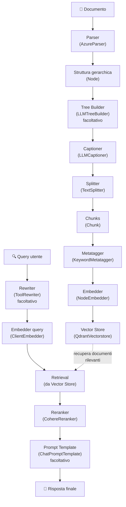

# Guida completa RAG con datapizzai

Questa guida illustra come implementare un sistema di Retrieval-Augmented Generation (RAG) completo utilizzando la libreria datapizzai. Il sistema copre l'intero flusso dalla parsing dei documenti fino alla generazione di risposte contestuali.

## Indice

- [Panoramica del flusso RAG](#panoramica-del-flusso-rag)
- [1. Setup iniziale](#1-setup-iniziale) ⚠️ **Richiede Qdrant server attivo**
- [2. Parsing dei documenti](#2-parsing-dei-documenti)
  - [TextParser (raccomandato per iniziare)](#textparser-raccomandato-per-iniziare)
  - [AzureParser (per PDF complessi)](#azureparser-per-pdf-complessi)
- [3. Tree builder (facoltativo)](#3-tree-builder-facoltativo)
- [4. Captioning delle immagini e tabelle](#4-captioning-delle-immagini-e-tabelle)
- [5. Splitting del testo](#5-splitting-del-testo)
- [6. Metatagger](#6-metatagger)
- [7. Embedding generation](#7-embedding-generation)
  - [NodeEmbedder](#nodeembedder)
  - [ClientEmbedder (per le query)](#clientembedder-per-le-query)
- [8. Vector store](#8-vector-store)
- [9. Rewriter (facoltativo)](#9-rewriter-facoltativo)
- [10. Reranking](#10-reranking)
- [11. Prompt templates (facoltativo)](#11-prompt-templates-facoltativo)
- [12. Esempio completo end-to-end](#12-esempio-completo-end-to-end)

## Panoramica del flusso RAG

⚠️ **PREREQUISITO**: Assicurati che Qdrant server sia attivo prima di iniziare:
```bash
docker run -p 6333:6333 qdrant/qdrant
```

Il sistema RAG con datapizzai è composto dai seguenti componenti principali:



## 1. Setup iniziale

### Prerequisiti di sistema

**Qdrant vector database** (obbligatorio per il vector store):
```bash
# Avvia Qdrant server con Docker
docker run -p 6333:6333 qdrant/qdrant

# Dashboard disponibile su: http://localhost:6333/dashboard
```

### Dipendenze Python

Prima di iniziare, assicurarsi di avere installato datapizzai e le dipendenze necessarie:

```python
from datapizzai.modules.parsers import AzureParser
from datapizzai.modules.splitters import TextSplitter
from datapizzai.modules.captioners import LLMCaptioner
from datapizzai.modules.metatagger import KeywordMetatagger
from datapizzai.modules.treebuilder import LLMTreeBuilder
from datapizzai.modules.rerankers import CohereReranker
from datapizzai.modules.rewriters import ToolRewriter
from datapizzai.modules.prompt import ChatPromptTemplate
from datapizzai.embedders import ClientEmbedder, NodeEmbedder
from datapizzai.vectorstores import QdrantVectorstore
from datapizzai.clients import OpenAIClient
```

## 2. Parsing dei documenti

I parser convertono testi e documenti in strutture gerarchiche di nodi.

### TextParser (raccomandato per iniziare)

Il `TextParser` è il parser più semplice per testi puri, perfetto per iniziare:

```python
from datapizzai.modules.parsers.text_parser import TextParser, parse_text

# Metodo 1: Usando la classe
parser = TextParser()
text = """Il machine learning è una branca dell'intelligenza artificiale.

Permette ai computer di apprendere dai dati senza essere programmati esplicitamente.
Utilizza algoritmi statistici per identificare pattern nei dati."""

document_node = parser.parse(text, metadata={"source": "example"})

# Metodo 2: Funzione di convenienza (più semplice)
document_node = parse_text(text)
```

**Vantaggi:**
- Nessuna API key richiesta
- Funziona offline
- Parsing intelligente in paragrafi e frasi
- Struttura gerarchica: documento → paragrafi → frasi

**Output:** oggetto `Node` con struttura `DOCUMENT` → `PARAGRAPH` → `SENTENCE`.

### AzureParser (per PDF complessi)

Per documenti PDF con layout complessi, tabelle e immagini:

```python
from datapizzai.modules.parsers import AzureParser
import os
from dotenv import load_dotenv

load_dotenv()

# Richiede Azure Document Intelligence (servizio separato)
parser = AzureParser(
    api_key=os.getenv("AZURE_DOCUMENT_INTELLIGENCE_API_KEY"),  # NON Azure OpenAI!
    endpoint=os.getenv("AZURE_DOCUMENT_INTELLIGENCE_ENDPOINT"),
    result_type="markdown"
)

document_node = parser("path/to/document.pdf")
```

**Quando usarlo:**
- PDF con layout complessi
- Estrazione tabelle precise
- OCR di documenti scansionati
- Analisi immagini integrate

## 3. Tree builder (facoltativo)

Il tree builder ristruttura i nodi per ottimizzare la comprensione del documento usando un LLM.

```python
from datapizzai.clients import OpenAIClient
from datapizzai.modules.treebuilder import LLMTreeBuilder
import os
from dotenv import load_dotenv
load_dotenv()

# Configurazione client LLM
client = OpenAIClient(
            api_key=os.getenv("OPENAI_API_KEY"),
            model="gpt-4o",
            )


# Tree builder
tree_builder = LLMTreeBuilder(
    client=client,
)

document_node = tree_builder.build_tree(text)
print(document_node) 
```

**Parametri:**
- `client`: client LLM (OpenAI, Google, ecc)

**Metodi principali:**
- `build_tree(text)`: refactor di un testo usando il client scelto.
- `invoke(file_path)`: legge un file e lo sistema (questo per un file accessibile tramite path)
## 4. Captioning delle immagini e tabelle

Il captioner genera descrizioni testuali per elementi multimediali.

```python
captioner = LLMCaptioner(
    client=client,
    max_workers=3,  # numero di thread paralleli
    system_prompt_figure="Descrivi questa immagine in modo dettagliato e preciso.",
    system_prompt_table="Riassumi il contenuto di questa tabella evidenziando i punti chiave."
)

# Applicazione del captioner
captioned_node = captioner(document_node)
```

**Parametri:**
- `client`: client LLM per generare le caption
- `max_workers`: numero massimo di worker paralleli
- `system_prompt_figure`: prompt per descrivere le immagini
- `system_prompt_table`: prompt per descrivere le tabelle

**Funzionalità:** il captioner identifica automaticamente nodi di tipo `FIGURE` e `TABLE` e genera descrizioni testuali.

## 5. Splitting del testo

Lo splitter divide il contenuto in chunk gestibili per l'embedding.

```python
splitter = TextSplitter(
    max_char=1000,  # lunghezza massima del chunk
    overlap=100     # sovrapposizione tra chunk
)

# Conversione del nodo in testo (esempio semplificato)
text_content = document_node.content or ""
chunks = splitter(text_content)
```

**Parametri:**
- `max_char`: lunghezza massima di ciascun chunk in caratteri
- `overlap`: numero di caratteri di sovrapposizione tra chunk consecutivi

**Output:** lista di oggetti `Chunk` con ID univoci e metadati.

## 6. Metatagger

Il metatagger estrae parole chiave e le aggiunge ai metadati dei chunk per migliorare retrieval e categorizzazione.

```python
from datapizzai.modules.metatagger import KeywordMetatagger

metatagger = KeywordMetatagger(
    client=client,                 # Client LLM per l'estrazione
    max_workers=3,                 # Thread concorrenti
    system_prompt=(
        "Estrai fino a 5 keyword rilevanti per ciascun chunk; evita duplicati."
    ),
    user_prompt=(
        "Preferisci termini brevi e specifici; niente frasi complete."
    ),
    keyword_name="keywords"        # Nome del campo metadata
)

# Applicazione del metatagger ai chunk (preserva contenuto e ID)
tagged_chunks = metatagger(chunks)
```

**Parametri:**
- `client (Client)`: client LLM per l'estrazione delle keyword
- `max_workers (int)`: thread concorrenti (default: 3)
- `system_prompt (str, opzionale)`: istruzioni per l'estrazione
- `user_prompt (str, opzionale)`: contesto utente aggiuntivo
- `keyword_name (str)`: nome del campo metadata per le keyword (default: `"keywords"`)

**Funzionalità:**
- Elaborazione concorrente dei chunk
- Estrazione strutturata con modelli Pydantic
- Prompt e nome campo metadata personalizzabili
- Preserva contenuto e ID originali dei chunk

## 7. Embedding generation

Gli embedder convertono i chunk in rappresentazioni vettoriali.

### NodeEmbedder

```python
# Configurazione dell'embedder
embedder = NodeEmbedder(
    client=client,
    model_name="text-embedding-3-small",
    embedding_name="openai-small",
    batch_size=100  # dimensione del batch per l'elaborazione
)

# Generazione degli embedding
embedded_chunks = embedder(tagged_chunks)
```

**Parametri:**
- `client`: client per generare embedding
- `model_name`: nome del modello di embedding
- `embedding_name`: nome identificativo per l'embedding
- `batch_size`: numero di chunk da processare per batch

### ClientEmbedder (per le query)

```python
query_embedder = ClientEmbedder(
    client=client,
    model_name="text-embedding-3-small"
)
# Uso asincrono (consigliato)
#query_vector = await query_embedder.a_run(
#    "Come spieghi il machine learning?"
#)  # -> list[float]

# In alternativa, uso sincrono
query_vector = query_embedder.run("Come spieghi il machine learning?")
```

## 8. Vector store

Il vector store memorizza i chunk con i loro embedding per il retrieval efficiente.

⚠️ **IMPORTANTE**: Qdrant richiede di **creare esplicitamente le collezioni** prima dell'uso, specificando dimensione dei vettori e metrica di distanza.

```python
import uuid
from qdrant_client import QdrantClient
from qdrant_client.models import Distance, VectorParams
from datapizzai.type import Chunk
from datapizzai.vectorstores import QdrantVectorstore

# 1. PRIMA: assicurati che Qdrant server sia attivo
# Avvia con: docker run -p 6333:6333 qdrant/qdrant

# 2. Connetti a Qdrant
vectorstore = QdrantVectorstore(host="localhost", port=6333)
client_Q = QdrantClient(host="localhost", port=6333)

# 3. Crea collezione (una sola volta)
client_Q.create_collection(
    collection_name="documents",
    vectors_config=VectorParams(
        size=1536,  # Dimensione dei tuoi embeddings
        distance=Distance.COSINE
    )
)
chunks = [
    Chunk(id=uuid.uuid4(), text="Python programming concepts"),
    Chunk(id=uuid.uuid4(), text="Machine learning fundamentals")
]

embedded_chunks = embedder(chunks)

# 5. Aggiungi dati
vectorstore.add(embedded_chunks, collection_name="documents")
client = OpenAIClient(
    api_key=os.getenv("OPENAI_API_KEY"),
    model="text-embedding-3-small")
query_vector = client.embed("programming languages")
# 6. Ricerca
results = vectorstore.search(
    query_vector=query_vector,
    collection_name="documents",
)
```

**Prerequisiti:**
- **Qdrant server attivo**: `docker run -p 6333:6333 qdrant/qdrant`
- **Collezione creata** con dimensione corretta
- **Embedding dimension matching**: la collezione deve avere la stessa dimensione dei tuoi embeddings

**Parametri QdrantVectorstore:**
- `host`: indirizzo del server Qdrant (default: "localhost")  
- `port`: porta del server Qdrant (default: 6333)
- `https`: usa HTTPS (default: True, impostare False per locale)
- `api_key`: chiave API se richiesta (None per installazioni locali)

**Parametri search (variano per versione):**
- `query_vector`: vettore di query (lista di float)
- `collection_name`: nome della collezione
- `top_k` oppure `k`: numero di risultati da restituire

**Funzionalità:**
- Storage persistente di embedding con metadati
- Ricerca semantica ad alte prestazioni
- Supporto per embedding densi e sparsi
- Dashboard web su http://localhost:6333/dashboard

**Troubleshooting comune:**
```python
# Errore "Collection doesn't exist" → Crea collezione prima
# Errore "Connection refused" → Avvia Qdrant server  
# Errore dimensione → Verifica vector_size nella collezione
```

## 9. Rewriter (facoltativo)

I rewriter sono componenti di pipeline che trasformano e migliorano le query dell'utente usando modelli linguistici e tool. Aiutano a ottimizzare le query per ottenere risultati di ricerca e retrieval migliori, riformulando, espandendo o ristrutturando l'input.

Quando usarli:
- Reframing della domanda per maggior copertura informativa
- Espansione con sinonimi/termini tecnici o entità correlate
- Normalizzazione e disambiguazione della query (es. acronimi)
- Preparazione di query compatibili con tool e motori di ricerca

Caratteristiche comuni:
- Input: stringa della query (opzionalmente con memoria/contesto)
- Output: stringa riscritta o struttura con campi specifici
- Modalità: sincrona (`run`) o asincrona (`a_run`)

Esempio: ToolRewriter

```python
from datapizzai.modules.rewriters import ToolRewriter
from datapizzai.clients import OpenAIClient

client = OpenAIClient(api_key=os.getenv("OPENAI_API_KEY"), model="gpt-4o")

rewriter = ToolRewriter(
    client=client,
    system_prompt="Scegli e usa i tool solo se migliorano il recupero dei documenti.",
)

original_query = "Ciao, come stai? Sai per caso come funziona il machine learning?"

rewritten_query = rewriter.run(original_query, memory=None)
print(rewritten_query)
```

## 10. Reranking

Il reranker riordina i risultati del retrieval per relevanza.

```python
import os
from dotenv import load_dotenv

load_dotenv()

reranker = CohereReranker(
    api_key=os.getenv("COHERE_API_KEY"),
    endpoint="https://api.cohere.com/v1",
    top_n=5,        # numero di risultati finali
    threshold=0.7   # soglia di rilevanza
)

# Esempio di utilizzo con DatapizzAI
from datapizzai.embedders import ClientEmbedder
from datapizzai.vectorstores import QdrantVectorstore

query = "machine learning applications"

# Genera embedding per la query
query_embedder = ClientEmbedder(client=client, model_name="text-embedding-3-small")
query_embedding = await query_embedder.a_run(query)

# Usa DatapizzAI vectorstore
retrieved_chunks = vectorstore.search(
    query_vector=query_embedding,  # alcune versioni usano `query_vector`
    collection_name="documents", 
    top_k=20
)

# Reranking
final_chunks = reranker.invoke({
    "query": query,
    "documents": retrieved_chunks
})
```

**Parametri:**
- `api_key`: chiave API Cohere
- `endpoint`: endpoint del servizio
- `top_n`: numero massimo di documenti da restituire
- `threshold`: soglia minima di rilevanza

## 11. Prompt templates (facoltativo)

I template strutturano l'input per il modello di generazione.

```python
prompt_template = ChatPromptTemplate(
    template="""Basandoti sui seguenti documenti, rispondi alla domanda dell'utente.

Documenti:
{context}

Domanda: {question}

Rispondi in modo preciso e completo:"""
)

# Utilizzo del template
formatted_prompt = prompt_template.format(
    context="\n".join([chunk.text for chunk in final_chunks]),
    question=query
)
```

## 12. Esempio completo end-to-end

Ecco un esempio che integra tutti i componenti usando il `TextParser`:

```python
import asyncio
import os
from dotenv import load_dotenv
from datapizzai.clients import OpenAIClient
from datapizzai.modules.parsers.text_parser import parse_text

load_dotenv()

async def rag_pipeline_example():
    # 1. Setup
    client = OpenAIClient(api_key=os.getenv("OPENAI_API_KEY"))
    
    # 2. Parsing (con TextParser)
    text = """Il machine learning è una branca dell'intelligenza artificiale.
    
Permette ai computer di apprendere dai dati senza essere programmati esplicitamente.
Utilizza algoritmi statistici per identificare pattern nei dati."""
    
    document = parse_text(text)
    
    # 3. Tree building (opzionale)
    tree_builder = LLMTreeBuilder(client=client)
    restructured_doc = tree_builder.build_tree(text)
    
    # 4. Splitting
    splitter = TextSplitter(max_char=1000, overlap=100)
    # Estrai testo dal nodo
    text_content = _extract_text_from_node(restructured_doc)
    chunks = splitter.invoke(text_content)
    
    # 5. Metatagger
    metatagger = KeywordMetatagger(
        client=client,
        max_workers=3,
        system_prompt="Estrai fino a 5 keyword rilevanti per chunk; evita duplicati.",
        user_prompt="Preferisci termini brevi e specifici; niente frasi complete.",
        keyword_name="keywords"
    )
    for i, chunk in enumerate(chunks):
        chunks[i] = metatagger.invoke(chunk)
    
    # 6. Embedding
    embedder = NodeEmbedder(client=client)
    embedded_chunks = await embedder.a_run(chunks)
    
    # 7. Vector Store - DatapizzAI
    from qdrant_client import QdrantClient
    from qdrant_client.models import Distance, VectorParams
    from datapizzai.vectorstores import QdrantVectorstore
    
    # Connetti a Qdrant e crea collezione
    client = QdrantClient(host="localhost", port=6333)
    client.create_collection(
        collection_name="documents",
        vectors_config=VectorParams(size=384, distance=Distance.COSINE)
    )
    
    # Usa DatapizzAI vectorstore
    vectorstore = QdrantVectorstore(host="localhost", port=6333, https=False)
    
    # Aggiungi chunk
    vectorstore.add(embedded_chunks, collection_name="documents")
    
    # 8. Query processing
    query = "Qual è il contenuto principale del documento?"
    
    # 9. Retrieval
    query_embedder = ClientEmbedder(client=client, model_name="text-embedding-3-small")
    query_embedding = await query_embedder.a_run(query)
    
    results = vectorstore.search(
        query_vector=query_embedding,  # alcune versioni usano `query_vector`
        collection_name="documents",
        top_k=10  # oppure `k=10` in versioni precedenti
    )
    
    # 10. Reranking
    reranker = CohereReranker(api_key=os.getenv("COHERE_API_KEY"))
    final_results = reranker.invoke({
        "query": query,
        "documents": results
    })
    
    # 11. Response generation
    context = "\n".join([r.text for r in final_results])
    response = client.invoke([{
        "role": "user",
        "content": f"Contesto: {context}\n\nDomanda: {query}"
    }])
    
    return response

# Esecuzione
response = asyncio.run(rag_pipeline_example())
print(response.content)
```
