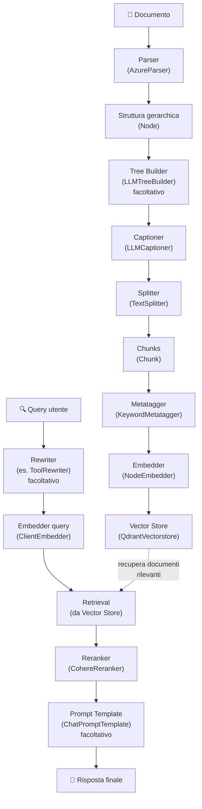

# Guida completa RAG

Questa guida illustra come implementare un sistema di Retrieval-Augmented Generation (RAG) completo utilizzando il framework datapizza-ai. Il sistema copre l'intero flusso dalla parsing dei documenti fino alla generazione di risposte contestuali.

## Indice

- [Panoramica del flusso RAG](#panoramica-del-flusso-rag)
- [1. Setup iniziale](#1-setup-iniziale) ⚠️ **Richiede Qdrant server attivo**
- [2. Parsing dei documenti](#2-parsing-dei-documenti)
  - [TextParser (raccomandato per iniziare)](#textparser-raccomandato-per-iniziare)
  - [AzureParser (per PDF complessi)](#azureparser-per-pdf-complessi)
- [3. Tree builder (facoltativo)](#3-tree-builder-facoltativo)
- [4. Captioning delle immagini e tabelle](#4-captioning-delle-immagini-e-tabelle)
- [5. Splitting del testo](#5-splitting-del-testo)
- [6. Metatagger](#6-metatagger)
- [7. Embedding generation](#7-embedding-generation)
  - [NodeEmbedder](#nodeembedder)
  - [ClientEmbedder (per le query)](#clientembedder-per-le-query)
- [8. Vector store](#8-vector-store)
- [9. Rewriter (facoltativo)](#9-rewriter-facoltativo)
- [10. Reranking](#10-reranking)
- [11. Prompt templates (facoltativo)](#11-prompt-templates-facoltativo)
- [12. Esempio completo end-to-end](#12-esempio-completo-end-to-end)

## Panoramica del flusso RAG

⚠️ **PREREQUISITO**: Assicurati che Qdrant server sia attivo prima di iniziare:
```bash
docker run -p 6333:6333 qdrant/qdrant
```

Il sistema RAG con datapizzai è composto dai seguenti componenti principali:



## 1. Setup iniziale

### Prerequisiti di sistema

**Qdrant vector database** (obbligatorio per il vector store):
```bash
# Avvia Qdrant server con Docker
docker run -p 6333:6333 qdrant/qdrant

# Dashboard disponibile su: http://localhost:6333/dashboard
```

### Dipendenze Python

Prima di iniziare, assicurarsi di avere installato datapizzai e le dipendenze necessarie:

```python
from datapizzai.modules.parsers import AzureParser
from datapizzai.modules.splitters import NodeSplitter
from datapizzai.modules.captioners import LLMCaptioner
from datapizzai.modules.metatagger import KeywordMetatagger
from datapizzai.modules.treebuilder import LLMTreeBuilder
from datapizzai.modules.rerankers import CohereReranker
from datapizzai.modules.rewriters import ToolRewriter
from datapizzai.modules.prompt import ChatPromptTemplate
from datapizzai.embedders import ClientEmbedder, NodeEmbedder
from datapizzai.vectorstores import QdrantVectorstore
from datapizzai.clients import OpenAIClient
```

## 2. Parsing dei documenti

I parser convertono testi e documenti in strutture gerarchiche di nodi.

### TextParser (raccomandato per iniziare)

Il `TextParser` è il parser più semplice per testi puri, perfetto per iniziare:

```python
from datapizzai.modules.parsers.text_parser import TextParser, parse_text

# Metodo 1: Usando la classe
parser = TextParser()
text = """Il machine learning è una branca dell'intelligenza artificiale.

Permette ai computer di apprendere dai dati senza essere programmati esplicitamente.
Utilizza algoritmi statistici per identificare pattern nei dati."""

document_node = parser.parse(text, metadata={"source": "example"})

# Metodo 2: Funzione di convenienza (più semplice)
document_node = parse_text(text)
```

**Vantaggi:**
- Nessuna API key richiesta
- Funziona offline
- Parsing intelligente in paragrafi e frasi
- Struttura gerarchica: documento → paragrafi → frasi

**Output:** oggetto `Node` con struttura `DOCUMENT` → `PARAGRAPH` → `SENTENCE`.

### AzureParser (per PDF complessi)

Per documenti PDF con layout complessi, tabelle e immagini:

```python
from datapizzai.modules.parsers import AzureParser
import os
from dotenv import load_dotenv

load_dotenv()

# Richiede Azure Document Intelligence (servizio separato)
parser = AzureParser(
    api_key=os.getenv("AZURE_DOCUMENT_INTELLIGENCE_API_KEY"),  # NON Azure OpenAI!
    endpoint=os.getenv("AZURE_DOCUMENT_INTELLIGENCE_ENDPOINT"),
    result_type="markdown"
)

document_node = parser("document.pdf")
```

**Quando usarlo:**
- PDF con layout complessi
- Estrazione tabelle precise
- OCR di documenti scansionati
- Analisi immagini integrate

## 3. Tree builder (facoltativo)

Il tree builder serve quando parti da testo libero e NON hai usato un parser (sezione 2): crea o ristruttura una gerarchia di nodi a partire dal testo, così da sfruttare al meglio i componenti successivi della pipeline (captioner, splitter, metatagger, embedder). È facoltativo perché, se hai già usato un parser (es. `TextParser` o `AzureParser`), disponi già di una struttura a nodi.

```python
from datapizzai.clients import OpenAIClient
from datapizzai.modules.treebuilder import LLMTreeBuilder
import os
from dotenv import load_dotenv
load_dotenv()

# Configurazione client LLM
client = OpenAIClient(
            api_key=os.getenv("OPENAI_API_KEY"),
            model="gpt-4o",
            )


# Tree Builder: crea struttura a nodi dal testo se non hai usato un parser
tree_builder = LLMTreeBuilder(client=client)
document_node = tree_builder.build_tree(text)
print(document_node)
```

**Parametri:**
- `client`: client LLM (OpenAI, Google, ecc)

**Metodi principali:**
- `build_tree(text)`: refactor di un testo usando il client scelto.
- `invoke(file_path)`: legge un file e lo sistema (questo per un file accessibile tramite path)
## 4. Captioning delle immagini e tabelle

Il captioner genera descrizioni testuali per elementi multimediali.

```python
captioner = LLMCaptioner(
    client=client,
    max_workers=3,  # numero di thread paralleli
    system_prompt_figure="Descrivi questa immagine in modo dettagliato e preciso.",
    system_prompt_table="Riassumi il contenuto di questa tabella evidenziando i punti chiave."
)

# Applicazione del captioner
captioned_node = captioner(document_node)
```

**Parametri:**
- `client`: client LLM per generare le caption
- `max_workers`: numero massimo di worker paralleli
- `system_prompt_figure`: prompt per descrivere le immagini
- `system_prompt_table`: prompt per descrivere le tabelle

**Funzionalità:** il captioner identifica automaticamente nodi di tipo `FIGURE` e `TABLE` e genera descrizioni testuali.

## 5. Splitting del testo

Dato che stiamo lavorando con nodi, usa il NodeSplitter: divide i nodi in sotto‑nodi/chunk adatti all'embedding.

```python
splitter = NodeSplitter(
    max_char=1000,  # lunghezza massima del chunk
    overlap=100     # sovrapposizione tra chunk
)

# Suddivisione diretta del nodo in sotto‑nodi/chunk
chunks = splitter(document_node)
```

**Parametri:**
- `max_char`: lunghezza massima di ciascun chunk in caratteri
- `overlap`: numero di caratteri di sovrapposizione tra chunk consecutivi

**Output:** lista di oggetti `Chunk` con ID univoci e metadati.

## 6. Metatagger

Il metatagger estrae parole chiave e le aggiunge ai metadati dei chunk per migliorare retrieval e categorizzazione.

```python
from datapizzai.modules.metatagger import KeywordMetatagger

metatagger = KeywordMetatagger(
    client=client,                 # Client LLM per l'estrazione
    max_workers=3,                 # Thread concorrenti
    system_prompt=(
        "Estrai fino a 5 keyword rilevanti per ciascun chunk; evita duplicati."
    ),
    user_prompt=(
        "Preferisci termini brevi e specifici; niente frasi complete."
    ),
    keyword_name="keywords"        # Nome del campo metadata
)

# Applicazione del metatagger ai chunk (preserva contenuto e ID)
tagged_chunks = metatagger(chunks)
```

**Parametri:**
- `client (Client)`: client LLM per l'estrazione delle keyword
- `max_workers (int)`: thread concorrenti (default: 3)
- `system_prompt (str, opzionale)`: istruzioni per l'estrazione
- `user_prompt (str, opzionale)`: contesto utente aggiuntivo
- `keyword_name (str)`: nome del campo metadata per le keyword (default: `"keywords"`)

**Funzionalità:**
- Elaborazione concorrente dei chunk
- Estrazione strutturata con modelli Pydantic
- Prompt e nome campo metadata personalizzabili
- Preserva contenuto e ID originali dei chunk

## 7. Embedding generation

Gli embedder aggiungono i vettori ai chunks.

### NodeEmbedder

```python
# Configurazione dell'embedder
embedder = NodeEmbedder(
    client=client,
    model_name="text-embedding-3-small",
    embedding_name="openai-small",
    batch_size=100  # dimensione del batch per l'elaborazione
)

# Generazione degli embedding
embedded_chunks = embedder(tagged_chunks)
```

**Parametri:**
- `client`: client per generare embedding
- `model_name`: nome del modello di embedding
- `embedding_name`: nome identificativo per l'embedding
- `batch_size`: numero di chunk da processare per batch


## 8. Vector store

Il vector store memorizza i chunks con i loro vettori per un retrieval efficiente. In questa guida manteniamo la sezione essenziale per non duplicare la documentazione dei moduli.

Esempio minimo con Qdrant (presuppone Qdrant avviato):

```python
from datapizzai.vectorstores import QdrantVectorstore

vectorstore = QdrantVectorstore(host="localhost", port=6333)
vectorstore.add(embedded_chunks, collection_name="documents")

# Crea un embedding per la query con lo stesso client
query_vector = client.embed("programming languages")

results = vectorstore.search(
    query_vector=query_vector,
    collection_name="documents",
    top_n=10,
)
```

## 9. Rewriter (facoltativo)

I rewriter sono componenti di pipeline che trasformano e migliorano le query dell'utente usando modelli linguistici e tool. Aiutano a ottimizzare le query per ottenere risultati di ricerca e retrieval migliori, riformulando, espandendo o ristrutturando l'input.

Quando usarli:
- Reframing della domanda per maggior copertura informativa
- Espansione con sinonimi/termini tecnici o entità correlate
- Normalizzazione e disambiguazione della query (es. acronimi)
- Preparazione di query compatibili con tool e motori di ricerca

Caratteristiche comuni:
- Input: stringa della query (opzionalmente con memoria/contesto)
- Output: stringa riscritta o struttura con campi specifici
- Modalità: sincrona (`run`) o asincrona (`a_run`)

Esempio: ToolRewriter

```python
from datapizzai.modules.rewriters import ToolRewriter
from datapizzai.clients import OpenAIClient

client = OpenAIClient(api_key=os.getenv("OPENAI_API_KEY"), model="gpt-4o")

rewriter = ToolRewriter(
    client=client,
    system_prompt="Scegli e usa i tool solo se migliorano il recupero dei documenti.",
)

original_query = "Ciao, come stai? Sai per caso come funziona il machine learning?"
# Uso asincrono (consigliato)
# rewritten_query = await rewriter.a_run(original_query)

# In alternativa, uso sincrono
rewritten_query = rewriter.run(original_query, memory=None)
print(rewritten_query)
```

## 10. Reranking -- da sistemare quando avrò accesso a Azure

Il reranker riordina i risultati del retrieval per relevanza.

```python
import os
from dotenv import load_dotenv
from datapizzai.embedders import ClientEmbedder
from datapizzai.vectorstores import QdrantVectorstore

load_dotenv()

reranker = CohereReranker(
    api_key=os.getenv("COHERE_API_KEY"),
    endpoint="https://api.cohere.com/v1",
    top_n=5,        # numero di risultati finali
)

query = "machine learning applications"

# Genera embedding per la query
query_embedder = ClientEmbedder(client=client, model_name="text-embedding-3-small")
query_embedding = await query_embedder.a_run(query)

# Usa DatapizzAI vectorstore
retrieved_chunks = vectorstore.search(
    query_vector=query_embedding,  # alcune versioni usano `query_vector`
    collection_name="documents", 
    top_n=20
)

# Reranking
final_chunks = reranker.invoke({
    "query": query,
    "documents": retrieved_chunks
})
```

**Parametri:**
- `api_key`: chiave API Cohere
- `endpoint`: endpoint del servizio
- `top_n`: numero massimo di documenti da restituire
- `threshold`: soglia minima di rilevanza

Suggerimenti e troubleshooting:
- Cohere richiede un `model` valido (es. `rerank-english-v3.0`). La versione attuale di `CohereReranker` può non esporre il parametro modello: in tal caso usa `TogetherReranker` con `model` esplicito oppure il client Cohere SDK diretto. Il modulo Cohere è pensato per essere usato con account Azure.

## 11. Prompt templates (facoltativo)

I template strutturano l'input per il modello di generazione.

```python
from datapizzai.modules.prompt import ChatPromptTemplate
from datapizzai.type import Chunk
# Create RAG prompt template
template = ChatPromptTemplate(
    user_prompt_template="Question: {{ user_prompt }}\nPlease answer based on the provided context.",
    retrieval_prompt_template="Context:\n- {{ chunk.text }}\n"
)

# Simulate search results
chunks = [
    Chunk(id="1", text="Python is a high-level programming language"),
    Chunk(id="2", text="Python was created by Guido van Rossum in 1991")
]

# Create conversation memory
memory = template.format(
    user_prompt="Who created Python?",
    chunks=chunks,
    retrieval_query="Python creator history"
)

print("User: ", memory[0])
print("Assistant: ", memory[1])
print("Tool: ", memory[2].blocks[0].result)

# 1. User:  Question: Who created Python? Please answer based on the provided context.
# 2. Assistant: FunctionCall(search_vectorstore, query="Python creator history")
# 3. Tool:  Context - Python is a high-level programming language - Python was created by Guido van Rossum in 1991
```
