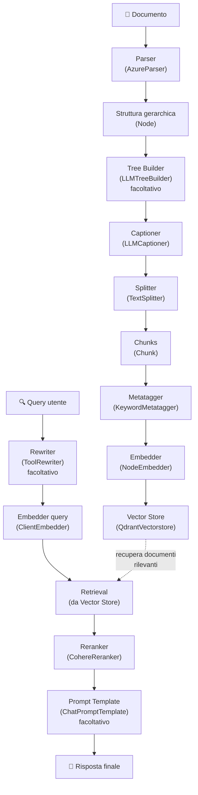

# Guida completa RAG con datapizzai

Questa guida illustra come implementare un sistema di Retrieval-Augmented Generation (RAG) completo utilizzando la libreria datapizzai. Il sistema copre l'intero flusso dalla parsing dei documenti fino alla generazione di risposte contestuali.

## Panoramica del flusso RAG

Il sistema RAG con datapizzai è composto dai seguenti componenti principali:



## 1. Setup iniziale

Prima di iniziare, assicurarsi di avere installato datapizzai e le dipendenze necessarie:

```python
from datapizzai.modules.parsers import AzureParser
from datapizzai.modules.splitters import TextSplitter
from datapizzai.modules.captioners import LLMCaptioner
from datapizzai.modules.metatagger import KeywordMetatagger
from datapizzai.modules.treebuilder import LLMTreeBuilder
from datapizzai.modules.rerankers import CohereReranker
from datapizzai.modules.rewriters import ToolRewriter
from datapizzai.modules.prompt import ChatPromptTemplate
from datapizzai.embedders import ClientEmbedder, NodeEmbedder
from datapizzai.vectorstores import QdrantVectorstore
from datapizzai.clients import OpenAIClient
```

## 2. Parsing dei documenti

I parser convertono testi e documenti in strutture gerarchiche di nodi.

### TextParser (raccomandato per iniziare)

Il `TextParser` è il parser più semplice per testi puri, perfetto per iniziare:

```python
from datapizzai.modules.parsers.text_parser import TextParser, parse_text

# Metodo 1: Usando la classe
parser = TextParser()
text = """Il machine learning è una branca dell'intelligenza artificiale.

Permette ai computer di apprendere dai dati senza essere programmati esplicitamente.
Utilizza algoritmi statistici per identificare pattern nei dati."""

document_node = parser.parse(text, metadata={"source": "example"})

# Metodo 2: Funzione di convenienza (più semplice)
document_node = parse_text(text)
```

**Vantaggi:**
- Nessuna API key richiesta
- Funziona offline
- Parsing intelligente in paragrafi e frasi
- Struttura gerarchica: documento → paragrafi → frasi

**Output:** oggetto `Node` con struttura `DOCUMENT` → `PARAGRAPH` → `SENTENCE`.

### AzureParser (per PDF complessi)

Per documenti PDF con layout complessi, tabelle e immagini:

```python
from datapizzai.modules.parsers import AzureParser

# Richiede Azure Document Intelligence (servizio separato)
parser = AzureParser(
    api_key="your_azure_document_intelligence_key",  # NON Azure OpenAI!
    endpoint="https://your-doc-intel-endpoint.cognitiveservices.azure.com/",
    result_type="markdown"
)

document_node = parser.invoke("path/to/document.pdf")
```

**Quando usarlo:**
- PDF con layout complessi
- Estrazione tabelle precise
- OCR di documenti scansionati
- Analisi immagini integrate

## 3. Tree builder (facoltativo)

Il tree builder ristruttura i nodi per ottimizzare la comprensione del documento usando un LLM.

```python
from datapizzai.clients import OpenAIClient
from datapizzai.modules.treebuilder import LLMTreeBuilder

# Configurazione client LLM
client = OpenAIClient(api_key="your_openai_key")

# Tree builder
tree_builder = LLMTreeBuilder(
    client=client,
    system_prompt="Riorganizza la struttura del documento per migliorare la comprensione."
)

# IMPORTANTE: usa build_tree() con il testo, NON invoke() con il nodo!
# Estrai il testo dal nodo parsato
text_content = document_node.content or _extract_text_from_node(document_node)

# Applicazione del tree builder
restructured_node = tree_builder.build_tree(text_content)

# Funzione helper per estrarre testo da nodi complessi
def _extract_text_from_node(node):
    text_parts = []
    if hasattr(node, 'content') and node.content:
        text_parts.append(node.content)
    if hasattr(node, 'children'):
        for child in node.children:
            child_text = _extract_text_from_node(child)
            if child_text:
                text_parts.append(child_text)
    return "\n".join(text_parts)
```

**Parametri:**
- `client`: client LLM per la ristrutturazione
- `system_prompt`: prompt per guidare la ristrutturazione

**Metodi principali:**
- `build_tree(text)`: ristruttura un testo usando LLM
- `invoke(file_path)`: legge un file e lo ristruttura (per file su disco)

**⚠️ Problemi comuni e soluzioni:**

Il TreeBuilder può fallire se l'LLM non produce XML valido. Errori tipici:
```
XML parsing failed after cleaning: not well-formed (invalid token)
```

**Soluzioni:**

1. **Usa il sistema di fallback automatico** (già integrato):
```python
# Il TreeBuilder ha fallback automatico - controlla i metadata
if result.metadata.get('llm_fallback'):
    print("TreeBuilder ha usato fallback - risultato comunque valido")
```

2. **Approccio più robusto**:
```python
def safe_tree_building(client, text):
    try:
        tree_builder = LLMTreeBuilder(client=client)
        result = tree_builder.build_tree(text)
        
        # Controlla se ha funzionato davvero
        if not result.metadata.get('llm_fallback'):
            return result
        else:
            print("TreeBuilder fallback - uso TextParser")
            return parse_text(text)
    except Exception as e:
        print(f"TreeBuilder fallito: {e}")
        return parse_text(text)  # Fallback sicuro
```

3. **Salta il TreeBuilder per iniziare**:
```python
# Per la maggior parte dei casi, TextParser è sufficiente
document = parse_text(text)  # Più affidabile
```

## 4. Captioning delle immagini e tabelle

Il captioner genera descrizioni testuali per elementi multimediali.

```python
captioner = LLMCaptioner(
    client=client,
    max_workers=3,  # numero di thread paralleli
    system_prompt_figure="Descrivi questa immagine in modo dettagliato e preciso.",
    system_prompt_table="Riassumi il contenuto di questa tabella evidenziando i punti chiave."
)

# Applicazione del captioner
captioned_node = captioner.invoke(document_node)
```

**Parametri:**
- `client`: client LLM per generare le caption
- `max_workers`: numero massimo di worker paralleli
- `system_prompt_figure`: prompt per descrivere le immagini
- `system_prompt_table`: prompt per descrivere le tabelle

**Funzionalità:** il captioner identifica automaticamente nodi di tipo `FIGURE` e `TABLE` e genera descrizioni testuali.

## 5. Splitting del testo

Lo splitter divide il contenuto in chunk gestibili per l'embedding.

```python
splitter = TextSplitter(
    max_char=1000,  # lunghezza massima del chunk
    overlap=100     # sovrapposizione tra chunk
)

# Conversione del nodo in testo (esempio semplificato)
text_content = document_node.content or ""
chunks = splitter.invoke(text_content)
```

**Parametri:**
- `max_char`: lunghezza massima di ciascun chunk in caratteri
- `overlap`: numero di caratteri di sovrapposizione tra chunk consecutivi

**Output:** lista di oggetti `Chunk` con ID univoci e metadati.

## 6. Metatagger

Il metatagger aggiunge tag e metadati ai chunk per migliorare il retrieval.

```python
metatagger = KeywordMetatagger(
    num_keywords=5  # numero di keyword da estrarre
)

# Applicazione del metatagger ai chunk
tagged_chunks = []
for chunk in chunks:
    tagged_chunk = metatagger.invoke(chunk.text)
    tagged_chunks.append(tagged_chunk)
```

**Parametri:**
- `num_keywords`: numero di parole chiave da estrarre per chunk

**Funzionalità:** estrae automaticamente parole chiave rilevanti dal contenuto e le aggiunge ai metadati.

## 7. Embedding generation

Gli embedder convertono i chunk in rappresentazioni vettoriali.

### NodeEmbedder

```python
# Configurazione dell'embedder
embedder = NodeEmbedder(
    client=client,
    model_name="text-embedding-3-small",
    embedding_name="openai-small",
    batch_size=100  # dimensione del batch per l'elaborazione
)

# Generazione degli embedding
embedded_chunks = embedder.invoke(tagged_chunks)
```

**Parametri:**
- `client`: client per generare embedding
- `model_name`: nome del modello di embedding
- `embedding_name`: nome identificativo per l'embedding
- `batch_size`: numero di chunk da processare per batch

### ClientEmbedder (per le query)

```python
query_embedder = ClientEmbedder(
    client=client,
    model_name="text-embedding-3-small"
)
```

## 8. Vector store

Il vector store memorizza i chunk con i loro embedding per il retrieval efficiente.

```python
# Configurazione Qdrant
vectorstore = QdrantVectorstore(
    host="localhost",
    port=6333,
    api_key=None  # se necessario
)

# Creazione della collection
collection_name = "my_documents"

# Aggiunta dei chunk al vector store
for chunk in embedded_chunks:
    vectorstore.add(chunk, collection_name=collection_name)
```

**Parametri:**
- `host`: indirizzo del server Qdrant
- `port`: porta del server Qdrant
- `api_key`: chiave API se richiesta

**Funzionalità:**
- Storage persistente di embedding
- Ricerca semantica veloce
- Supporto per embedding densi e sparsi

## 9. Query rewriting (facoltativo)

Il rewriter ottimizza le query utente per migliorare il retrieval.

```python
rewriter = ToolRewriter(
    tools=["web_search", "document_search"],  # tool disponibili
    max_rewrites=3
)

original_query = "Come funziona il machine learning?"
rewritten_query = rewriter.invoke(original_query)
```

## 10. Reranking

Il reranker riordina i risultati del retrieval per relevanza.

```python
reranker = CohereReranker(
    api_key="your_cohere_key",
    endpoint="https://api.cohere.com/v1",
    top_n=5,        # numero di risultati finali
    threshold=0.7   # soglia di rilevanza
)

# Esempio di utilizzo
query = "machine learning applications"
retrieved_chunks = vectorstore.search(query, top_k=20)

# Reranking
final_chunks = reranker.invoke({
    "query": query,
    "documents": retrieved_chunks
})
```

**Parametri:**
- `api_key`: chiave API Cohere
- `endpoint`: endpoint del servizio
- `top_n`: numero massimo di documenti da restituire
- `threshold`: soglia minima di rilevanza

## 11. Prompt templates (facoltativo)

I template strutturano l'input per il modello di generazione.

```python
prompt_template = ChatPromptTemplate(
    template="""Basandoti sui seguenti documenti, rispondi alla domanda dell'utente.

Documenti:
{context}

Domanda: {question}

Rispondi in modo preciso e completo:"""
)

# Utilizzo del template
formatted_prompt = prompt_template.format(
    context="\n".join([chunk.text for chunk in final_chunks]),
    question=query
)
```

## 12. Esempio completo end-to-end

Ecco un esempio che integra tutti i componenti usando il `TextParser`:

```python
import asyncio
from datapizzai.clients import OpenAIClient
from datapizzai.modules.parsers.text_parser import parse_text

async def rag_pipeline_example():
    # 1. Setup
    client = OpenAIClient(api_key="your_key")
    
    # 2. Parsing (con TextParser)
    text = """Il machine learning è una branca dell'intelligenza artificiale.
    
Permette ai computer di apprendere dai dati senza essere programmati esplicitamente.
Utilizza algoritmi statistici per identificare pattern nei dati."""
    
    document = parse_text(text)
    
    # 3. Tree building (opzionale)
    tree_builder = LLMTreeBuilder(client=client)
    restructured_doc = tree_builder.build_tree(text)
    
    # 4. Splitting
    splitter = TextSplitter(max_char=1000, overlap=100)
    # Estrai testo dal nodo
    text_content = _extract_text_from_node(restructured_doc)
    chunks = splitter.invoke(text_content)
    
    # 5. Metatagger
    metatagger = KeywordMetatagger()
    for i, chunk in enumerate(chunks):
        chunks[i] = metatagger.invoke(chunk)
    
    # 6. Embedding
    embedder = NodeEmbedder(client=client)
    embedded_chunks = embedder.invoke(chunks)
    
    # 7. Vector Store
    vectorstore = QdrantVectorstore(host="localhost")
    collection = "documents"
    
    for chunk in embedded_chunks:
        vectorstore.add(chunk, collection_name=collection)
    
    # 8. Query processing
    query = "Qual è il contenuto principale del documento?"
    
    # 9. Retrieval
    query_embedder = ClientEmbedder(client=client)
    query_embedding = query_embedder.invoke(query)
    
    results = vectorstore.search(
        query_embedding, 
        collection_name=collection, 
        top_k=10
    )
    
    # 10. Reranking
    reranker = CohereReranker(api_key="cohere_key")
    final_results = reranker.invoke({
        "query": query,
        "documents": results
    })
    
    # 11. Response generation
    context = "\n".join([r.text for r in final_results])
    response = client.invoke([{
        "role": "user",
        "content": f"Contesto: {context}\n\nDomanda: {query}"
    }])
    
    return response

# Esecuzione
response = asyncio.run(rag_pipeline_example())
print(response.content)
```