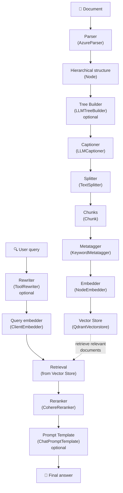

# Complete RAG Guide with datapizzai

This guide shows how to implement a complete Retrieval‑Augmented Generation (RAG) system using the datapizzai library. The system covers the entire flow from document parsing to context‑aware answer generation.

## RAG Flow Overview

A datapizzai‑based RAG system is composed of the following main components:



## 1. Initial Setup

Before starting, ensure datapizzai and required dependencies are installed:

```python
from datapizzai.modules.parsers import AzureParser
from datapizzai.modules.splitters import TextSplitter
from datapizzai.modules.captioners import LLMCaptioner
from datapizzai.modules.metatagger import KeywordMetatagger
from datapizzai.modules.treebuilder import LLMTreeBuilder
from datapizzai.modules.rerankers import CohereReranker
from datapizzai.modules.rewriters import ToolRewriter
from datapizzai.modules.prompt import ChatPromptTemplate
from datapizzai.embedders import ClientEmbedder, NodeEmbedder
from datapizzai.vectorstores import QdrantVectorstore
from datapizzai.clients import OpenAIClient
```

## 2. Document Parsing

The parser converts documents into hierarchical node structures.

### AzureParser

`AzureParser` uses Azure AI Document Intelligence for advanced parsing of PDFs and other documents:

```python
# Parser configuration
parser = AzureParser(
    api_key="your_azure_api_key",
    endpoint="https://your-endpoint.cognitiveservices.azure.com/",
    result_type="markdown"  # or "text"
)

# Parse a document
document_node = parser.invoke("path/to/document.pdf")
```

Main parameters:
- `api_key`: Azure Document Intelligence API key
- `endpoint`: Azure service endpoint
- `result_type`: output format ("markdown" or "text")

Output: returns a `Node` with a hierarchical structure (document → pages → paragraphs → lines → words).

## 3. Tree Builder (optional)

The tree builder restructures nodes to optimize document understanding.

```python
from datapizzai.clients import OpenAIClient

# LLM client configuration
client = OpenAIClient(api_key="your_openai_key")

# Tree builder
tree_builder = LLMTreeBuilder(
    client=client,
    system_prompt="Reorganize the document structure to improve comprehension."
)

# Apply tree builder
restructured_node = tree_builder.invoke(document_node)
```

Parameters:
- `client`: LLM client used for restructuring
- `system_prompt`: prompt to guide restructuring

## 4. Captioning Images and Tables

The captioner generates textual descriptions for media elements.

```python
captioner = LLMCaptioner(
    client=client,
    max_workers=3,  # number of parallel threads
    system_prompt_figure="Describe this image in a detailed and accurate way.",
    system_prompt_table="Summarize this table highlighting the key points."
)

# Apply captioner
captioned_node = captioner.invoke(document_node)
```

Parameters:
- `client`: LLM client to generate captions
- `max_workers`: maximum number of parallel workers
- `system_prompt_figure`: prompt for figures
- `system_prompt_table`: prompt for tables

Behavior: automatically detects `FIGURE` and `TABLE` nodes and generates textual descriptions.

## 5. Text Splitting

The splitter divides content into manageable chunks for embedding.

```python
splitter = TextSplitter(
    max_char=1000,  # maximum chunk length
    overlap=100     # overlap between chunks
)

# Convert node to text (simplified example)
text_content = document_node.content or ""
chunks = splitter.invoke(text_content)
```

Parameters:
- `max_char`: maximum number of characters per chunk
- `overlap`: number of overlapping characters between consecutive chunks

Output: list of `Chunk` objects with unique IDs and metadata.

## 6. Metatagger

The metatagger adds tags and metadata to chunks to improve retrieval.

```python
metatagger = KeywordMetatagger(
    num_keywords=5  # number of keywords to extract
)

# Apply metatagger to chunks
tagged_chunks = []
for chunk in chunks:
    tagged_chunk = metatagger.invoke(chunk.text)
    tagged_chunks.append(tagged_chunk)
```

Parameters:
- `num_keywords`: number of keywords to extract per chunk

Behavior: automatically extracts relevant keywords from the content and adds them to metadata.

## 7. Embedding Generation

Embedders convert chunks into vector representations.

### NodeEmbedder

```python
# Embedder configuration
embedder = NodeEmbedder(
    client=client,
    model_name="text-embedding-3-small",
    embedding_name="openai-small",
    batch_size=100  # batch size for processing
)

# Generate embeddings
embedded_chunks = embedder.invoke(tagged_chunks)
```

Parameters:
- `client`: client used to generate embeddings
- `model_name`: embedding model name
- `embedding_name`: identifier for the embedding
- `batch_size`: number of chunks per batch

### ClientEmbedder (for queries)

```python
query_embedder = ClientEmbedder(
    client=client,
    model_name="text-embedding-3-small"
)
```

## 8. Vector Store

The vector store persists chunks and their embeddings for efficient retrieval.

```python
# Qdrant configuration
vectorstore = QdrantVectorstore(
    host="localhost",
    port=6333,
    api_key=None  # if required
)

# Create a collection
collection_name = "my_documents"

# Add chunks to the vector store
for chunk in embedded_chunks:
    vectorstore.add(chunk, collection_name=collection_name)
```

Parameters:
- `host`: Qdrant server address
- `port`: Qdrant server port
- `api_key`: API key if required

Features:
- Persistent storage of embeddings
- Fast semantic search
- Supports dense and sparse embeddings

## 9. Query Rewriting (optional)

The rewriter optimizes user queries to improve retrieval.

```python
rewriter = ToolRewriter(
    tools=["web_search", "document_search"],  # available tools
    max_rewrites=3
)

original_query = "How does machine learning work?"
rewritten_query = rewriter.invoke(original_query)
```

## 10. Reranking

The reranker reorders retrieved results by relevance.

```python
reranker = CohereReranker(
    api_key="your_cohere_key",
    endpoint="https://api.cohere.com/v1",
    top_n=5,        # number of final results
    threshold=0.7   # relevance threshold
)

# Example usage
query = "machine learning applications"
retrieved_chunks = vectorstore.search(query, top_k=20)

# Reranking
final_chunks = reranker.invoke({
    "query": query,
    "documents": retrieved_chunks
})
```

Parameters:
- `api_key`: Cohere API key
- `endpoint`: service endpoint
- `top_n`: maximum number of documents to return
- `threshold`: minimum relevance threshold

## 11. Prompt Templates (optional)

Templates structure the input for the generative model.

```python
prompt_template = ChatPromptTemplate(
    template="""Based on the following documents, answer the user's question.

Documents:
{context}

Question: {question}

Answer precisely and comprehensively:"""
)

# Use the template
formatted_prompt = prompt_template.format(
    context="\n".join([chunk.text for chunk in final_chunks]),
    question=query
)
```

## 12. End‑to‑End Example

Here is a complete example integrating all components:

```python
import asyncio
from datapizzai.clients import OpenAIClient

async def rag_pipeline_example():
    # 1. Setup
    client = OpenAIClient(api_key="your_key")
    
    # 2. Parsing
    parser = AzureParser(
        api_key="azure_key",
        endpoint="azure_endpoint"
    )
    document = parser.invoke("document.pdf")
    
    # 3. Captioning
    captioner = LLMCaptioner(client=client)
    captioned_doc = captioner.invoke(document)
    
    # 4. Splitting
    splitter = TextSplitter(max_char=1000, overlap=100)
    text_content = captioned_doc.content or ""
    chunks = splitter.invoke(text_content)
    
    # 5. Metatagger
    metatagger = KeywordMetatagger()
    for i, chunk in enumerate(chunks):
        chunks[i] = metatagger.invoke(chunk)
    
    # 6. Embedding
    embedder = NodeEmbedder(client=client)
    embedded_chunks = embedder.invoke(chunks)
    
    # 7. Vector Store
    vectorstore = QdrantVectorstore(host="localhost")
    collection = "documents"
    
    for chunk in embedded_chunks:
        vectorstore.add(chunk, collection_name=collection)
    
    # 8. Query processing
    query = "What is the main content of the document?"
    
    # 9. Retrieval
    query_embedder = ClientEmbedder(client=client)
    query_embedding = query_embedder.invoke(query)
    
    results = vectorstore.search(
        query_embedding, 
        collection_name=collection, 
        top_k=10
    )
    
    # 10. Reranking
    reranker = CohereReranker(api_key="cohere_key")
    final_results = reranker.invoke({
        "query": query,
        "documents": results
    })
    
    # 11. Response generation
    context = "\n".join([r.text for r in final_results])
    response = client.invoke([{
        "role": "user",
        "content": f"Context: {context}\n\nQuestion: {query}"
    }])
    
    return response

# Run
response = asyncio.run(rag_pipeline_example())
print(response.content)
```

