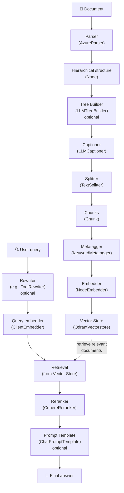

# Complete RAG Guide with datapizzai

This guide shows how to implement a complete Retrieval‑Augmented Generation (RAG) system using the datapizzai library. The system covers the entire flow from document parsing to context‑aware answer generation.

## Table of Contents

- [RAG Flow Overview](#rag-flow-overview)
- [1. Initial Setup](#1-initial-setup)
- [2. Document Parsing](#2-document-parsing)
  - [TextParser (recommended to start)](#textparser-recommended-to-start)
  - [AzureParser (for complex PDFs)](#azureparser-for-complex-pdfs)
- [3. Tree Builder (optional)](#3-tree-builder-optional)
- [4. Captioning Images and Tables](#4-captioning-images-and-tables)
- [5. Text Splitting](#5-text-splitting)
- [6. Metatagger](#6-metatagger)
- [7. Embedding Generation](#7-embedding-generation)
  - [NodeEmbedder](#nodeembedder)
  - [ClientEmbedder (for queries)](#clientembedder-for-queries)
- [8. Vector Store](#8-vector-store)
- [9. Query Rewriting (optional)](#9-query-rewriting-optional)
- [10. Reranking](#10-reranking)
- [11. Prompt Templates (optional)](#11-prompt-templates-optional)
- [12. End‑to‑End Example](#12-endtoend-example)

## RAG Flow Overview

A datapizzai‑based RAG system is composed of the following main components:



## 1. Initial Setup

Before starting, ensure datapizzai and required dependencies are installed:

```python
from datapizzai.modules.parsers import AzureParser
from datapizzai.modules.splitters import TextSplitter
from datapizzai.modules.captioners import LLMCaptioner
from datapizzai.modules.metatagger import KeywordMetatagger
from datapizzai.modules.treebuilder import LLMTreeBuilder
from datapizzai.modules.rerankers import CohereReranker
from datapizzai.modules.rewriters import ToolRewriter
from datapizzai.modules.prompt import ChatPromptTemplate
from datapizzai.embedders import ClientEmbedder, NodeEmbedder
from datapizzai.vectorstores import QdrantVectorstore
from datapizzai.clients import OpenAIClient
```

## 2. Document Parsing

Parsers convert texts and documents into hierarchical node structures.

### TextParser (recommended to start)

`TextParser` is the simplest parser for plain text, perfect to get started:

```python
from datapizzai.modules.parsers.text_parser import TextParser, parse_text

# Method 1: Using the class
parser = TextParser()
text = """Machine learning is a branch of artificial intelligence.

It enables computers to learn from data without being explicitly programmed.
It uses statistical algorithms to identify patterns in data."""

document_node = parser.parse(text, metadata={"source": "example"})

# Method 2: Convenience function (simpler)
document_node = parse_text(text)
```

Advantages:
- No API key required
- Works offline
- Smart parsing into paragraphs and sentences
- Hierarchical structure: document → paragraphs → sentences

Output: `Node` object with `DOCUMENT` → `PARAGRAPH` → `SENTENCE` structure.

### AzureParser (for complex PDFs)

For PDF documents with complex layouts, tables and images:

```python
import os
from dotenv import load_dotenv

load_dotenv()

# Parser configuration
parser = AzureParser(
    api_key=os.getenv("AZURE_DOCUMENT_INTELLIGENCE_API_KEY"),
    endpoint=os.getenv("AZURE_DOCUMENT_INTELLIGENCE_ENDPOINT"),
    result_type="markdown"  # or "text"
)

# Parse a document
document_node = parser.invoke("path/to/document.pdf")
```

Main parameters:
- `api_key`: Azure Document Intelligence API key
- `endpoint`: Azure service endpoint
- `result_type`: output format ("markdown" or "text")

Output: returns a `Node` with a hierarchical structure (document → pages → paragraphs → lines → words).

## 3. Tree Builder (optional)

The tree builder restructures content to optimize document understanding using an LLM.

```python
from datapizzai.clients import OpenAIClient
from datapizzai.modules.treebuilder import LLMTreeBuilder
import os
from dotenv import load_dotenv

load_dotenv()

# LLM client configuration
client = OpenAIClient(api_key=os.getenv("OPENAI_API_KEY"))

# Tree builder
tree_builder = LLMTreeBuilder(
    client=client,
)

# IMPORTANT: use build_tree() with TEXT, NOT invoke() with the node!
# Extract text from the parsed node
text_content = document_node.content or _extract_text_from_node(document_node)

# Apply the tree builder
restructured_node = tree_builder.build_tree(text_content)

# Helper function to extract text from complex nodes
def _extract_text_from_node(node):
    text_parts = []
    if hasattr(node, 'content') and node.content:
        text_parts.append(node.content)
    if hasattr(node, 'children'):
        for child in node.children:
            child_text = _extract_text_from_node(child)
            if child_text:
                text_parts.append(child_text)
    return "\n".join(text_parts)
```

Parameters:
- `client`: LLM client (OpenAI, Google, etc.)

Main methods:
- `build_tree(text)`: refactors a text using the selected client
- `invoke(file_path)`: reads a text file from path and refactors it

## 4. Captioning Images and Tables

The captioner generates textual descriptions for media elements.

```python
captioner = LLMCaptioner(
    client=client,
    max_workers=3,  # number of parallel threads
    system_prompt_figure="Describe this image in a detailed and accurate way.",
    system_prompt_table="Summarize this table highlighting the key points."
)

# Apply captioner
captioned_node = captioner(document_node)
```

Parameters:
- `client`: LLM client to generate captions
- `max_workers`: maximum number of parallel workers
- `system_prompt_figure`: prompt for figures
- `system_prompt_table`: prompt for tables

Behavior: automatically detects `FIGURE` and `TABLE` nodes and generates textual descriptions.

## 5. Text Splitting

The splitter divides content into manageable chunks for embedding.

```python
splitter = TextSplitter(
    max_char=1000,  # maximum chunk length
    overlap=100     # overlap between chunks
)

# Convert node to text (simplified example)
text_content = document_node.content or ""
chunks = splitter.invoke(text_content)
```

Parameters:
- `max_char`: maximum number of characters per chunk
- `overlap`: number of overlapping characters between consecutive chunks

Output: list of `Chunk` objects with unique IDs and metadata.

## 6. Metatagger

The metatagger extracts keywords and attaches them to chunk metadata to improve retrieval and categorization.

```python
from datapizzai.modules.metatagger import KeywordMetatagger

metatagger = KeywordMetatagger(
    client=client,                 # LLM client for extraction
    max_workers=3,                 # Concurrent threads
    system_prompt=(
        "Extract up to 5 relevant keywords per chunk; avoid duplicates."
    ),
    user_prompt=(
        "Prefer short, specific terms; no full sentences."
    ),
    keyword_name="keywords"        # Metadata field name
)

# Apply metatagger to chunks (preserves content and IDs)
tagged_chunks = metatagger(chunks)
```

Parameters:
- `client (Client)`: LLM client for keyword extraction
- `max_workers (int)`: concurrent processing threads (default: 3)
- `system_prompt (str, optional)`: instructions for keyword extraction
- `user_prompt (str, optional)`: additional user context
- `keyword_name (str)`: metadata field name for keywords (default: `"keywords"`)

Features:
- Concurrent chunk processing
- Structured keyword extraction using Pydantic models
- Customizable prompts and metadata field names
- Preserves original chunk content and IDs

## 7. Embedding Generation

Embedders convert chunks into vector representations.

### NodeEmbedder

```python
# Embedder configuration
embedder = NodeEmbedder(
    client=client,
    model_name="text-embedding-3-small",
    embedding_name="openai-small",
    batch_size=100  # batch size for processing
)

# Generate embeddings (sync)
embedded_chunks = embedder(tagged_chunks)
```

Parameters:
- `client`: client used to generate embeddings
- `model_name`: embedding model name
- `embedding_name`: identifier for the embedding
- `batch_size`: number of chunks per batch

### ClientEmbedder (for queries)

```python
query_embedder = ClientEmbedder(
    client=client,
    model_name="text-embedding-3-small"
)

# Async usage (recommended)
query_vector = await query_embedder.a_run(
    "How would you explain machine learning?"
)  # -> list[float]

# Alternatively, sync usage
# query_vector = query_embedder.run("How would you explain machine learning?")
```

## 8. Vector Store

The vector store persists chunks and their embeddings for efficient retrieval.

```python
import os, uuid
from qdrant_client import QdrantClient
from qdrant_client.models import Distance, VectorParams
from datapizzai.type import Chunk
from datapizzai.vectorstores import QdrantVectorstore
from datapizzai.clients import OpenAIClient

# 1) Ensure Qdrant server is running
# docker run -p 6333:6333 qdrant/qdrant

# 2) Connect to Qdrant and create collection once
vectorstore = QdrantVectorstore(host="localhost", port=6333)
client_Q = QdrantClient(host="localhost", port=6333)

client_Q.create_collection(
    collection_name="documents",
    vectors_config=VectorParams(
        size=1536,              # match your embedding model
        distance=Distance.COSINE
    )
)

# 3) Prepare chunks and embed
chunks = [
    Chunk(id=uuid.uuid4(), text="Python programming concepts"),
    Chunk(id=uuid.uuid4(), text="Machine learning fundamentals"),
]

embedded_chunks = embedder(chunks)

# 4) Add to vector store (batch)
vectorstore.add(embedded_chunks, collection_name="documents")

# 5) Build a query embedding and search
client = OpenAIClient(api_key=os.getenv("OPENAI_API_KEY"), model="text-embedding-3-small")
query_vector = client.embed("programming languages")

results = vectorstore.search(
    query_vector=query_vector,
    collection_name="documents",
)
```

Parameters QdrantVectorstore:
- `host`: Qdrant server address (default: "localhost")
- `port`: Qdrant server port (default: 6333)
- `https`: enable HTTPS (default: True; set False for local HTTP)
- `api_key`: API key if required (None for local HTTP)

Search parameters (version‑dependent):
- `query_vector`: query embedding (list of float)
- `collection_name`: target collection name
- `top_k` or `k`: number of results to return

Features:
- Persistent storage of embeddings with metadata
- Fast semantic search
- Supports dense and sparse embeddings

## 9. Rewriters (optional)

Rewriters are pipeline components that transform and enhance user queries using language models and tools. They help optimize queries for better search results and data retrieval by rephrasing, expanding, or restructuring the input.

When to use them:
- Reframing questions for broader information coverage
- Expanding with synonyms/technical terms or related entities
- Normalizing and disambiguating queries (e.g., acronyms)
- Preparing tool‑compatible queries for search engines or APIs

Common traits:
- Input: query string (optionally with memory/context)
- Output: rewritten string or a structured payload with fields
- Modes: synchronous (`run`) or asynchronous (`a_run`)

Example: ToolRewriter

```python
from datapizzai.modules.rewriters import ToolRewriter

rewriter = ToolRewriter(
    client=client,
    system_prompt="Pick and use tools only when they improve document retrieval.",
)

original_query = "How does machine learning work?"
# Async usage (recommended)
rewritten_query = await rewriter.a_run(original_query)

# Alternatively, sync usage
# rewritten_query = rewriter.run(original_query)
```

## 10. Reranking

The reranker reorders retrieved results by relevance.

```python
import os
from dotenv import load_dotenv

load_dotenv()

reranker = CohereReranker(
    api_key=os.getenv("COHERE_API_KEY"),
    endpoint="https://api.cohere.com/v1",
    top_n=5,        # number of final results
    threshold=0.7   # relevance threshold
)

# Example usage with DatapizzAI
from datapizzai.embedders import ClientEmbedder
from datapizzai.vectorstores import QdrantVectorstore

query = "machine learning applications"

# Build query embedding
query_embedder = ClientEmbedder(client=client, model_name="text-embedding-3-small")
query_embedding = await query_embedder.a_run(query)

# Search
retrieved_chunks = vectorstore.search(
    query_vector=query_embedding,
    collection_name="documents",
    top_k=20
)

# Reranking
final_chunks = reranker.invoke({
    "query": query,
    "documents": retrieved_chunks
})
```

Parameters:
- `api_key`: Cohere API key
- `endpoint`: service endpoint
- `top_n`: maximum number of documents to return
- `threshold`: minimum relevance threshold

Tips and troubleshooting:
- Cohere requires a valid `model` (e.g., `rerank-english-v3.0`). Your current `CohereReranker` may not expose a model parameter; if so, prefer `TogetherReranker` with an explicit `model` or call the Cohere SDK directly.

## 11. Prompt Templates (optional)

Templates structure the input for the generative model.

```python
prompt_template = ChatPromptTemplate(
    template="""Based on the following documents, answer the user's question.

Documents:
{context}

Question: {question}

Answer precisely and comprehensively:"""
)

# Use the template
formatted_prompt = prompt_template.format(
    context="\n".join([chunk.text for chunk in final_chunks]),
    question=query
)
```

## 12. End‑to‑End Example

Here is a complete example integrating all components using `TextParser`:

```python
import asyncio
import os
from dotenv import load_dotenv
from datapizzai.clients import OpenAIClient
from datapizzai.modules.parsers.text_parser import parse_text

load_dotenv()

async def rag_pipeline_example():
    # 1. Setup
    client = OpenAIClient(api_key=os.getenv("OPENAI_API_KEY"))
    
    # 2. Parsing (with TextParser)
    text = """Machine learning is a branch of artificial intelligence.
    
It enables computers to learn from data without being explicitly programmed.
It uses statistical algorithms to identify patterns in data."""
    
    document = parse_text(text)
    
    # 3. Tree building (optional)
    tree_builder = LLMTreeBuilder(client=client)
    restructured_doc = tree_builder.build_tree(text)
    
    # 4. Splitting
    splitter = TextSplitter(max_char=1000, overlap=100)
    # Extract text from the node
    text_content = _extract_text_from_node(restructured_doc)
    chunks = splitter.invoke(text_content)
    
    # 5. Metatagger
    metatagger = KeywordMetatagger(
        client=client,
        max_workers=3,
        system_prompt="Extract up to 5 relevant keywords per chunk; avoid duplicates.",
        user_prompt="Prefer short, specific terms; no full sentences.",
        keyword_name="keywords"
    )
    for i, chunk in enumerate(chunks):
        chunks[i] = metatagger.invoke(chunk)
    
    # 6. Embedding
    embedder = NodeEmbedder(client=client)
    embedded_chunks = await embedder.a_run(chunks)
    
    # 7. Vector Store
    vectorstore = QdrantVectorstore(host="localhost")
    collection = "documents"
    
    for chunk in embedded_chunks:
        vectorstore.add(chunk, collection_name=collection)
    
    # 8. Query processing
    query = "What is the main content of the document?"
    
    # 9. Retrieval
    query_embedder = ClientEmbedder(client=client)
    query_embedding = await query_embedder.a_run(query)
    
    results = vectorstore.search(
        query_vector=query_embedding, 
        collection_name=collection, 
        top_k=10  # or `k=10` on older versions
    )
    
    # 10. Reranking
    reranker = CohereReranker(api_key=os.getenv("COHERE_API_KEY"))
    final_results = reranker.invoke({
        "query": query,
        "documents": results
    })
    
    # 11. Response generation
    context = "\n".join([r.text for r in final_results])
    response = client.invoke([{
        "role": "user",
        "content": f"Context: {context}\n\nQuestion: {query}"
    }])
    
    return response

# Run
response = asyncio.run(rag_pipeline_example())
print(response.content)
```
