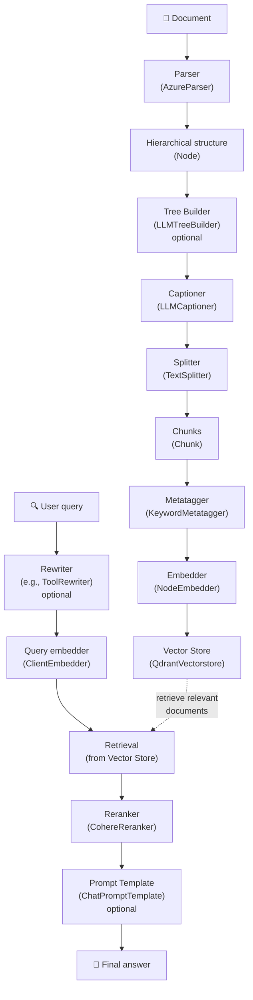

# Complete RAG Guide with datapizza-ai

This guide shows how to implement a complete Retrieval‑Augmented Generation (RAG) system using the datapizza-ai framework. The system covers the entire flow from document parsing to context‑aware answer generation.

## Table of Contents

- [RAG Flow Overview](#rag-flow-overview)
- [Initial Setup](#initial-setup)
- [Ingestion Pipeline](#ingestion-pipeline)
  - [Document Parsing](#document-parsing)
  - [Tree Builder (optional)](#tree-builder-optional)
  - [Captioning Images and Tables](#captioning-images-and-tables)
  - [Text Splitting](#text-splitting)
  - [Metatagger](#metatagger)
  - [Embedding Generation](#embedding-generation)
  - [Vector Store Persistence](#vector-store-persistence)
- [Retrieval Pipeline](#retrieval-pipeline)
  - [Query Rewriting (optional)](#query-rewriting-optional)
  - [Query Embedding and Search](#query-embedding-and-search)
  - [Reranking](#reranking)
- [Prompt Template (optional)](#prompt-template-optional)

## RAG Flow Overview

A prerequisite for local development is a running Qdrant server:
```bash
docker run -p 6333:6333 qdrant/qdrant
```

A datapizzai‑based RAG system is composed of the following main components:



## Initial Setup

System prerequisite — Qdrant vector database (required for the vector store):
```bash
# Start Qdrant server with Docker
docker run -p 6333:6333 qdrant/qdrant

# Dashboard available at: http://localhost:6333/dashboard
```

Python dependencies (imports used in this guide):

```python
from datapizzai.modules.parsers import AzureParser
from datapizzai.modules.splitters import NodeSplitter
from datapizzai.modules.captioners import LLMCaptioner
from datapizzai.modules.metatagger import KeywordMetatagger
from datapizzai.modules.treebuilder import LLMTreeBuilder
from datapizzai.modules.rerankers import CohereReranker
from datapizzai.modules.rewriters import ToolRewriter
from datapizzai.modules.prompt import ChatPromptTemplate
from datapizzai.embedders import ClientEmbedder, NodeEmbedder
from datapizzai.vectorstores import QdrantVectorstore
from datapizzai.clients import OpenAIClient
```

## Ingestion Pipeline

### Document Parsing

Parsers convert texts and documents into hierarchical node structures.

#### TextParser (recommended to start)

`TextParser` is the simplest parser for plain text, perfect to get started:

```python
from datapizzai.modules.parsers.text_parser import TextParser, parse_text

# Method 1: Using the class
parser = TextParser()
text = """Machine learning is a branch of artificial intelligence.

It enables computers to learn from data without being explicitly programmed.
It uses statistical algorithms to identify patterns in data."""

document_node = parser.parse(text, metadata={"source": "example"})

# Method 2: Convenience function (simpler)
document_node = parse_text(text)
```

Advantages:
- No API key required
- Works offline
- Smart parsing into paragraphs and sentences
- Hierarchical structure: document → paragraphs → sentences

Output: `Node` object with `DOCUMENT` → `PARAGRAPH` → `SENTENCE` structure.

#### AzureParser (for complex PDFs)

For PDF documents with complex layouts, tables and images:

```python
import os
from dotenv import load_dotenv

load_dotenv()

# Parser configuration
parser = AzureParser(
    api_key=os.getenv("AZURE_DOCUMENT_INTELLIGENCE_API_KEY"),
    endpoint=os.getenv("AZURE_DOCUMENT_INTELLIGENCE_ENDPOINT"),
    result_type="markdown"  # or "text"
)

# Parse a document
document_node = parser.invoke("path/to/document.pdf")
```

Main parameters:
- `api_key`: Azure Document Intelligence API key
- `endpoint`: Azure service endpoint
- `result_type`: output format ("markdown" or "text")

Output: returns a `Node` with a hierarchical structure (document → pages → paragraphs → lines → words).

### Tree Builder (optional)

Use the Tree Builder when you start from raw text and did NOT use a parser (section 2). It creates or restructures a node hierarchy from the text, so downstream pipeline components (captioner, splitter, metatagger, embedder) can work at their best. It is optional because, if you already used a parser (e.g., `TextParser` or `AzureParser`), you already have a node structure.

```python
from datapizzai.clients import OpenAIClient
from datapizzai.modules.treebuilder import LLMTreeBuilder
import os
from dotenv import load_dotenv

load_dotenv()

# LLM client configuration
client = OpenAIClient(
    api_key=os.getenv("OPENAI_API_KEY"),
    model="gpt-4o",
)

# Tree Builder: create node structure from text if you don't have a parser output
tree_builder = LLMTreeBuilder(client=client)
document_node = tree_builder.build_tree(text)
```

The component accepts any LLM client (`client`) and exposes two main entry points: `build_tree(text)` to restructure raw text and `invoke(file_path)` when working directly from a file on disk.

### Captioning Images and Tables

The captioner generates textual descriptions for media elements.

```python
captioner = LLMCaptioner(
    client=client,
    max_workers=3,  # number of parallel threads
    system_prompt_figure="Describe this image in a detailed and accurate way.",
    system_prompt_table="Summarize this table highlighting the key points."
)

# Apply captioner
captioned_node = captioner(document_node)
```

The captioner relies on the provided LLM client (`client`) and can parallelize the workload through `max_workers`. The prompts `system_prompt_figure` and `system_prompt_table` let you tailor the tone for each modality, while the component automatically targets `FIGURE` and `TABLE` nodes and returns descriptive text.

### Text Splitting

Since we work with nodes, prefer NodeSplitter: it splits nodes into sub‑nodes/chunks ready for embedding.

```python
splitter = NodeSplitter(
    max_char=1000  # maximum chunk length
)

# Split the node directly into chunks
chunks = splitter(document_node)
```

`max_char` controls the maximum length of each chunk and `overlap` tunes how much content adjacent chunks share. The splitter returns a list of `Chunk` objects with unique IDs and metadata ready for the downstream steps.

### Metatagger

The metatagger extracts keywords and attaches them to chunk metadata to improve retrieval and categorization.

```python
from datapizzai.modules.metatagger import KeywordMetatagger

metatagger = KeywordMetatagger(
    client=client,                 # LLM client for extraction
    max_workers=3,                 # Concurrent threads
    system_prompt=(
        "Extract up to 5 relevant keywords per chunk; avoid duplicates."
    ),
    user_prompt=(
        "Prefer short, specific terms; no full sentences."
    ),
    keyword_name="keywords"        # Metadata field name
)

# Apply metatagger to chunks (preserves content and IDs)
tagged_chunks = metatagger(chunks)
```

The metatagger leverages your LLM client (`client`) and optional parallelism via `max_workers`. Prompts (`system_prompt`, `user_prompt`) guide the extraction and `keyword_name` defines where to store the keywords. Processing is concurrent, validated with Pydantic models and preserves original chunk content and IDs.

### Embedding Generation

Embedders add vectors to chunks.

#### NodeEmbedder

```python
# Embedder configuration
embedder = NodeEmbedder(
    client=client,
    model_name="text-embedding-3-small",
    embedding_name="openai-small",
    batch_size=100  # batch size for processing
)

# Generate embeddings (sync)
embedded_chunks = embedder(tagged_chunks)
```

`NodeEmbedder` uses the configured client (`client`) together with the selected `model_name`. You can optionally tag the vector set with `embedding_name` and control throughput with `batch_size`.

<!-- Removed: ClientEmbedder is not needed inside the RAG pipeline section. -->

### Vector Store Persistence

The vector store persists chunks and their vectors for efficient retrieval. We keep this section essential to avoid duplicating module docs.

Minimal Qdrant setup, if you haven’t already started it:
```python
# 1. Setup Qdrant
from qdrant_client import QdrantClient
from qdrant_client.models import Distance, VectorParams
from datapizzai.vectorstores import QdrantVectorstore

client = QdrantClient(host="localhost", port=6333)
client.create_collection(
    collection_name="documents",
    vectors_config=VectorParams(size=1536, distance=Distance.COSINE)
)
```

Then manage chunks with Qdrant:
```python
vectorstore = QdrantVectorstore(host="localhost", port=6333)
vectorstore.add(embedded_chunks, collection_name="documents")
```

```

Once the vector store is populated, the retrieval pipeline can query the collection to answer user requests.

## Retrieval Pipeline

### Query Rewriting (optional)

Rewriters help turn vague or colloquial questions into retrieval-ready queries. They are useful for expanding terminology, resolving ambiguity, or orchestrating external tools before searching the vector store.

```python
from datapizzai.modules.rewriters import ToolRewriter

rewriter = ToolRewriter(
    client=client,
    system_prompt=(
        "You are a query rewriter for a DatapizzAI RAG pipeline. "
        "Take messy user questions, capture the main intent, and craft a search-ready "
        "query that includes helpful keywords (e.g., parser, splitter, vector store). "
        "Invoke tools only when they can add useful context for retrieval."
    ),
)

original_query = "Uhm, does that pizza AI thing magically slice PDFs or what?"

# Async usage (recommended)
# rewritten_query = await rewriter.a_run(original_query)

# Alternatively, sync usage
rewritten_query = rewriter.run(original_query)
print(rewritten_query)
```

### Query Embedding and Search

After rewriting, reuse the embedding client from the ingestion step and query the vector store.

```python
from datapizzai.clients import OpenAIClient

client = OpenAIClient(
    api_key=os.getenv("OPENAI_API_KEY"),
    model="text-embedding-3-small",
)

query_vector = client.embed(rewritten_query)

results = vectorstore.search(
    query_vector=query_vector,
    collection_name="documents",
)
```

### Reranking

The reranker reorders retrieved results by relevance.

```python
import os
from dotenv import load_dotenv
from datapizzai.embedders import ClientEmbedder

load_dotenv()

reranker = CohereReranker(
    api_key=os.getenv("COHERE_API_KEY"),
    endpoint="https://api.cohere.com/v1",
    top_n=5,  # number of final results
)

query = "data visualization applications"

# Generate embedding for the query
query_embedder = ClientEmbedder(client=client, model_name="text-embedding-3-small")
query_embedding = await query_embedder.a_run(query)

# Use DatapizzAI vector store
retrieved_chunks = vectorstore.search(
    query_vector=query_embedding,
    collection_name="documents",
)

# Reranking (async)
final_chunks = await reranker.a_run({
    "query": query,
    "documents": retrieved_chunks
})
```

Keep in mind that Cohere expects a valid `model` (for example, `rerank-english-v3.0`). If your `CohereReranker` wrapper does not expose that parameter, switch to `TogetherReranker` with an explicit `model` or call the Cohere SDK directly.

### Prompt Template (optional)

Templates structure the input for the generative model.

```python
from datapizzai.modules.prompt import ChatPromptTemplate
from datapizzai.type import Chunk

# Create RAG prompt template
template = ChatPromptTemplate(
    user_prompt_template="Question: {{ user_prompt }}\nPlease answer based on the provided context.",
    retrieval_prompt_template="Context:\n- {{ chunk.text }}\n"
)

# Simulate search results
chunks = [
    Chunk(id="1", text="Python is a high-level programming language"),
    Chunk(id="2", text="Python was created by Guido van Rossum in 1991")
]

# Create conversation memory
memory = template.format(
    user_prompt="Who created Python?",
    chunks=chunks,
    retrieval_query="Python creator history"
)

print("User: ", memory[0])
print("Assistant: ", memory[1])
print("Tool: ", memory[2].blocks[0].result)

# 1. User:  Question: Who created Python? Please answer based on the provided context.
# 2. Assistant: FunctionCall(search_vectorstore, query="Python creator history")
# 3. Tool:  Context - Python is a high-level programming language - Python was created by Guido van Rossum in 1991
```
