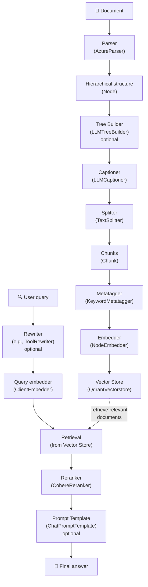

# Complete RAG Guide with datapizza-ai

This guide shows how to implement a complete Retrieval‑Augmented Generation (RAG) system using the datapizza-ai framework. The system covers the entire flow from document parsing to context‑aware answer generation.

## Table of Contents

- [RAG Flow Overview](#rag-flow-overview)
- [1. Initial Setup](#1-initial-setup)
- [2. Document Parsing](#2-document-parsing)
  - [TextParser (recommended to start)](#textparser-recommended-to-start)
  - [AzureParser (for complex PDFs)](#azureparser-for-complex-pdfs)
- [3. Tree Builder (optional)](#3-tree-builder-optional)
- [4. Captioning Images and Tables](#4-captioning-images-and-tables)
- [5. Text Splitting](#5-text-splitting)
- [6. Metatagger](#6-metatagger)
- [7. Embedding Generation](#7-embedding-generation)
  - [NodeEmbedder](#nodeembedder)
  - [ClientEmbedder (for queries)](#clientembedder-for-queries)
- [8. Vector Store](#8-vector-store)
- [9. Query Rewriting (optional)](#9-query-rewriting-optional)
- [10. Reranking](#10-reranking)
- [11. Prompt Templates (optional)](#11-prompt-templates-optional)
- [12. End‑to‑End Example](#12-endtoend-example)

## RAG Flow Overview

A prerequisite for local development is a running Qdrant server:
```bash
docker run -p 6333:6333 qdrant/qdrant
```

A datapizzai‑based RAG system is composed of the following main components:



## 1. Initial Setup

System prerequisite — Qdrant vector database (required for the vector store):
```bash
# Start Qdrant server with Docker
docker run -p 6333:6333 qdrant/qdrant

# Dashboard available at: http://localhost:6333/dashboard
```

Python dependencies (imports used in this guide):

```python
from datapizzai.modules.parsers import AzureParser
from datapizzai.modules.splitters import NodeSplitter
from datapizzai.modules.captioners import LLMCaptioner
from datapizzai.modules.metatagger import KeywordMetatagger
from datapizzai.modules.treebuilder import LLMTreeBuilder
from datapizzai.modules.rerankers import CohereReranker
from datapizzai.modules.rewriters import ToolRewriter
from datapizzai.modules.prompt import ChatPromptTemplate
from datapizzai.embedders import ClientEmbedder, NodeEmbedder
from datapizzai.vectorstores import QdrantVectorstore
from datapizzai.clients import OpenAIClient
```

## 2. Document Parsing

Parsers convert texts and documents into hierarchical node structures.

### TextParser (recommended to start)

`TextParser` is the simplest parser for plain text, perfect to get started:

```python
from datapizzai.modules.parsers.text_parser import TextParser, parse_text

# Method 1: Using the class
parser = TextParser()
text = """Machine learning is a branch of artificial intelligence.

It enables computers to learn from data without being explicitly programmed.
It uses statistical algorithms to identify patterns in data."""

document_node = parser.parse(text, metadata={"source": "example"})

# Method 2: Convenience function (simpler)
document_node = parse_text(text)
```

Advantages:
- No API key required
- Works offline
- Smart parsing into paragraphs and sentences
- Hierarchical structure: document → paragraphs → sentences

Output: `Node` object with `DOCUMENT` → `PARAGRAPH` → `SENTENCE` structure.

### AzureParser (for complex PDFs)

For PDF documents with complex layouts, tables and images:

```python
import os
from dotenv import load_dotenv

load_dotenv()

# Parser configuration
parser = AzureParser(
    api_key=os.getenv("AZURE_DOCUMENT_INTELLIGENCE_API_KEY"),
    endpoint=os.getenv("AZURE_DOCUMENT_INTELLIGENCE_ENDPOINT"),
    result_type="markdown"  # or "text"
)

# Parse a document
document_node = parser.invoke("path/to/document.pdf")
```

Main parameters:
- `api_key`: Azure Document Intelligence API key
- `endpoint`: Azure service endpoint
- `result_type`: output format ("markdown" or "text")

Output: returns a `Node` with a hierarchical structure (document → pages → paragraphs → lines → words).

## 3. Tree Builder (optional)

Use the Tree Builder when you start from raw text and did NOT use a parser (section 2). It creates or restructures a node hierarchy from the text, so downstream pipeline components (captioner, splitter, metatagger, embedder) can work at their best. It is optional because, if you already used a parser (e.g., `TextParser` or `AzureParser`), you already have a node structure.

```python
from datapizzai.clients import OpenAIClient
from datapizzai.modules.treebuilder import LLMTreeBuilder
import os
from dotenv import load_dotenv

load_dotenv()

# LLM client configuration
client = OpenAIClient(
    api_key=os.getenv("OPENAI_API_KEY"),
    model="gpt-4o",
)

# Tree Builder: create node structure from text if you don't have a parser output
tree_builder = LLMTreeBuilder(client=client)
document_node = tree_builder.build_tree(text)
```

Parameters:
- `client`: LLM client (OpenAI, Google, etc.)

Main methods:
- `build_tree(text)`: refactors a text using the selected client
- `invoke(file_path)`: reads a text file from path and refactors it

## 4. Captioning Images and Tables

The captioner generates textual descriptions for media elements.

```python
captioner = LLMCaptioner(
    client=client,
    max_workers=3,  # number of parallel threads
    system_prompt_figure="Describe this image in a detailed and accurate way.",
    system_prompt_table="Summarize this table highlighting the key points."
)

# Apply captioner
captioned_node = captioner(document_node)
```

Parameters:
- `client`: LLM client to generate captions
- `max_workers`: maximum number of parallel workers
- `system_prompt_figure`: prompt for figures
- `system_prompt_table`: prompt for tables

Behavior: automatically detects `FIGURE` and `TABLE` nodes and generates textual descriptions.

## 5. Text Splitting

Since we work with nodes, prefer NodeSplitter: it splits nodes into sub‑nodes/chunks ready for embedding.

```python
splitter = NodeSplitter(
    max_char=1000  # maximum chunk length
)

# Split the node directly into chunks
chunks = splitter(document_node)
```

Parameters:
- `max_char`: maximum number of characters per chunk
- `overlap`: number of overlapping characters between consecutive chunks

Output: list of `Chunk` objects with unique IDs and metadata.

## 6. Metatagger

The metatagger extracts keywords and attaches them to chunk metadata to improve retrieval and categorization.

```python
from datapizzai.modules.metatagger import KeywordMetatagger

metatagger = KeywordMetatagger(
    client=client,                 # LLM client for extraction
    max_workers=3,                 # Concurrent threads
    system_prompt=(
        "Extract up to 5 relevant keywords per chunk; avoid duplicates."
    ),
    user_prompt=(
        "Prefer short, specific terms; no full sentences."
    ),
    keyword_name="keywords"        # Metadata field name
)

# Apply metatagger to chunks (preserves content and IDs)
tagged_chunks = metatagger(chunks)
```

Parameters:
- `client (Client)`: LLM client for keyword extraction
- `max_workers (int)`: concurrent processing threads (default: 3)
- `system_prompt (str, optional)`: instructions for keyword extraction
- `user_prompt (str, optional)`: additional user context
- `keyword_name (str)`: metadata field name for keywords (default: `"keywords"`)

Features:
- Concurrent chunk processing
- Structured keyword extraction using Pydantic models
- Customizable prompts and metadata field names
- Preserves original chunk content and IDs

## 7. Embedding Generation

Embedders add vectors to chunks.

### NodeEmbedder

```python
# Embedder configuration
embedder = NodeEmbedder(
    client=client,
    model_name="text-embedding-3-small",
    embedding_name="openai-small",
    batch_size=100  # batch size for processing
)

# Generate embeddings (sync)
embedded_chunks = embedder(tagged_chunks)
```

Parameters:
- `client`: client used to generate embeddings
- `model_name`: embedding model name
- `embedding_name`: identifier for the embedding
- `batch_size`: number of chunks per batch

<!-- Removed: ClientEmbedder is not needed inside the RAG pipeline section. -->

## 8. Vector Store

The vector store persists chunks and their vectors for efficient retrieval. We keep this section essential to avoid duplicating module docs.

Minimal Qdrant setup, if you haven’t already started it:
```python
# 1. Setup Qdrant
from qdrant_client import QdrantClient
from qdrant_client.models import Distance, VectorParams
from datapizzai.vectorstores import QdrantVectorstore

client = QdrantClient(host="localhost", port=6333)
client.create_collection(
    collection_name="documents",
    vectors_config=VectorParams(size=1536, distance=Distance.COSINE)
)
```

Then manage chunks with Qdrant:
```python
vectorstore = QdrantVectorstore(host="localhost", port=6333)
vectorstore.add(embedded_chunks, collection_name="documents")

# Create a query embedding with the same client
query_vector = client.embed("Data visualization")

results = vectorstore.search(
    query_vector=query_vector,
    collection_name="documents",
)
```

## 9. Rewriters (optional)

Rewriters are pipeline components that transform and enhance user queries using language models and tools. They help optimize queries for better search results and data retrieval by rephrasing, expanding, or restructuring the input.

When to use them:
- Reframing questions for broader information coverage
- Expanding with synonyms/technical terms or related entities
- Normalizing and disambiguating queries (e.g., acronyms)
- Preparing tool‑compatible queries for search engines or APIs

Common traits:
- Input: query string (optionally with memory/context)
- Output: rewritten string or a structured payload with fields
- Modes: synchronous (`run`) or asynchronous (`a_run`)

Example: ToolRewriter

```python
from datapizzai.modules.rewriters import ToolRewriter

rewriter = ToolRewriter(
    client=client,
    system_prompt="Pick and use tools only when they improve document retrieval.",
)

original_query = "How does machine learning work?"
# Async usage (recommended)
rewritten_query = await rewriter.a_run(original_query)

# Alternatively, sync usage
# rewritten_query = rewriter.run(original_query)
```

## 10. Reranking

The reranker reorders retrieved results by relevance.

```python
import os
from dotenv import load_dotenv
from datapizzai.embedders import ClientEmbedder

load_dotenv()

reranker = CohereReranker(
    api_key=os.getenv("COHERE_API_KEY"),
    endpoint="https://api.cohere.com/v1",
    top_n=5,  # number of final results
)

query = "data visualization applications"

# Generate embedding for the query
query_embedder = ClientEmbedder(client=client, model_name="text-embedding-3-small")
query_embedding = await query_embedder.a_run(query)

# Use DatapizzAI vector store
retrieved_chunks = vectorstore.search(
    query_vector=query_embedding,
    collection_name="documents",
)

# Reranking (async)
final_chunks = await reranker.a_run({
    "query": query,
    "documents": retrieved_chunks
})
```

Notes and troubleshooting:
- Cohere requires a valid `model` (e.g., `rerank-english-v3.0`). If your `CohereReranker` version does not expose a `model` parameter, prefer `TogetherReranker` with an explicit `model`, or use the Cohere SDK directly.

## 11. Prompt Templates (optional)

Templates structure the input for the generative model.

```python
from datapizzai.modules.prompt import ChatPromptTemplate
from datapizzai.type import Chunk

# Create RAG prompt template
template = ChatPromptTemplate(
    user_prompt_template="Question: {{ user_prompt }}\nPlease answer based on the provided context.",
    retrieval_prompt_template="Context:\n- {{ chunk.text }}\n"
)

# Simulate search results
chunks = [
    Chunk(id="1", text="Python is a high-level programming language"),
    Chunk(id="2", text="Python was created by Guido van Rossum in 1991")
]

# Create conversation memory
memory = template.format(
    user_prompt="Who created Python?",
    chunks=chunks,
    retrieval_query="Python creator history"
)

print("User: ", memory[0])
print("Assistant: ", memory[1])
print("Tool: ", memory[2].blocks[0].result)

# 1. User:  Question: Who created Python? Please answer based on the provided context.
# 2. Assistant: FunctionCall(search_vectorstore, query="Python creator history")
# 3. Tool:  Context - Python is a high-level programming language - Python was created by Guido van Rossum in 1991
```

## 12. End‑to‑End Example

Here is a complete example integrating all components using `TextParser`:

```python
import asyncio
import os
from dotenv import load_dotenv
from datapizzai.clients import OpenAIClient
from datapizzai.modules.parsers.text_parser import parse_text

load_dotenv()

async def rag_pipeline_example():
    # 1. Setup
    client = OpenAIClient(api_key=os.getenv("OPENAI_API_KEY"))
    
    # 2. Parsing (with TextParser)
    text = """Machine learning is a branch of artificial intelligence.
    
It enables computers to learn from data without being explicitly programmed.
It uses statistical algorithms to identify patterns in data."""
    
    document = parse_text(text)
    
    # 3. Tree building (optional)
    tree_builder = LLMTreeBuilder(client=client)
    restructured_doc = tree_builder.build_tree(text)
    
    # 4. Splitting
    splitter = TextSplitter(max_char=1000, overlap=100)
    # Extract text from the node
    text_content = _extract_text_from_node(restructured_doc)
    chunks = splitter.invoke(text_content)
    
    # 5. Metatagger
    metatagger = KeywordMetatagger(
        client=client,
        max_workers=3,
        system_prompt="Extract up to 5 relevant keywords per chunk; avoid duplicates.",
        user_prompt="Prefer short, specific terms; no full sentences.",
        keyword_name="keywords"
    )
    for i, chunk in enumerate(chunks):
        chunks[i] = metatagger.invoke(chunk)
    
    # 6. Embedding
    embedder = NodeEmbedder(client=client)
    embedded_chunks = await embedder.a_run(chunks)
    
    # 7. Vector Store
    vectorstore = QdrantVectorstore(host="localhost")
    collection = "documents"
    
    for chunk in embedded_chunks:
        vectorstore.add(chunk, collection_name=collection)
    
    # 8. Query processing
    query = "What is the main content of the document?"
    
    # 9. Retrieval
    query_embedder = ClientEmbedder(client=client)
    query_embedding = await query_embedder.a_run(query)
    
    results = vectorstore.search(
        query_vector=query_embedding, 
        collection_name=collection, 
        top_k=10  # or `k=10` on older versions
    )
    
    # 10. Reranking
    reranker = CohereReranker(api_key=os.getenv("COHERE_API_KEY"))
    final_results = reranker.invoke({
        "query": query,
        "documents": results
    })
    
    # 11. Response generation
    context = "\n".join([r.text for r in final_results])
    response = client.invoke([{
        "role": "user",
        "content": f"Context: {context}\n\nQuestion: {query}"
    }])
    
    return response

# Run
response = asyncio.run(rag_pipeline_example())
print(response.content)
```
