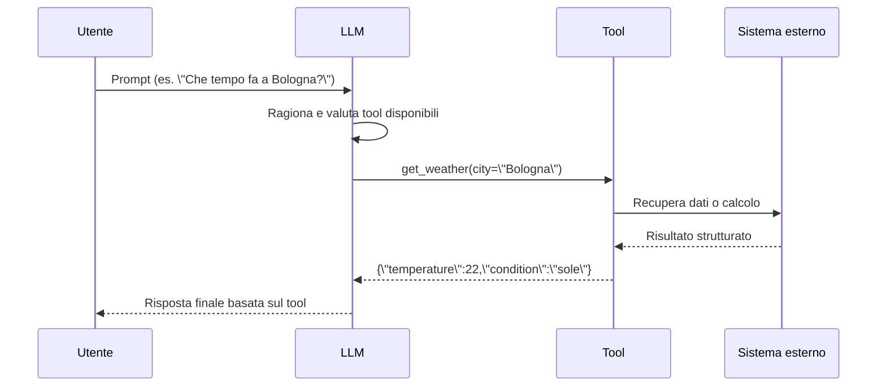
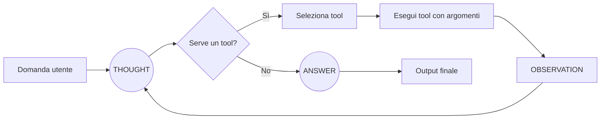
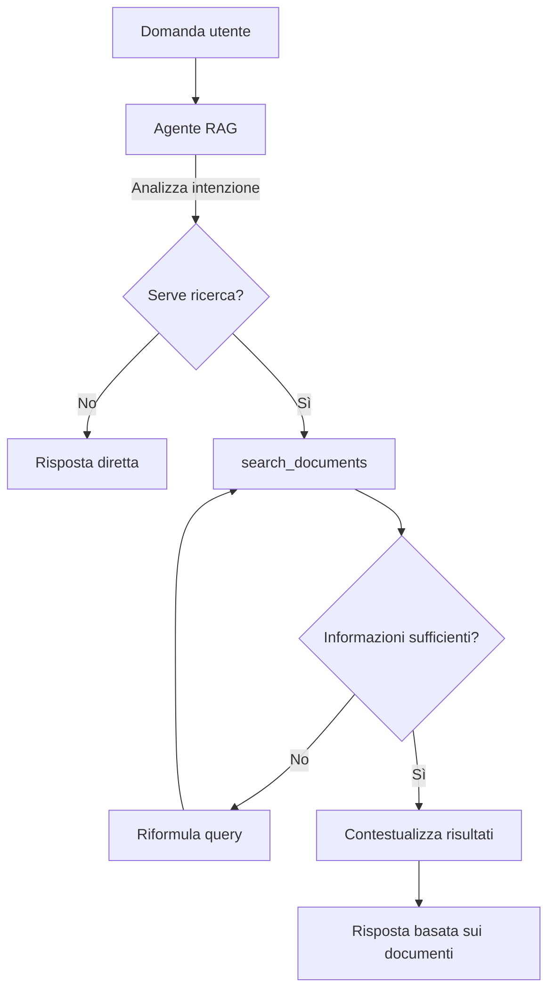

# Tool, agenti e RAG agentico con datapizza-ai

Questa guida riprende il notebook `Notebook/Agents_Tutorial.ipynb` e illustra come creare tool, agenti e un flusso RAG agentico utilizzando il framework **datapizza-ai**.

## Prerequisiti

- Variabile `OPENAI_API_KEY` configurata in un file `.env`
- Vector store Qdrant già popolato con i documenti Ducati (fare riferimento a `RAG_Tutorial.ipynb`)

---

## Indice

0. [Fondamenti teorici](#0-fondamenti-teorici)
1. [Setup e configurazione](#1-setup-e-configurazione)
2. [Tool con datapizza-ai](#2-tool-con-datapizza-ai)
3. [Agenti](#3-agenti)
4. [RAG agentico](#4-rag-agentico)
5. [Appendice: definire tool manualmente](#5-appendice-definire-tool-manualmente)

---

## 0. Fondamenti teorici

Questa sezione introduce i concetti chiave e illustra visivamente come avvengono le interazioni tra utente, LLM, tool e componenti RAG. I diagrammi Mermaid permettono di cogliere rapidamente il flusso logico.

### 0.1 Tool: estendere le capacità dell'LLM

I tool consentono all'LLM di eseguire operazioni fuori dalla sua knowledge base: accedere a dati aggiornati, interrogare servizi interni o effettuare calcoli affidabili. L'LLM valuta autonomamente quando usarli.



**Punti essenziali**

- Il decoratore `@tool` di datapizza-ai genera automaticamente lo schema JSON richiesto dall'LLM.
- I tool possono essere informativi (ritornano dati) o operativi (eseguono azioni concrete).
- Gestire bene le descrizioni aiuta il modello a scegliere il tool corretto.

### 0.2 Agenti: ciclo ReAct

Gli agenti implementano un loop ReAct (Reason + Act). Ad ogni iterazione pensano, decidono se agire, osservano il risultato e aggiornano il contesto prima di rispondere o continuare.



**Perché sono utili**

- Mantengono memoria delle azioni svolte e delle osservazioni ricevute.
- Possono orchestrare più tool, riformulare query e pianificare passi intermedi.
- Parametri come `max_steps` e logging dei passi (es. `stream_invoke`) facilitano il debugging.

### 0.3 RAG agentico: ricerca guidata dall'agente

Nel RAG classico ogni query genera sempre un embedding e una ricerca. Nel RAG agentico l'agente valuta se serve consultare i documenti, riformula la query se necessario e può ripetere la ricerca fino a ottenere un contesto sufficiente.



**Benefici principali**

- Evita ricerche inutili (es. saluti) riducendo costi e latenza.
- Migliora la copertura grazie a query iterative e riformulazioni mirate.
- Consente di combinare la ricerca con altri tool (calcoli, API interne) nello stesso ciclo agente.

---

## 1. Setup e configurazione

### 1.1 Caricare le variabili d'ambiente

```python
import os
from dotenv import load_dotenv

# Carica le variabili d'ambiente da .env
load_dotenv()

api_key = os.getenv("OPENAI_API_KEY")
if not api_key:
    raise ValueError("OPENAI_API_KEY non trovata. Impostala nel file .env")

# Parametri usati nel resto della guida
LLM_MODEL = "gpt-5.1"
EMBEDDING_MODEL = "text-embedding-3-small"
QDRANT_PATH = "../qdrant_data"
COLLECTION_NAME = "ducati_docs"

print("Setup completato")
print(f"Modello LLM: {LLM_MODEL}")
```

### 1.2 Creare il client OpenAI

```python
from datapizza.agents import Agent
from datapizza.clients.openai import OpenAIClient
from datapizza.tools import tool

# Client OpenAI che useremo per gli agenti
client = OpenAIClient(api_key=api_key, model=LLM_MODEL)
print("Client OpenAI creato")
```

---

## 2. Tool con datapizza-ai

Un **tool** è una funzione che l'LLM può scegliere di invocare per ottenere dati o eseguire azioni che non può svolgere autonomamente (API esterne, calcoli, database, ecc.). Il decoratore `@tool` di datapizza-ai genera automaticamente lo schema JSON necessario al modello, traducendo docstring e type hint in descrizioni utilizzabili dall'LLM.

### 2.1 Esempio: tool meteo

```python
@tool
def get_weather(city: str, unit: str = "celsius") -> str:
    """
    Restituisce le condizioni meteo attuali di una città italiana.

    Args:
        city: Nome della città (es: Bologna, Milano, Roma)
        unit: celsius oppure fahrenheit
    """
    weather_data = {
        "bologna": {"temp": 22, "condition": "soleggiato"},
        "milano": {"temp": 18, "condition": "nuvoloso"},
        "roma": {"temp": 25, "condition": "sereno"},
    }

    city_lower = city.lower()
    if city_lower not in weather_data:
        return f"Città {city} non trovata nel database meteo."

    data = weather_data[city_lower]
    temp = data["temp"]
    if unit == "fahrenheit":
        temp = temp * 9/5 + 32

    return f"A {city} ci sono {temp}°{'F' if unit == 'fahrenheit' else 'C'}, cielo {data['condition']}."

# Test
print(get_weather("Bologna"))
print(get_weather("Milano", "fahrenheit"))
```

### 2.2 Esempio: tool calcolatrice

```python
import math

@tool
def calculate(expression: str) -> str:
    """
    Esegue calcoli matematici (operazioni base, pow, sqrt, funzioni trigonometriche, costanti).

    Args:
        expression: Espressione da valutare (es: "2 + 2", "sqrt(16)", "pow(2, 10)")
    """
    allowed_names = {
        "sqrt": math.sqrt,
        "pow": pow,
        "abs": abs,
        "round": round,
        "sin": math.sin,
        "cos": math.cos,
        "pi": math.pi,
    }

    try:
        result = eval(expression, {"__builtins__": {}}, allowed_names)
        return f"Il risultato di {expression} è {result}"
    except Exception as e:
        return f"Errore nel calcolo: {str(e)}"

# Test
print(calculate("2 + 2"))
print(calculate("sqrt(144)"))
print(calculate("pow(2, 10)"))
```

---

## 3. Agenti

Un **agente** usa un LLM come motore di ragionamento per analizzare il problema, pianificare i passi, invocare i tool necessari, osservare i risultati e iterare fino al completamento del task. Rispetto a un semplice function calling, un agente può effettuare più chiamate ai tool, mantiene uno stato conversazionale e decide autonomamente quando fermarsi.

Esempio di creazione agente con datapizza-ai:

```python
agent = Agent(
    name="nome_agente",
    system_prompt="Istruzioni per l'agente",
    client=OpenAIClient(api_key="...", model="gpt-4o-mini"),
    tools=[tool1, tool2],
    max_steps=10,
)

response = agent.run("Domanda dell'utente")
print(response.text)
```

### 3.1 Agente con tool meteo e calcolatrice

```python
weather_agent = Agent(
    name="weather_calculator_agent",
    system_prompt="""Sei un assistente utile che può:
- Fornire informazioni meteo sulle città italiane
- Eseguire calcoli matematici

Usa i tool disponibili quando necessario. Rispondi sempre in italiano.""",
    client=client,
    tools=[get_weather, calculate],
    max_steps=5,
)
print("Agente creato con tool: get_weather, calculate")
```

#### Eseguire qualche test

```python
# Domanda sul meteo
response = weather_agent.run("Che tempo fa a Bologna?")
print(response.text)

# Domanda matematica
response = weather_agent.run("Quanto fa 2 elevato alla 16?")
print(response.text)

# Ragionamento multi-step
response = weather_agent.run("Se a Bologna ci sono 22 gradi, quanto fa il quadrato della temperatura?")
print(response.text)

# Domanda generica (non richiede tool)
response = weather_agent.run("Ciao, come stai?")
print(response.text)
```

### 3.2 Visualizzare i passi con `stream_invoke`

```python
print("Esecuzione con stream_invoke:")
print("=" * 50)

for step in weather_agent.stream_invoke("Che temperatura c'è a Roma in Fahrenheit?"):
    print(f"\n--- Step {step.index} ---")
    print(f"Testo: {step.text}")
```

---

## 4. RAG agentico

Nel RAG classico ogni richiesta dell'utente scatena una ricerca sul vector store. In un **RAG agentico** è l'agente a decidere se, come e quante volte eseguire la ricerca (`search_documents`); può riformulare la query, combinare informazioni da più tool e rispondere direttamente quando non servono dati esterni.

### 4.1 Setup di vector store ed embedder

```python
from datapizza.vectorstores.qdrant import QdrantVectorstore
from datapizza.embedders.openai import OpenAIEmbedder

vectorstore = QdrantVectorstore(location=None, path=QDRANT_PATH)
embedder = OpenAIEmbedder(api_key=api_key, model_name=EMBEDDING_MODEL)

print(f"Vector store caricato da: {QDRANT_PATH}")
```

### 4.2 Tool `search_documents`

```python
@tool
def search_documents(query: str, num_results: int = 3) -> str:
    """
    Cerca informazioni nei documenti aziendali Ducati indicizzati.
    Usa questo tool per domande su Ducati, team, persone, processi e tecnologie.

    Args:
        query: Testo o parole chiave da cercare
        num_results: Numero di risultati desiderati (default: 3)
    """
    try:
        query_embedding = embedder.embed(query)
        results = vectorstore.search(
            query_vector=query_embedding,
            collection_name=COLLECTION_NAME,
            k=num_results,
        )

        if not results:
            return "Nessun documento trovato per questa ricerca."

        formatted_results = []
        for i, chunk in enumerate(results, 1):
            text = chunk.text[:500] + "..." if len(chunk.text) > 500 else chunk.text
            formatted_results.append(f"[Risultato {i}]\n{text}")

        return "\n\n".join(formatted_results)
    except Exception as e:
        return f"Errore nella ricerca: {str(e)}"

print("Tool search_documents creato")

# Test
print("Test ricerca 'team IT Ducati':")
print(search_documents("team IT Ducati"))
```

### 4.3 Creazione dell'agente RAG

```python
rag_agent = Agent(
    name="ducati_rag_agent",
    system_prompt="""Sei un assistente esperto dei documenti aziendali Ducati.

Hai accesso al tool search_documents per cercare informazioni nei documenti indicizzati.

REGOLE IMPORTANTI:
1. Usa search_documents SOLO per domande su Ducati (team, persone, processi, tecnologie)
2. Per domande generiche rispondi direttamente SENZA usare il tool
3. Se non trovi informazioni sufficienti, riformula la query e ripeti la ricerca
4. Basi le risposte esclusivamente sui documenti trovati
5. Se non trovi informazioni, dillo chiaramente

Rispondi sempre in italiano in modo chiaro e conciso.""",
    client=client,
    tools=[search_documents],
    max_steps=5,
)
print("Agente RAG creato")
```

### 4.4 Test dell'agente RAG

```python
# Domanda che richiede la ricerca
print("Domanda: Quanti dipendenti IT ha Ducati?")
print("=" * 50)
for step in rag_agent.stream_invoke("Quanti dipendenti IT ha Ducati?"):
    text = step.text
    print(f"Step {step.index}: {text[:200]}..." if len(text) > 200 else f"Step {step.index}: {text}")

# Domanda generica (non deve usare il tool)
print("Domanda: Ciao, come ti chiami?")
print("=" * 50)
response = rag_agent.run("Ciao, come ti chiami?")
print(f"Risposta: {response.text}")

# Domande specifiche
for question in [
    "Quali strumenti AI usa Ducati?",
    "Chi è il CIO di Ducati?",
    "Qual è il fatturato annuo di Ducati?",
]:
    print(f"\nDomanda: {question}")
    response = rag_agent.run(question)
    print(f"Risposta: {response.text}")
```

### 4.5 Confronto: RAG classico vs RAG agentico

```python
def rag_normale(query: str) -> str:
    """
    RAG classico: genera sempre embeddig e cerca nel database,
    anche quando non sarebbe necessario.
    """
    query_embedding = embedder.embed(query)
    results = vectorstore.search(
        query_vector=query_embedding,
        collection_name=COLLECTION_NAME,
        k=3,
    )

    if results:
        context = "\n---\n".join([chunk.text for chunk in results])
    else:
        context = "Nessun documento trovato."

    prompt = f"""Basandoti sul contesto, rispondi alla domanda.

CONTESTO:
{context}

DOMANDA: {query}

RISPOSTA:"""

    response = client.invoke(prompt)
    return response.text

print("Funzione rag_normale definita")
```

```python
# Confronto con un saluto
print("CONFRONTO: 'Ciao, come stai?'")
print("=" * 60)

print("\n--- RAG NORMALE ---")
response_normale = rag_normale("Ciao, come stai?")
print(f"Risposta: {response_normale}")

print("\n--- RAG AGENTICO ---")
response_agentico = rag_agent.run("Ciao, come stai?")
print(f"Risposta: {response_agentico.text}")

# Confronto con domanda sui documenti
print("\nCONFRONTO: 'Chi è Andrea Spina?'")
print("=" * 60)

print("\n--- RAG NORMALE ---")
response_normale = rag_normale("Chi è Andrea Spina?")
print(f"Risposta: {response_normale}")

print("\n--- RAG AGENTICO ---")
response_agentico = rag_agent.run("Chi è Andrea Spina?")
print(f"Risposta: {response_agentico.text}")
```

---

## 5. Appendice: definire tool manualmente

Il decoratore `@tool` semplifica lo sviluppo, ma è utile ricordare come definire manualmente funzioni e relativi schemi JSON da passare al function calling di OpenAI.

### 5.1 Tool meteo manuale

```python
import json

def get_weather(city: str, unit: str = "celsius") -> dict:
    """
    Restituisce il meteo di una città (dati simulati).
    """
    weather_data = {
        "bologna": {"temp": 22, "condition": "soleggiato"},
        "milano": {"temp": 18, "condition": "nuvoloso"},
        "roma": {"temp": 25, "condition": "sereno"},
    }

    city_lower = city.lower()
    if city_lower not in weather_data:
        return {"error": f"Città {city} non trovata"}

    data = weather_data[city_lower]
    temp = data["temp"]
    if unit == "fahrenheit":
        temp = temp * 9/5 + 32

    return {
        "city": city,
        "temperature": temp,
        "unit": unit,
        "condition": data["condition"],
    }

weather_tool = {
    "type": "function",
    "function": {
        "name": "get_weather",
        "description": "Restituisce le condizioni meteo attuali di una città italiana",
        "parameters": {
            "type": "object",
            "properties": {
                "city": {
                    "type": "string",
                    "description": "Nome della città (es: Bologna, Milano, Roma)",
                },
                "unit": {
                    "type": "string",
                    "enum": ["celsius", "fahrenheit"],
                    "description": "Unità di misura della temperatura",
                },
            },
            "required": ["city"],
        },
    },
}

print(json.dumps(weather_tool, indent=2))
```

### 5.2 Tool calcolatrice manuale

```python
import math

def calculate(expression: str) -> dict:
    """
    Valuta un'espressione matematica.
    """
    allowed_names = {
        "sqrt": math.sqrt,
        "pow": pow,
        "abs": abs,
        "round": round,
        "sin": math.sin,
        "cos": math.cos,
        "pi": math.pi,
    }

    try:
        result = eval(expression, {"__builtins__": {}}, allowed_names)
        return {"expression": expression, "result": result}
    except Exception as e:
        return {"expression": expression, "error": str(e)}

calculator_tool = {
    "type": "function",
    "function": {
        "name": "calculate",
        "description": "Esegue calcoli matematici (operazioni base, pow, sqrt, trigonometria, pi)",
        "parameters": {
            "type": "object",
            "properties": {
                "expression": {
                    "type": "string",
                    "description": "Espressione da valutare (es: '2 + 2', 'sqrt(16)', 'pow(2, 10)')",
                }
            },
            "required": ["expression"],
        },
    },
}
```

### 5.3 Usare i tool manuali con OpenAI

Una volta definite funzioni e schemi, puoi passarli all'API `chat.completions.create` impostando `tools=[weather_tool, calculator_tool]` e gestendo le `tool_calls` esattamente come mostrato nella documentazione di OpenAI function calling.
