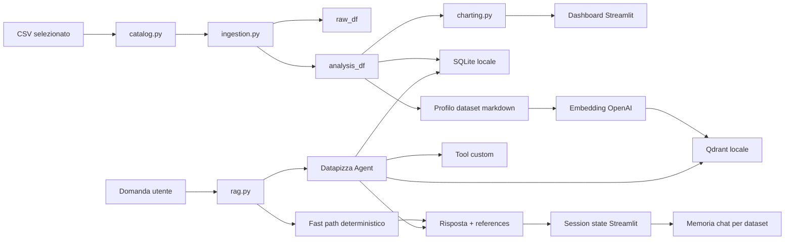
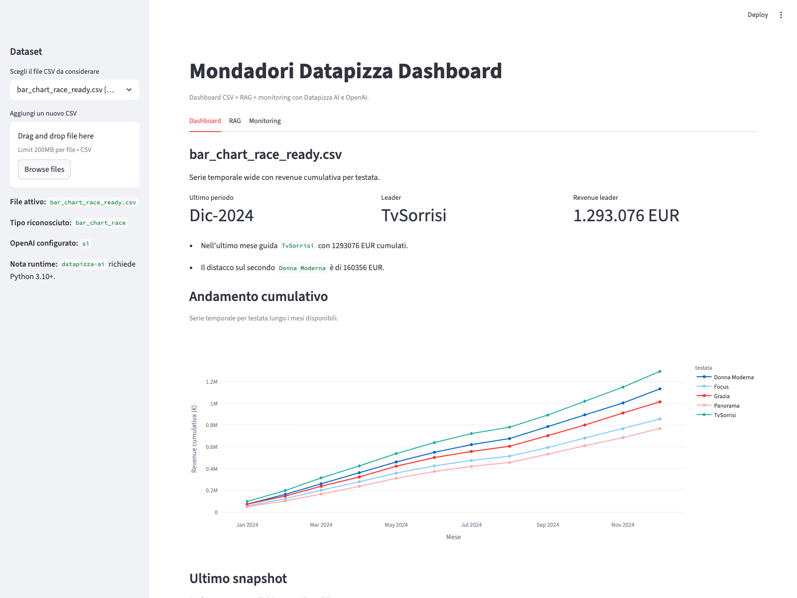
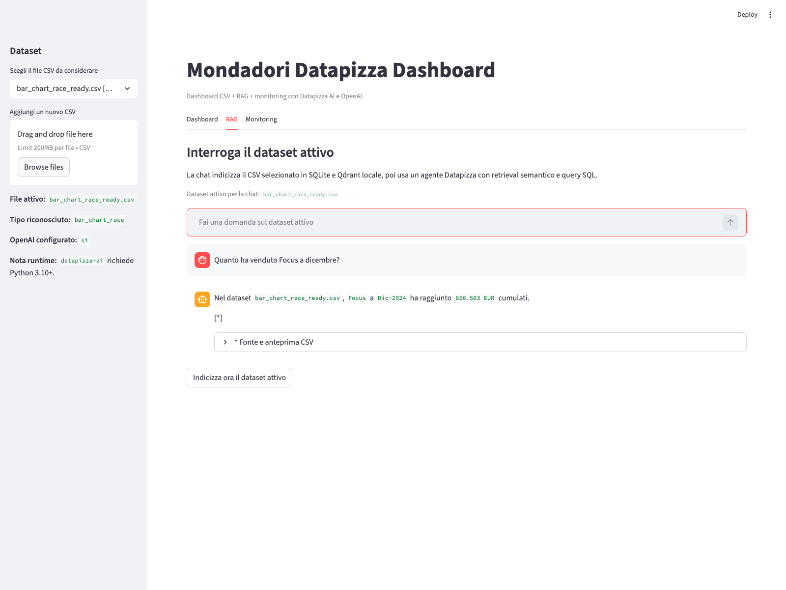
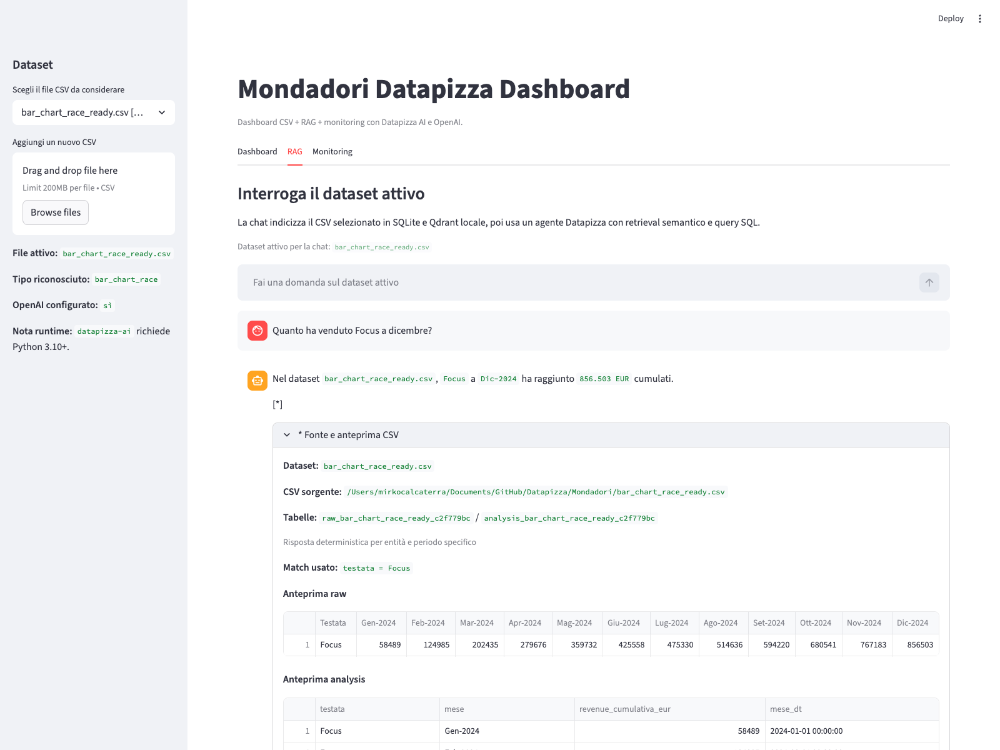
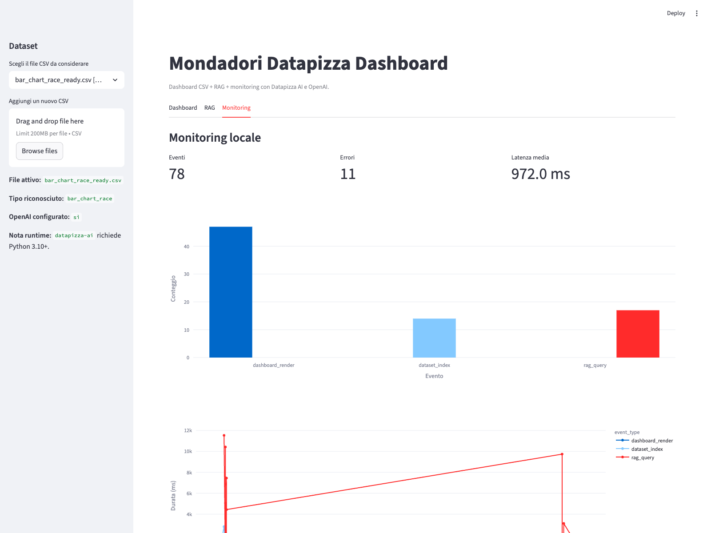

# Datapizza Dashboard RAG

Dashboard Streamlit per esplorare CSV Mondadori e interrogarli in linguaggio naturale con:

- dashboard interattiva
- trasformazione analitica locale
- SQLite locale per query strutturate
- Qdrant locale per retrieval
- Datapizza Agent + OpenAI per il flusso RAG
- monitoring applicativo locale

## Cosa fa

L'applicazione unisce due modalita` di lavoro nello stesso posto:

1. analisi visuale del CSV tramite KPI, insight e grafici Plotly
2. analisi conversazionale tramite chat sul dataset attivo

Il punto importante e` che la chat non si limita al "solo LLM":

- usa il dataset selezionato in quel momento
- salva una memoria di chat separata per dataset
- prova una scorciatoia deterministica per richieste frequenti
- usa l'agente Datapizza quando serve retrieval, SQL o reasoning multi-step
- mostra la fonte della risposta con anteprima del CSV

## Quando usarlo

Questo progetto e` utile se vuoi:

- validare rapidamente numeri presenti nei CSV
- navigare dataset con strutture ricorrenti come `scatter`, `bar_chart_race`, `sankey` e `slope`
- fare follow-up naturali come `e per Focus?` o `solo dicembre?`
- ottenere sia un numero sia il riferimento da cui quel numero arriva

## Requisiti

- Python 3.11+ consigliato
- una chiave OpenAI valida
- ambiente locale con permessi di scrittura nella cartella del progetto

## Setup rapido

### 1. Crea l'ambiente virtuale

Dalla root della repo:

```bash
python3.11 -m venv .venv
source .venv/bin/activate
```

Se non hai `python3.11`, usa una versione 3.11+ disponibile sul tuo sistema.

### 2. Installa le dipendenze

```bash
pip install -r datapizza_dashboard_rag/requirements.txt
```

### 3. Configura le variabili ambiente

Puoi usare:

- `datapizza_dashboard_rag/.env`
- oppure `.env` nella root della repo

Valori minimi:

```env
Openai=YOUR_OPENAI_API_KEY
DATAPIZZA_CHAT_MODEL=gpt-4o-mini
DATAPIZZA_EMBEDDING_MODEL=text-embedding-3-small
```

Note:

- il nome della variabile API key e` `Openai`, con questa esatta maiuscola/minuscola
- se la chiave non e` presente, la tab RAG resta disabilitata in UI

### 4. Avvia l'app

Sempre dalla root della repo:

```bash
streamlit run datapizza_dashboard_rag/app.py
```

### 5. Apri la dashboard nel browser

Di default Streamlit espone un URL locale simile a:

```text
http://localhost:8501
```

## Guida d'uso passo passo

Questa e` la parte piu` importante se devi usare il progetto ogni giorno.

### 1. Seleziona il dataset attivo

Nella sidebar trovi:

- il menu per scegliere il CSV
- il tipo riconosciuto automaticamente
- lo stato della configurazione OpenAI
- l'upload di un nuovo CSV

L'app scansiona automaticamente:

- i CSV nella root della repo
- i CSV in `datapizza_dashboard_rag/datasets/`

### 2. Esplora la tab Dashboard

La tab `Dashboard` mostra:

- una descrizione sintetica del dataset
- KPI principali
- insight testuali
- grafici Plotly coerenti con il tipo di dataset
- anteprima `Raw` e `Analysis`

L'obiettivo di questa tab e` farti capire velocemente:

- che struttura ha il dataset
- quali metriche contiene
- qual e` il periodo piu` recente
- quali testate o categorie emergono subito

### 3. Usa la tab RAG

La tab `RAG` lavora sempre sul dataset selezionato nella sidebar.

Flusso tipico:

1. scegli il dataset
2. apri `RAG`
3. fai una domanda
4. alla prima domanda l'app prepara gli asset locali del dataset
5. ricevi la risposta con riferimento alla fonte

Esempi di domande utili:

- `Quanto ha venduto Focus a dicembre?`
- `Solo dicembre, non il cumulato`
- `E per Panorama?`
- `Qual e` la testata con revenue piu alta nell'ultimo mese?`
- `Mostrami i top 3`

### 4. Leggi la fonte della risposta

Se la risposta usa una reference, sotto il testo compare il marker `[*]`.

Aprendo il box fonte puoi vedere:

- nome del dataset
- path del CSV sorgente
- nome della tabella raw in SQLite
- nome della tabella analysis in SQLite
- anteprima dei dati usati

Questo e` molto utile per:

- controllare che il match sulla testata sia corretto
- verificare il periodo letto
- distinguere tra dato raw e dato trasformato

### 5. Controlla la tab Monitoring

La tab `Monitoring` mostra gli eventi locali salvati in JSONL:

- `dashboard_render`
- `dataset_index`
- `rag_query`

Trovi anche:

- conteggi per tipo evento
- latenza media
- elenco eventi recenti con metadata

## Come ragiona la chat

La chat usa una combinazione di percorsi.

### Percorso deterministico

Per richieste frequenti e molto strutturate il codice evita il giro completo dell'agente e risponde in modo diretto.

Esempi:

- match entita` + periodo
- differenza tra mesi in serie cumulative
- richiami espliciti alla memoria recente della chat

Questo rende la risposta:

- piu` veloce
- piu` prevedibile
- meno fragile sui follow-up

### Percorso agentico

Quando la richiesta richiede piu` contesto, il sistema usa Datapizza Agent con:

- retrieval da Qdrant locale
- query SQL su SQLite locale
- tool custom per entita` e periodi

Questo serve soprattutto per:

- ranking
- confronti multi-entita`
- richieste piu` aperte
- uso con dataset meno facilmente interpretabili da una regola diretta

## Regole business importanti

Il progetto ha alcune regole esplicite per evitare errori tipici.

### 1. Dataset cumulativi

Se il dataset contiene `revenue_cumulativa_eur`:

- la revenue totale di una testata e` l'ultimo valore cumulativo disponibile
- il valore del singolo mese puo` essere calcolato come delta tra due mesi consecutivi

Esempio:

- `Dic-2024 cumulato = 856.503`
- `Nov-2024 cumulato = 767.183`
- `solo Dic-2024 = 89.320`

### 2. Match flessibile delle testate

La chat non si affida a match case-sensitive o esatti quando esiste un match plausibile.

Questo aiuta in casi come:

- `Focus`
- `FOCUS`
- `focus`

### 3. Memoria per dataset

La memoria e` separata per dataset.

Questo significa che:

- il contesto di `scatter_ready.csv` non inquina quello di `bar_chart_race_ready.csv`
- i follow-up restano coerenti col dataset attivo

## Tipi di dataset supportati

Il riconoscimento del tipo dataset e` basato sullo schema del CSV.

### `scatter`

Colonne attese:

- `Testata`
- `CPM Medio (€)`
- `Fill Rate (%)`
- `Revenue (€)`
- `Mese`

Uso tipico:

- performance mensile per testata
- confronto CPM vs fill rate
- revenue per mese

### `bar_chart_race`

Formato wide con:

- prima colonna `Testata`
- colonne successive tipo `Gen-2024`, `Feb-2024`, ...

Uso tipico:

- serie cumulative per testata
- confronto ultimo snapshot
- delta mese su mese

### `sankey`

Colonne attese:

- `Source`
- `Target`
- `Value`

Uso tipico:

- flussi tra categorie o nodi

### `slope`

Formato wide con:

- prima colonna `Testata`
- periodi tipo `Q1-2024`, `Q2-2024`, ...

Uso tipico:

- confronto tra trimestri
- delta rispetto al periodo precedente

### `generic`

Per CSV non riconosciuti automaticamente.

La dashboard mostra grafici generici e la chat resta comunque disponibile.

## Architettura ad alto livello



## Architettura dettagliata

### 1. `catalog.py`

Responsabilita`:

- scoprire i CSV disponibili
- inferire il `kind`
- costruire un `dataset_id` stabile

Output principale:

- `DatasetEntry`

### 2. `ingestion.py`

Responsabilita`:

- leggere il CSV originale
- produrre `raw_df`
- produrre `analysis_df`
- scrivere SQLite locale
- creare il profilo dataset
- creare manifest e collection Qdrant locale

Persistenza generata:

- `storage/sqlite/dashboard.db`
- `storage/profiles/<dataset_id>.md`
- `storage/manifests/<dataset_id>.json`
- `storage/qdrant/local_qdrant/`

### 3. `charting.py`

Responsabilita`:

- KPI
- insight
- grafici specifici per `kind`

### 4. `rag.py`

Responsabilita`:

- risposta diretta su casi deterministici
- entity matching
- period matching
- delta su serie cumulative
- memoria conversazionale
- orchestrazione agente Datapizza
- retrieval locale
- query SQL

In pratica `rag.py` e` il punto in cui convergono:

- semantica business
- contesto conversazionale
- tool agentici

### 5. `local_qdrant.py`

Responsabilita`:

- adattare Qdrant locale su filesystem
- creare collection
- salvare chunk embeddings
- eseguire search semantica

### 6. `monitoring.py`

Responsabilita`:

- salvare eventi applicativi in `events.jsonl`
- avvolgere operazioni con tracing OpenTelemetry

## Flusso end-to-end

1. l'utente apre la dashboard
2. l'app scopre i CSV disponibili
3. l'utente seleziona un dataset
4. la tab Dashboard costruisce KPI, insight e grafici
5. alla prima domanda RAG il dataset viene indicizzato localmente
6. la domanda passa a `rag.py`
7. `rag.py` prova prima il percorso deterministico
8. se non basta, usa l'agente Datapizza con tool, retrieval e SQL
9. la risposta viene mostrata con references
10. la memoria aggiornata resta in `st.session_state`
11. gli eventi vengono registrati nella tab Monitoring

## Struttura del progetto

```text
datapizza_dashboard_rag/
├── app.py
├── README.md
├── requirements.txt
├── .env.example
├── scripts/
│   └── capture_screenshots.mjs
├── dashboard_rag/
│   ├── __init__.py
│   ├── catalog.py
│   ├── charting.py
│   ├── config.py
│   ├── ingestion.py
│   ├── local_qdrant.py
│   ├── monitoring.py
│   └── rag.py
├── datasets/
├── docs/
│   ├── architecture.md
│   ├── monitoring.md
│   └── screenshots/
└── storage/
```

## Cartelle e file da conoscere davvero

### `app.py`

Da leggere se vuoi capire:

- layout Streamlit
- sidebar
- tab Dashboard / RAG / Monitoring
- gestione `st.session_state`

### `dashboard_rag/config.py`

Da leggere se vuoi capire:

- path locali
- caricamento `.env`
- modelli OpenAI configurati

### `dashboard_rag/ingestion.py`

Da leggere se vuoi capire:

- come un CSV diventa `analysis_df`
- dove finiscono SQLite, manifest e profilo

### `dashboard_rag/rag.py`

Da leggere se vuoi capire:

- come vengono gestite memoria e follow-up
- quando il sistema usa il fast path
- quando entra in gioco l'agente

## Screenshot reali

Gli screenshot sotto sono stati generati dalla dashboard locale e salvati in:

```text
datapizza_dashboard_rag/docs/screenshots/
```

### 1. Dashboard overview



### 2. Domanda RAG e risposta



### 3. Fonte espansa con anteprima CSV



### 4. Tab Monitoring



### Rigenerare gli screenshot

Con la dashboard avviata su `http://127.0.0.1:8501`, puoi rigenerarli con:

```bash
node datapizza_dashboard_rag/scripts/capture_screenshots.mjs
```

## Troubleshooting

### La chat RAG non parte

Controlla:

- presenza di `Openai=...` nel file `.env`
- ambiente virtuale attivo
- dipendenze installate

### Errore di rete o DNS

Se vedi un errore di rete in fase embedding o agent run, controlla:

- connessione internet
- VPN/proxy aziendale
- eventuali `OPENAI_BASE_URL`, `HTTP_PROXY`, `HTTPS_PROXY`

### La risposta sembra usare il dataset sbagliato

Controlla:

- il dataset selezionato nella sidebar
- il box reference sotto la risposta

### I dati sembrano "troppo alti"

Verifica se stai leggendo:

- un valore incrementale del mese
- oppure un valore cumulativo

Per `bar_chart_race` questa distinzione e` fondamentale.

### Voglio reindicizzare il dataset

Usa il pulsante:

```text
Indicizza ora il dataset attivo
```

## Esempi di utilizzo consigliati

### Esempi `scatter`

- `Quanto ha venduto Focus a Dic-2024?`
- `Qual e` il mese con revenue totale piu alta?`
- `Confronta Focus e Panorama a settembre`

### Esempi `bar_chart_race`

- `Quanto vale Focus a Dic-2024?`
- `Solo dicembre, non il cumulato`
- `Chi e` leader nell'ultimo mese disponibile?`

### Esempi `sankey`

- `Qual e` il flusso piu rilevante?`
- `Quale target riceve il valore piu alto?`

### Esempi `slope`

- `Chi ha il delta migliore tra Q1 e Q2?`
- `Quale testata cresce di piu?`

## Note per sviluppo e manutenzione

- usa `raw_df` per mostrare il CSV originale
- usa `analysis_df` per analytics, SQL e logica RAG
- non sommare mai alla cieca serie cumulative
- per nuove euristiche, preferisci regole deterministiche solo quando sono davvero robuste
- per nuove classi di CSV, aggiorna insieme `catalog.py`, `ingestion.py` e `charting.py`

## Documentazione aggiuntiva

- [docs/architecture.md](./docs/architecture.md)
- [docs/monitoring.md](./docs/monitoring.md)
- [datasets/README.md](./datasets/README.md)
